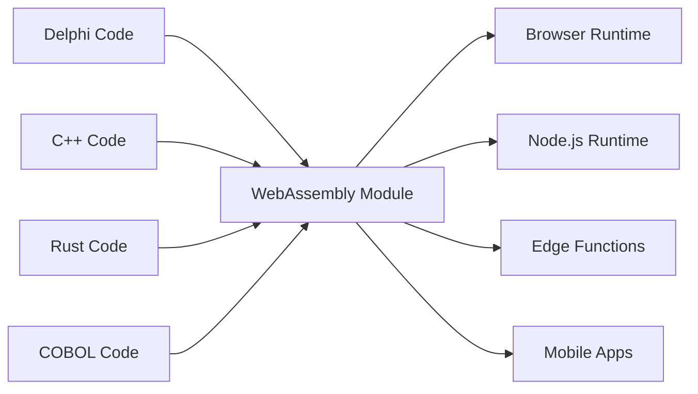

# Universal Fabricator

"صنع ملفات ثنائية لتطبيقات سطح المكتب Linux هو عذاب كبير. تريد فقط تجميع ملف ثنائي واحد وجعله يعمل، ويفضل أن يكون إلى الأبد، ويفضل عبر جميع توزيعات Linux." - Linus Torvalds، 2014

## كذبتان نرفض قبولهما

### كذبة التراث: "أعد كتابة كل شيء"

صرخة Linus الشهيرة حول كابوس توزيع البرمجيات هي عرض لكذبة أكبر وأكثر تكلفة يخبر بها قطاع البرمجيات نفسه: أن التعليمات البرمجية القديمة هي دين تقني، والطريقة الوحيدة للتحديث هي التخلص من عقود من منطق الأعمال المختبر والبدء من الصفر.

هذا جنون. تعليمات Delphi أو COBOL أو C++ تلك تعمل. إنها تشفر سنوات من معرفة الأعمال، والتعامل مع الحالات الحدية، والأخطاء المصححة. إعادة كتابتها لا تقدم المخاطر فقط - إنها تدمر المعرفة المؤسسية التي لا يمكن تعويضها.

Universal Fabricator مبني على رفض بسيط وقوي: **نحن نرفض قبول أن هذه هي الطريقة الوحيدة**. ماذا لو كان بإمكانك تشغيل منطقك القديم في أي مكان، دون إعادة كتابة؟ ليس من خلال الترجمة. من خلال **التنفيذ العالمي والحتمي**.

### المعضلة الحديثة: "السرعة أو الأداء"

لكن هذا ليس فقط عن الماضي. في العصر الحديث، نواجه خيارًا زائفًا جديدًا: المعضلة بين سرعة النماذج الأولية (TypeScript، Python) وأداء الإنتاج (Rust، Go). تضطر الفرق إلى قرار مؤلم: البقاء مع النموذج الأولي البطيء، أو الشروع في إعادة كتابة كاملة محفوفة بالمخاطر للإنتاج.

Universal Fabricator يرفض هذا الخيار أيضًا. إنه يوفر جسرًا - ليس فقط من الماضي إلى الحاضر، ولكن من الحاضر إلى مستقبل عالي الأداء، دون التضحية بسرعة تطويرك.

> **منطق عملك لا يحتاج إلى إعادة كتابة. إنه يحتاج إلى نهضة.**

## كيف يعمل

Universal Fabricator يتجلى كدوال Hatcher متعددة اللغات - تعليماتك البرمجية القديمة مجمعة إلى WebAssembly - والتي يتم تعبئتها وتنفيذها بشكل آمن داخل Hatcher EGG. هذه البنية مدعومة بثلاثة مكونات رئيسية:

### سحر WebAssembly

WebAssembly (WASM) هو الاختراق الذي يجعل هذا ممكنًا. أي لغة يمكن تجميعها إلى WASM يمكن تشغيلها في أي مكان - المتصفح، الخادم، الحافة، الهاتف المحمول. تصبح تعليماتك البرمجية القديمة محمولة دون تغيير سطر واحد.



### Hatcher Functions: دوال بدون حدود

دوال Lambda التقليدية تعمل في السحابة. دوال Hatcher الخاصة بنا تعمل في كل مكان:

```typescript
// Your 20-year-old Delphi tax calculation
const taxCalculator = await loadWASM('./legacy/tax-engine.wasm')

// Use it like a modern JavaScript function
const tax = await taxCalculator.calculateTax({
  income: 75000,
  deductions: 12000,
  state: 'NY',
})

// It runs at native speed, locally, with perfect accuracy
```

### بنية EGGs

EGGs (Enforced Governance Guardrails) هي الحاويات لمنطقك العالمي:

```yaml
egg: payroll-processor
version: 2.1.0
engine: wasm

modules:
  - name: tax-calculator
    source: delphi
    binary: tax-engine.wasm
    interface: ./interfaces/tax.ts

  - name: compliance-checker
    source: cobol
    binary: compliance.wasm
    interface: ./interfaces/compliance.ts

  - name: optimization-engine
    source: cpp
    binary: optimizer.wasm
    interface: ./interfaces/optimizer.ts

orchestration:
  entry: orchestrate.js
  runtime: node
```

## احفظ أصولك

### الحياة الثانية لتعليماتك البرمجية

تطبيق Delphi ذلك من عام 2001؟ يصبح:

- خدمة مصغرة في مجموعة Kubernetes الخاصة بك
- دالة في تطبيق React الخاص بك
- عامل حافة للتوزيع العالمي
- مكتبة في خط أنابيب بيانات Python الخاص بك

دون تغيير التعليمات البرمجية الأصلية. دون فقدان منطق الأعمال. دون مخاطر إعادة الكتابة.

### مثال: ثورة البنوك

```javascript
// Original: 30-year-old COBOL transaction processor
// Now: Modern web API

import { loadCOBOLModule } from '@hatcher/eggs'

const transactionProcessor = await loadCOBOLModule('./legacy/transactions.wasm')

// Modern Express.js API
app.post('/api/transfer', async (req, res) => {
  // Modern validation
  const validated = await validateRequest(req.body)

  // Legacy business logic (perfect accuracy)
  const result = await transactionProcessor.processTransfer({
    fromAccount: validated.from,
    toAccount: validated.to,
    amount: validated.amount,
  })

  // Modern response
  res.json({
    success: result.success,
    transactionId: result.id,
    timestamp: new Date().toISOString(),
  })
})
```

## تطور دون مخاطر

### التحديث التدريجي

لا يتعين عليك تحديث كل شيء دفعة واحدة:

```typescript
class HybridPayrollSystem {
  // Keep the complex calculation in Delphi
  private legacyCalculator = loadWASM('./legacy/payroll.wasm')

  // Add modern features in TypeScript
  async calculatePayroll(employee: Employee) {
    // Use legacy for core calculation
    const base = await this.legacyCalculator.calculate(employee)

    // Enhance with modern features
    const withBenefits = this.addModernBenefits(base)
    const withAnalytics = this.trackAnalytics(withBenefits)

    return withAnalytics
  }

  // New features in modern code
  private addModernBenefits(payroll: Payroll) {
    // Modern benefits calculation
  }
}
```

### التشغيل البيني للغات

لغات مختلفة لنقاط قوة مختلفة:

```javascript
// Use each language for what it does best
const system = {
  // Rust for performance-critical
  imageProcessor: await loadWASM('./rust/image-processor.wasm'),

  // Delphi for business logic
  businessRules: await loadWASM('./delphi/rules-engine.wasm'),

  // C++ for algorithms
  optimizer: await loadWASM('./cpp/optimizer.wasm'),

  // JavaScript for orchestration
  async process(input) {
    const image = await this.imageProcessor.prepare(input.image)
    const rules = await this.businessRules.evaluate(input.data)
    const optimized = await this.optimizer.optimize(rules)

    return { image, result: optimized }
  },
}
```

## حسّن مستقبلك: من النموذج الأولي إلى الأداء

Hatcher هو أيضًا منصة تحسين تدريجية للتطبيقات الحديثة. يمكنك إنشاء نموذج أولي لتطبيقك بالكامل في TypeScript للعثور على ملاءمة السوق للمنتج، ثم استبدال اختناقات الأداء جراحيًا بوحدات Rust أو Go عالية الأداء دون إعادة كتابة كاملة.

### حسّن مستقبلك: سير عمل التحويل

Hatcher يوفر سير عمل ثوري لتطوير نموذج أولي حديث إلى تطبيق عالي الأداء. أنت لا تعيد الكتابة؛ أنت تحول. يمكنك إنشاء نموذج أولي لتطبيقك بالكامل في TypeScript، ثم استخدام الذكاء الاصطناعي كشريك لترقية المنطق الحرج بأمان ومنهجية إلى لغات عالية الأداء مثل Rust أو Go.

هذا هو Alchemist's Playbook.

#### الخطوة 1: النموذج الأولي (TypeScript)

تبدأ بتعليمات TypeScript برمجية عاملة، ولكن ربما "قذرة" أو بطيئة.

```ts
// Your initial prototype for calculating user discounts.
// It works, but has complex logic and isn't fast enough.
function calculateDiscount(user, cart) {
  let discount = 0
  if (user.isVip) discount += 0.1
  if (cart.total > 100) discount += 0.05
  // ... many more complex and slow rules
  return Math.min(discount, 0.25) // cap discount
}
```

#### الخطوة 2: المواصفات المدعومة بالذكاء الاصطناعي (التعليمات البرمجية → معايير القبول)

تحدد الدالة وتأمر Hatcher: "صف هذا المنطق كمعايير قبول." يحلل الذكاء الاصطناعي التعليمات البرمجية ويهندس عكسيًا قواعد الأعمال.

```Gherkin
# AI-Generated Acceptance Criteria

Feature: User Discount Calculation

Scenario: VIP user with large cart
Given a user is a "VIP"
And the cart total is over 100
Then the final discount should be 15%

Scenario: Non-VIP user
Given a user is not a "VIP"
Then the discount is based only on cart total

Scenario: Discount Capping
When any combination of rules results in a discount over 25%
Then the final discount must be capped at 25%
```

#### **الخطوة 3: التحسين البشري (نقطة التحكم)**

الآن، أنت، المطور، تراجع وتحسن معايير القبول هذه بلغة إنجليزية بسيطة. تلتقط حالة حدية فاتها الذكاء الاصطناعي وتضيف سيناريو جديد. هذه نقطة التحكم الخاصة بك.

#### الخطوة 4: التوليد المدفوع بالاختبار (معايير القبول → الاختبارات → التعليمات البرمجية)

مع معايير القبول المعتمدة من قبل الإنسان كعقد، تأمر Hatcher: "قم بإنشاء تعليمات برمجية Rust واختبارات الوحدة لتلبية هذه المعايير."

1. Hatcher يولد أولاً الاختبارات في Rust، مما يعكس معايير القبول مباشرة.

2. ثم، يولد تعليمات Rust البرمجية التي تجعل تلك الاختبارات تنجح.

```rust
// The final, high-performance Rust code, guaranteed by tests
// to match the human-approved business logic.
pub fn calculate_discount(user: &User, cart: &Cart) -> f64 {
    // Blazingly fast, safe Rust logic...
}
```

#### الخطوة 5: القطعة الحية

الناتج النهائي ليس فقط وحدة .wasm المجمعة. إنها الوحدة **مقترنة بمواصفاتها القابلة للقراءة من قبل الإنسان**. يتم الحفاظ على معايير القبول جنبًا إلى جنب مع lambda، مما يخلق توثيقًا حيًا للصيانة والتطور المستقبليين.

هذا هو حلم الكيميائي: عملية آمنة ومنظمة لتحويل نموذج أولي إلى تطبيق عالي الأداء، دون مخاطر، ومع وضوح تام.

## نفذ بثقة

### WASM Cleanroom

كل وحدة WASM تعمل في صندوق رمل:

```typescript
interface WASMSandbox {
  memory: {
    limit: '100MB'
    shared: false
  }

  cpu: {
    timeout: '5s'
    priority: 'normal'
  }

  io: {
    filesystem: 'none'
    network: 'none'
    system: 'none'
  }
}
```

تعليماتك البرمجية القديمة لا يمكنها:

- الوصول إلى نظام الملفات (ما لم يتم منحه صراحة)
- إجراء مكالمات شبكة (ما لم يتم منحه صراحة)
- تعطل عملية المضيف
- تسريب الذاكرة
- التدخل مع وحدات أخرى

### واجهات آمنة النوع

إنشاء واجهات TypeScript من تعليماتك البرمجية القديمة:

```typescript
// Auto-generated from Delphi function signatures
export interface TaxEngine {
  calculateFederalTax(income: number, deductions: number): Promise<number>
  calculateStateTax(income: number, state: string): Promise<number>
  getDeductionLimit(filingStatus: FilingStatus): Promise<number>
}

// Type-safe usage
const engine: TaxEngine = await loadWASM('./tax-engine.wasm')
const tax = await engine.calculateFederalTax(100000, 12000) // Type-checked!
```

## مثبت في الخنادق

### السيناريو 1: عملاق التأمين

شركة تأمين عمرها 40 عامًا بملايين سطور COBOL:

```yaml
before:
  problem: 'COBOL mainframe costs $2M/year'
  solution: '5-year, $50M rewrite project (failed twice)'

after:
  solution: 'Compile COBOL to WASM'
  timeline: '3 months'
  result:
    - Run on commodity hardware
    - Scale horizontally
    - Keep all business logic
    - Modern API layer
  savings: '$1.8M/year'
```

### السيناريو 2: شركة التداول

خوارزميات التداول عالية التردد في C++:

```javascript
// Original: C++ running on specialized hardware
// Now: Same C++ running everywhere

const tradingEngine = await loadWASM('./trading/algorithm.wasm')

// Deploy to edge locations globally
const edgeLocations = ['nyc', 'london', 'tokyo', 'singapore']

for (const location of edgeLocations) {
  deployToEdge(location, tradingEngine)
  // Same algorithm, microsecond latency, global distribution
}
```

### السيناريو 3: نظام التصنيع

تعليمات برمجية C مضمنة من أجهزة التحكم الصناعية:

```typescript
// 30-year-old C code from manufacturing equipment
const controller = await loadWASM('./embedded/controller.wasm')

// Now it powers a modern web dashboard
const Dashboard = () => {
  const [status, setStatus] = useState()

  useEffect(() => {
    const interval = setInterval(async () => {
      const data = await controller.getSystemStatus()
      setStatus(data)
    }, 1000)

    return () => clearInterval(interval)
  }, [])

  return <ModernUIComponent data={status} />
}
```

### السيناريو 4: شركة ناشئة للذكاء الاصطناعي

شركة ناشئة سريعة الحركة تنشئ نماذج أولية لخط أنابيب معالجة البيانات الخاص بها في Python.

```yaml
before:
  problem: 'Python prototype is too slow for production customers.'
  solution: "Plan a 6-month 'rewrite it in Go' project, pausing all feature development."
after:
  solution: 'Identify and rewrite 3 critical functions in Rust with Hatcher.'
  timeline: '2 weeks.'
  result:
    - 90% of the codebase remains in easy-to-iterate Python.
    - Critical path is now 120x faster.
    - Shipped to production customers next month.
    - Rewrite project cancelled.
```

## البدء

### الخطوة 1: حدد منطقك

ما هو منطق الأعمال المحاصر في التعليمات البرمجية القديمة؟

- محركات الحساب
- قواعد الأعمال
- منطق التحقق
- خوارزميات المعالجة

### الخطوة 2: التجميع إلى WASM

معظم اللغات تدعم الآن تجميع WASM:

```bash
# Delphi
delphi2wasm your-code.pas -o output.wasm

# C/C++
emcc your-code.cpp -o output.wasm

# COBOL
cobol2wasm your-code.cob -o output.wasm

# Rust
cargo build --target wasm32-unknown-unknown
```

### الخطوة 3: إنشاء واجهات

حدد كيف ستتفاعل التعليمات البرمجية الحديثة:

```typescript
// Define the interface
interface LegacyModule {
  initialize(): Promise<void>
  process(input: Input): Promise<Output>
  cleanup(): Promise<void>
}
```

### الخطوة 4: التكامل

استخدم منطقك القديم في التطبيقات الحديثة:

```javascript
const legacy = await loadWASM('./legacy.wasm')
// Your 30-year-old code is now a modern module
```

## الفلسفة

Universal Fabricator يجسد اعتقادًا أساسيًا: **التعليمات البرمجية هي أصل، وليست التزامًا**. كل سطر من التعليمات البرمجية العاملة يمثل مشاكل محلولة، وحالات حدية معالجة، ومعرفة مضمنة. عمر التعليمات البرمجية لا يقلل من قيمتها - إنه يثبتها.

نحن لا نتخلص من الكتب لأنها قديمة. لا نهدم المباني لأنها بنيت بأدوات مختلفة. لماذا نصر على إعادة كتابة التعليمات البرمجية التي تعمل؟

Universal Fabricator هو الحفاظ من خلال التقدم. إنه التحديث دون الدمار. إنه الجسر بين ما تم بناؤه وما يحتاج إلى بناؤه.

---

_Universal Fabricator لا يقوم فقط بتشغيل تعليماتك البرمجية القديمة - إنه يحررها. منطق عملك، المحرر من سجن أوقات التشغيل القديمة، يصبح عالميًا حقًا. اكتب مرة واحدة، شغل إلى الأبد، في كل مكان._

<PageCTA
  title="حرر تعليماتك البرمجية القديمة"
  subtitle="حول عقود من منطق الأعمال إلى وحدات حديثة وعالمية"
  buttonText="استكشف Fabricator"
  buttonLink="/ar/features-universal-fabricator"
  buttonStyle="secondary"
  footer="تعليماتك البرمجية هي أصل، وليست التزامًا. احفظها. حدثها."
/>
