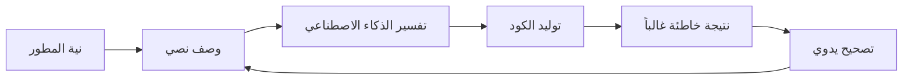

# Visual-to-Code Bridge

Visual-to-Code Bridge هو الميزة المميزة لـ Hatcher التي تُحدث ثورة في كيفية تفاعل المطورين مع مساعدي البرمجة بالذكاء الاصطناعي. بدلاً من وصف التغييرات بالنص، تتعامل مباشرة مع الواجهة المرئية لتطبيقك، ويترجم Hatcher إجراءاتك إلى تعديلات كود دقيقة.

## كيف يعمل

### المشكلة التقليدية



**مثال على الدورة المُحبطة:**

- المطور: "اجعل الرأس أزرق ووسطه"
- الذكاء الاصطناعي: يولد CSS يجعل العنصر الخطأ أزرق
- المطور: "لا، الرأس الرئيسي، وليس رأس الشريط الجانبي"
- الذكاء الاصطناعي: يجعله بلون أزرق خاطئ
- المطور: "اجعله #3B82F6 وزد حجم الخط أيضاً"
- ... وهكذا

### نهج Visual-to-Code في Hatcher: الأوضاع المزدوجة للجسر

يعمل Visual-to-Code Bridge بشكل مختلف اعتماداً على مهمة مشروعك، مما يوفر التوازن الصحيح بين الحرية والسيطرة.

**في وضع التوليد: الإنشاء بمساعدة الذكاء الاصطناعي**

في مشروع `Generative`، يعمل الجسر كنظام استهداف عالي الدقة للذكاء الاصطناعي. سير العمل هو:

1. **أنت تربط السياق:** انقر لتحديد عنصر.

2. **أنت توفر الأمر:** استخدم اللغة الطبيعية لوصف التغيير المطلوب.

3. **الذكاء الاصطناعي ينفذ:** يولد الكود اللازم، محصور في النطاق الذي حددته.

**في EGG: التعامل الحتمي**

في EGG (Enforced Governance Guardrails)، يصبح الجسر أداة تعامل مباشر حيث لا يُستخدم توليد كود الذكاء الاصطناعي للتغييرات المرئية. سير العمل حتمي بنسبة 100%:

1. **أنت تتعامل مباشرة:** اسحب أو قم بتغيير الحجم أو حرر الخصائص في لوحة مرئية.

2. **المحرك يلتقط الحدث:** يسجل Hatcher التغيير كتحديث منظم.

3. **يتم تحديث التكوين:** يُكتب التغيير إلى ملف تكوين المشروع، ولا يُولّد ككود مصدر جديد.

## الميزات الأساسية

### 1. تحديد العناصر

**نظام تحديد ذكي**

- انقر على أي عنصر لتحديده
- مرر الماوس لمعاينة حدود التحديد
- حدد عناصر متعددة لعمليات الدفعة
- التحديد الهرمي (طفل، أب، أشقاء)

```typescript
// مثال: تحديد زر
const selection = {
  element: 'button.submit-btn',
  properties: {
    position: { x: 120, y: 45 },
    dimensions: { width: 100, height: 36 },
    styles: {
      backgroundColor: '#3B82F6',
      borderRadius: '6px',
      fontSize: '14px',
    },
  },
  context: {
    parent: 'form.checkout-form',
    siblings: ['input.email', 'input.password'],
    framework: 'Vue 3',
    component: 'SubmitButton.vue',
  },
}
```

### 2. التعامل البصري

**تحرير الخصائص المباشر**

- اسحب العناصر إلى مواضع جديدة
- قم بتغيير الحجم بسحب الزوايا
- منتقي الألوان للخلفيات والنص
- عناصر تحكم الطباعة (الخط، الحجم، الوزن)
- عناصر تحكم المسافات (الهامش، الحشو)

**معاينة مباشرة**

- شاهد التغييرات فوراً في تطبيقك
- لا حاجة للتحديث أو إعادة البناء
- تكامل استبدال الوحدة الساخن
- تحديثات CSS في الوقت الفعلي

### 3. التعرف على النية

يحلل Hatcher تغييراتك المرئية ويفهم:

**تغييرات التخطيط**

- تعديلات الموضع (مطلق، نسبي، flex)
- تعديلات الحجم (العرض، الارتفاع، متجاوب)
- تغييرات المحاذاة (مركز، flex، grid)

**تغييرات الأنماط**

- تعديلات الألوان (hex، RGB، HSL، متغيرات CSS)
- تحديثات الطباعة (عائلة الخط، الحجم، الوزن، ارتفاع السطر)
- التأثيرات البصرية (الظلال، الحدود، التدرجات)

**تغييرات المكونات**

- تعديلات الخصائص
- تحديثات الحالة
- إضافات معالج الأحداث

### 4. توليد الكود

استناداً إلى نيتك المرئية، يولد Hatcher:

**كود خاص بالإطار**

```vue
<!-- مثال Vue 3 -->
<template>
  <button
    class="submit-btn"
    :style="{
      transform: `translate(${position.x}px, ${position.y}px)`,
      backgroundColor: '#3B82F6',
    }"
    @click="handleSubmit"
  >
    Submit
  </button>
</template>
```

**تحديثات CSS**

```css
.submit-btn {
  position: absolute;
  left: 120px;
  top: 45px;
  background-color: #3b82f6;
  width: 100px;
  height: 36px;
  border-radius: 6px;
  font-size: 14px;
}
```

**تكامل TypeScript**

```typescript
interface ButtonProps {
  position: { x: number; y: number }
  variant: 'primary' | 'secondary'
  size: 'sm' | 'md' | 'lg'
}
```

## القدرات المتقدمة

### 1. التصميم المستجيب

**تحرير متعدد نقاط الانقطاع**

- حرر أحجام الشاشات المختلفة في وقت واحد
- ولّد CSS متجاوب تلقائياً
- حافظ على اتساق التصميم عبر الأجهزة

```css
/* كود متجاوب مُولّد */
.submit-btn {
  /* Mobile */
  width: 100%;
  margin: 0 16px;
}

@media (min-width: 768px) {
  /* Tablet */
  .submit-btn {
    width: 200px;
    margin: 0 auto;
  }
}

@media (min-width: 1024px) {
  /* Desktop */
  .submit-btn {
    width: 150px;
    position: absolute;
    left: 120px;
  }
}
```

### 2. تغييرات مُدركة للمكونات

**اكتشاف المكونات الذكي**

- يتعرف على مكونات Vue و React و Svelte
- يفهم خصائص وحالة المكونات
- يحافظ على حدود المكونات

**مثال: تعديل مكون Vue**

```vue
<!-- قبل -->
<UserCard :user="currentUser" size="medium" />

<!-- بعد التعديل البصري -->
<UserCard
  :user="currentUser"
  size="large"
  :style="{ marginTop: '24px' }"
  show-avatar
/>
```

### 3. تكامل نظام التصميم

**استخدام الرموز التلقائي**

- يتعرف على رموز نظام التصميم
- يقترح القيم المناسبة
- يحافظ على الاتساق

```css
/* بدلاً من القيم التعسفية */
color: #3b82f6;
padding: 12px;

/* يستخدم رموز التصميم */
color: var(--color-primary-500);
padding: var(--spacing-3);
```

## أمثلة سير العمل

### مثال 1: تعديل التخطيط

**الهدف**: نقل الشريط الجانبي من الجانب الأيسر إلى الأيمن

1. **حدد**: انقر على مكون الشريط الجانبي
2. **اسحب**: اسحبه إلى الجانب الأيمن من الشاشة
3. **راجع**: شاهد تغييرات flex/grid المُولّدة
4. **طبّق**: اقبل تعديلات CSS

**الكود المُولّد**:

```css
.layout-container {
  display: flex;
  flex-direction: row; /* Changed from row-reverse */
}

.sidebar {
  order: 2; /* Changed from 1 */
  margin-left: auto; /* Added */
}
```

### مثال 2: تنسيق المكون

**الهدف**: تغيير مظهر الزر ليطابق التصميم

1. **حدد**: انقر على الزر
2. **نسّق**: استخدم منتقي الألوان، اضبط الحجم، عدّل الحدود
3. **معاينة**: شاهد التغييرات مباشرة في التطبيق
4. **ولّد**: احصل على تحديثات خصائص المكون

**الكود المُولّد**:

```vue
<script setup>
const buttonStyle = {
  variant: 'primary',
  size: 'lg',
  rounded: true,
}
</script>

<template>
  <AppButton v-bind="buttonStyle"> Submit Order </AppButton>
</template>
```

### مثال 3: تعديل متجاوب

**الهدف**: جعل الشبكة متجاوبة

1. **حدد**: اختر حاوية الشبكة
2. **قم بتغيير الحجم**: اضبط الأعمدة لنقاط انقطاع مختلفة
3. **اختبر**: معاينة على الهاتف المحمول/الجهاز اللوحي/سطح المكتب
4. **طبّق**: ولّد CSS Grid متجاوب

**الكود المُولّد**:

```css
.product-grid {
  display: grid;
  gap: 1rem;
  grid-template-columns: 1fr; /* Mobile */
}

@media (min-width: 640px) {
  .product-grid {
    grid-template-columns: repeat(2, 1fr); /* Tablet */
  }
}

@media (min-width: 1024px) {
  .product-grid {
    grid-template-columns: repeat(3, 1fr); /* Desktop */
  }
}
```

## التكامل مع محركات الذكاء الاصطناعي

يعمل Visual-to-Code Bridge بسلاسة مع محركات الذكاء الاصطناعي المدعومة:

### تكامل Claude Code

```typescript
const visualIntent = captureVisualChange(selection, modification)
const codeChange = await claudeCode.generateChange({
  intent: visualIntent,
  context: projectContext,
  playbook: teamPlaybook,
})
```

### تكامل Gemini CLI

```typescript
const prompt = buildVisualPrompt(visualIntent, codeContext)
const suggestion = await geminiCLI.complete(prompt)
const refinedCode = refineWithPlaybook(suggestion)
```

## أفضل الممارسات

### 1. ابدأ صغيراً

- قم بإجراء تغييرات مرئية تدريجية
- اختبر كل تعديل قبل الانتقال إلى التالي
- بناء تغييرات معقدة من خلال خطوات أصغر

### 2. استخدم Playbooks

- حدد أنماط المكونات في playbooks الخاصة بك
- أنشئ قواعد تنسيق متسقة
- وثّق أنماط التصميم الشائعة

### 3. راجع الكود المُولّد

- راجع دائماً اختلاف الكود قبل التطبيق
- تأكد من أن الكود المُولّد يتبع معاييرك
- حسّن المطالبات إذا لزم الأمر للحصول على نتائج أفضل

### 4. اختبر بدقة

- استخدم الاختبارات الآلية للتحقق من التغييرات
- تحقق من السلوك المتجاوب
- تحقق من الامتثال لإمكانية الوصول

---

يمثل Visual-to-Code Bridge تحولاً أساسياً في كيفية تفاعلنا مع الذكاء الاصطناعي للتطوير. من خلال القضاء على طبقة الترجمة بين النية والتنفيذ، فإنه يخلق تجربة تطوير أكثر بديهية ودقة وكفاءة.
