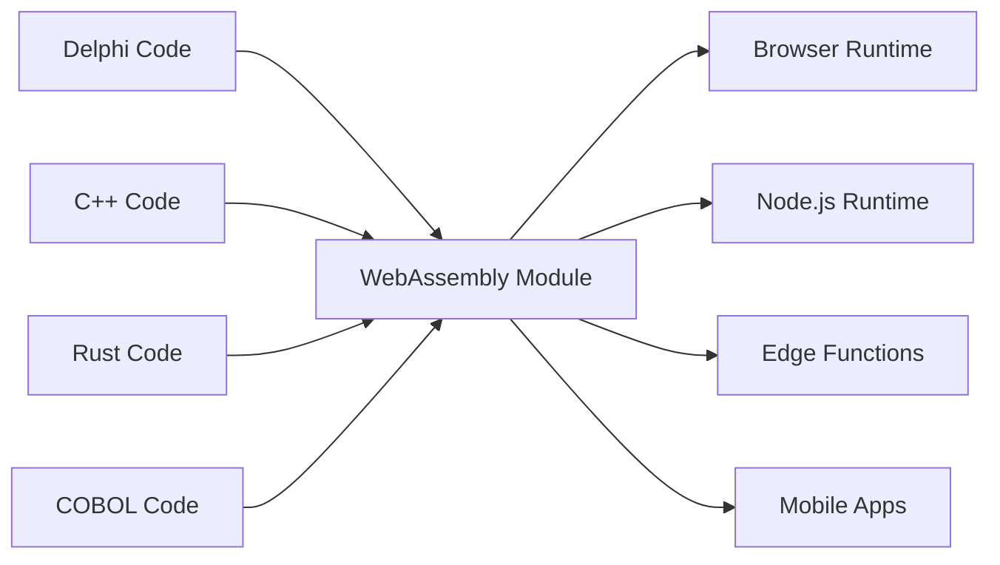

# The Universal Fabricator

"Making binaries for linux desktop applications is a major pain in the ass. You want to just compile one binary and have it work, preferably forever, and preferably across all the linux distributions." - Linus Torvalds, 2014

## Zwei Lügen, die wir nicht akzeptieren

### Die Legacy-Lüge: "Alles neu schreiben"

Linus' berühmter Rant über den Alptraum der Software-Distribution ist ein Symptom einer größeren, kostspieligeren Lüge, die sich die Softwareindustrie selbst erzählt: dass Legacy-Code technische Schuld ist und der einzige Weg zur Modernisierung darin besteht, jahrzehntelang bewährte Business-Logik wegzuwerfen und von vorne zu beginnen.

Das ist Wahnsinn. Dieser Delphi-, COBOL- oder C++-Code funktioniert. Er kodiert jahrelanges Geschäftswissen, behandelt Edge Cases und behebt Bugs. Ihn neu zu schreiben führt nicht nur Risiko ein – es zerstört unersetzliches institutionelles Wissen.

Der Universal Fabricator basiert auf einer einfachen, mächtigen Weigerung: **wir weigern uns zu akzeptieren, dass dies der einzige Weg ist**. Was wäre, wenn Sie Ihre Legacy-Logik überall ausführen könnten, ohne Neuschreibung? Nicht durch Übersetzung. Durch **universelle, deterministische Ausführung**.

### Das moderne Dilemma: "Geschwindigkeit oder Performance"

Aber es geht nicht nur um die Vergangenheit. Im modernen Zeitalter stehen wir vor einer neuen falschen Wahl: dem Dilemma zwischen Prototyping-Geschwindigkeit (TypeScript, Python) und Produktions-Performance (Rust, Go). Teams werden zu einer schmerzhaften Entscheidung gezwungen: beim langsamen Prototyp bleiben oder sich auf eine riskante, vollständige Neuschreibung für die Produktion einlassen.

Der Universal Fabricator lehnt auch diese Wahl ab. Er bietet eine Brücke – nicht nur von der Vergangenheit zur Gegenwart, sondern von der Gegenwart zu einer leistungsstärkeren Zukunft, ohne Ihre Entwicklungsgeschwindigkeit zu opfern.

> **Ihre Business-Logik braucht keine Neuschreibung. Sie braucht eine Renaissance.**

## Wie es funktioniert

Der Universal Fabricator manifestiert sich als Polyglot Hatcher Functions – Ihr Legacy-Code kompiliert zu WebAssembly – die sicher in einem Hatcher EGG verpackt und ausgeführt werden. Diese Architektur wird von drei Schlüsselkomponenten angetrieben:

### Die Magie von WebAssembly

WebAssembly (WASM) ist der Durchbruch, der dies möglich macht. Jede Sprache, die zu WASM kompilieren kann, kann überall laufen – Browser, Server, Edge, Mobile. Ihr Legacy-Code wird portabel, ohne eine einzige Zeile zu ändern.



### Hatcher Functions: Funktionen ohne Grenzen

Traditionelle Lambdas laufen in der Cloud. Unsere Hatcher Functions laufen überall:

```typescript
// Your 20-year-old Delphi tax calculation
const taxCalculator = await loadWASM('./legacy/tax-engine.wasm')

// Use it like a modern JavaScript function
const tax = await taxCalculator.calculateTax({
  income: 75000,
  deductions: 12000,
  state: 'NY',
})

// It runs at native speed, locally, with perfect accuracy
```

### Die EGGs-Architektur

EGGs (Enforced Governance Guardrails) sind die Container für Ihre universelle Logik:

```yaml
egg: payroll-processor
version: 2.1.0
engine: wasm

modules:
  - name: tax-calculator
    source: delphi
    binary: tax-engine.wasm
    interface: ./interfaces/tax.ts

  - name: compliance-checker
    source: cobol
    binary: compliance.wasm
    interface: ./interfaces/compliance.ts

  - name: optimization-engine
    source: cpp
    binary: optimizer.wasm
    interface: ./interfaces/optimizer.ts

orchestration:
  entry: orchestrate.js
  runtime: node
```

## Bewahren Sie Ihre Assets

### Das zweite Leben Ihres Codes

Diese Delphi-Anwendung von 2001? Sie wird:

- Ein Microservice in Ihrem Kubernetes-Cluster
- Eine Funktion in Ihrer React-App
- Ein Edge Worker für globale Verteilung
- Eine Bibliothek in Ihrer Python-Datenpipeline

Ohne den ursprünglichen Code zu ändern. Ohne die Business-Logik zu verlieren. Ohne das Risiko einer Neuschreibung.

### Beispiel: Die Banking-Revolution

```javascript
// Original: 30-year-old COBOL transaction processor
// Now: Modern web API

import { loadCOBOLModule } from '@hatcher/eggs'

const transactionProcessor = await loadCOBOLModule('./legacy/transactions.wasm')

// Modern Express.js API
app.post('/api/transfer', async (req, res) => {
  // Modern validation
  const validated = await validateRequest(req.body)

  // Legacy business logic (perfect accuracy)
  const result = await transactionProcessor.processTransfer({
    fromAccount: validated.from,
    toAccount: validated.to,
    amount: validated.amount,
  })

  // Modern response
  res.json({
    success: result.success,
    transactionId: result.id,
    timestamp: new Date().toISOString(),
  })
})
```

## Entwickeln Sie sich ohne Risiko

### Schrittweise Modernisierung

Sie müssen nicht alles auf einmal modernisieren:

```typescript
class HybridPayrollSystem {
  // Keep the complex calculation in Delphi
  private legacyCalculator = loadWASM('./legacy/payroll.wasm')

  // Add modern features in TypeScript
  async calculatePayroll(employee: Employee) {
    // Use legacy for core calculation
    const base = await this.legacyCalculator.calculate(employee)

    // Enhance with modern features
    const withBenefits = this.addModernBenefits(base)
    const withAnalytics = this.trackAnalytics(withBenefits)

    return withAnalytics
  }

  // New features in modern code
  private addModernBenefits(payroll: Payroll) {
    // Modern benefits calculation
  }
}
```

### Sprach-Interoperabilität

Verschiedene Sprachen für verschiedene Stärken:

```javascript
// Use each language for what it does best
const system = {
  // Rust for performance-critical
  imageProcessor: await loadWASM('./rust/image-processor.wasm'),

  // Delphi for business logic
  businessRules: await loadWASM('./delphi/rules-engine.wasm'),

  // C++ for algorithms
  optimizer: await loadWASM('./cpp/optimizer.wasm'),

  // JavaScript for orchestration
  async process(input) {
    const image = await this.imageProcessor.prepare(input.image)
    const rules = await this.businessRules.evaluate(input.data)
    const optimized = await this.optimizer.optimize(rules)

    return { image, result: optimized }
  },
}
```

## Optimieren Sie Ihre Zukunft: Von Prototyp zu Performance

Hatcher ist auch eine schrittweise Optimierungsplattform für moderne Anwendungen. Sie können Ihre gesamte Anwendung in TypeScript prototypisieren, um Product-Market-Fit zu finden, und dann chirurgisch Performance-Engpässe durch Hochleistungs-Rust- oder Go-Module ersetzen, ohne vollständige Neuschreibung.

### Optimieren Sie Ihre Zukunft: Der Transmutations-Workflow

Hatcher bietet einen revolutionären Workflow zur Entwicklung eines modernen Prototyps in eine Hochleistungsanwendung. Sie schreiben nicht neu; Sie transmutieren. Sie können Ihre gesamte Anwendung in TypeScript prototypisieren und dann AI als Partner nutzen, um kritische Logik sicher und systematisch auf Hochleistungssprachen wie Rust oder Go zu aktualisieren.

Dies ist das Alchemist's Playbook.

#### Schritt 1: Der Prototyp (TypeScript)

Sie beginnen mit funktionierendem, aber vielleicht "schmutzigem" oder langsamem TypeScript-Code.

```ts
// Your initial prototype for calculating user discounts.
// It works, but has complex logic and isn't fast enough.
function calculateDiscount(user, cart) {
  let discount = 0
  if (user.isVip) discount += 0.1
  if (cart.total > 100) discount += 0.05
  // ... many more complex and slow rules
  return Math.min(discount, 0.25) // cap discount
}
```

#### Schritt 2: AI-gestützte Spezifikation (Code → ACs)

Sie wählen die Funktion aus und befehlen Hatcher: "Beschreibe diese Logik als Acceptance Criteria." Die AI analysiert den Code und rekonstruiert die Geschäftsregeln.

```Gherkin
# AI-Generated Acceptance Criteria

Feature: User Discount Calculation

Scenario: VIP user with large cart
Given a user is a "VIP"
And the cart total is over 100
Then the final discount should be 15%

Scenario: Non-VIP user
Given a user is not a "VIP"
Then the discount is based only on cart total

Scenario: Discount Capping
When any combination of rules results in a discount over 25%
Then the final discount must be capped at 25%
```

#### **Schritt 3: Menschliche Verfeinerung (Der Kontrollpunkt)**

Jetzt überprüfen und verbessern Sie, der Entwickler, diese ACs in einfachem Englisch. Sie erfassen einen Edge Case, den die AI übersehen hat, und fügen ein neues Szenario hinzu. Dies ist Ihr Kontrollpunkt.

#### Schritt 4: Test-gesteuerte Generierung (ACs → Tests → Code)

Mit den von Menschen genehmigten ACs als Vertrag befehlen Sie Hatcher: "Generiere Rust-Code und Unit-Tests, um diese Kriterien zu erfüllen."

1. Hatcher generiert zuerst die Tests in Rust, die direkt die ACs widerspiegeln.

2. Dann generiert es den Rust-Code, der diese Tests bestehen lässt.

```rust
// The final, high-performance Rust code, guaranteed by tests
// to match the human-approved business logic.
pub fn calculate_discount(user: &User, cart: &Cart) -> f64 {
    // Blazingly fast, safe Rust logic...
}
```

#### Schritt 5: Das lebende Artefakt

Die finale Ausgabe ist nicht nur das kompilierte .wasm-Modul. Es ist das Modul **gepaart mit seiner menschenlesbaren Spezifikation**. Die ACs werden neben dem Lambda bewahrt und schaffen lebende Dokumentation für zukünftige Wartung und Evolution.

Dies ist der Traum des Alchemisten: ein sicherer, strukturierter Prozess zur Transmutation eines Prototyps in eine Hochleistungsanwendung, ohne Risiko und mit perfekter Klarheit.

## Führen Sie mit Vertrauen aus

### Der WASM-Reinraum

Jedes WASM-Modul läuft in einer Sandbox:

```typescript
interface WASMSandbox {
  memory: {
    limit: '100MB'
    shared: false
  }

  cpu: {
    timeout: '5s'
    priority: 'normal'
  }

  io: {
    filesystem: 'none'
    network: 'none'
    system: 'none'
  }
}
```

Ihr Legacy-Code kann nicht:

- Auf das Dateisystem zugreifen (es sei denn, ausdrücklich gewährt)
- Netzwerkaufrufe tätigen (es sei denn, ausdrücklich gewährt)
- Den Host-Prozess zum Absturz bringen
- Speicher lecken
- Andere Module stören

### Typsichere Schnittstellen

Generieren Sie TypeScript-Schnittstellen aus Ihrem Legacy-Code:

```typescript
// Auto-generated from Delphi function signatures
export interface TaxEngine {
  calculateFederalTax(income: number, deductions: number): Promise<number>
  calculateStateTax(income: number, state: string): Promise<number>
  getDeductionLimit(filingStatus: FilingStatus): Promise<number>
}

// Type-safe usage
const engine: TaxEngine = await loadWASM('./tax-engine.wasm')
const tax = await engine.calculateFederalTax(100000, 12000) // Type-checked!
```

## Bewährt im Schützengraben

### Szenario 1: Der Versicherungsriese

Eine 40 Jahre alte Versicherungsgesellschaft mit Millionen Zeilen COBOL:

```yaml
before:
  problem: 'COBOL mainframe costs $2M/year'
  solution: '5-year, $50M rewrite project (failed twice)'

after:
  solution: 'Compile COBOL to WASM'
  timeline: '3 months'
  result:
    - Run on commodity hardware
    - Scale horizontally
    - Keep all business logic
    - Modern API layer
  savings: '$1.8M/year'
```

### Szenario 2: Die Handelsgesellschaft

Hochfrequenz-Handelsalgorithmen in C++:

```javascript
// Original: C++ running on specialized hardware
// Now: Same C++ running everywhere

const tradingEngine = await loadWASM('./trading/algorithm.wasm')

// Deploy to edge locations globally
const edgeLocations = ['nyc', 'london', 'tokyo', 'singapore']

for (const location of edgeLocations) {
  deployToEdge(location, tradingEngine)
  // Same algorithm, microsecond latency, global distribution
}
```

### Szenario 3: Das Fertigungssystem

Eingebetteter C-Code von Industriesteuerungen:

```typescript
// 30-year-old C code from manufacturing equipment
const controller = await loadWASM('./embedded/controller.wasm')

// Now it powers a modern web dashboard
const Dashboard = () => {
  const [status, setStatus] = useState()

  useEffect(() => {
    const interval = setInterval(async () => {
      const data = await controller.getSystemStatus()
      setStatus(data)
    }, 1000)

    return () => clearInterval(interval)
  }, [])

  return <ModernUIComponent data={status} />
}
```

### Szenario 4: Das AI-Startup

Ein schnell bewegendes Startup prototypisiert ihre Datenverarbeitungspipeline in Python.

```yaml
before:
  problem: 'Python prototype is too slow for production customers.'
  solution: "Plan a 6-month 'rewrite it in Go' project, pausing all feature development."
after:
  solution: 'Identify and rewrite 3 critical functions in Rust with Hatcher.'
  timeline: '2 weeks.'
  result:
    - 90% of the codebase remains in easy-to-iterate Python.
    - Critical path is now 120x faster.
    - Shipped to production customers next month.
    - Rewrite project cancelled.
```

## Erste Schritte

### Schritt 1: Identifizieren Sie Ihre Logik

Welche Business-Logik ist in Legacy-Code gefangen?

- Berechnungs-Engines
- Geschäftsregeln
- Validierungslogik
- Verarbeitungsalgorithmen

### Schritt 2: Zu WASM kompilieren

Die meisten Sprachen unterstützen jetzt WASM-Kompilierung:

```bash
# Delphi
delphi2wasm your-code.pas -o output.wasm

# C/C++
emcc your-code.cpp -o output.wasm

# COBOL
cobol2wasm your-code.cob -o output.wasm

# Rust
cargo build --target wasm32-unknown-unknown
```

### Schritt 3: Schnittstellen erstellen

Definieren Sie, wie moderner Code interagieren wird:

```typescript
// Define the interface
interface LegacyModule {
  initialize(): Promise<void>
  process(input: Input): Promise<Output>
  cleanup(): Promise<void>
}
```

### Schritt 4: Integrieren

Verwenden Sie Ihre Legacy-Logik in modernen Anwendungen:

```javascript
const legacy = await loadWASM('./legacy.wasm')
// Your 30-year-old code is now a modern module
```

## Die Philosophie

Der Universal Fabricator verkörpert eine grundlegende Überzeugung: **Code ist ein Asset, keine Verbindlichkeit**. Jede Zeile funktionierender Code repräsentiert gelöste Probleme, behandelte Edge Cases und eingebettetes Wissen. Das Alter des Codes mindert seinen Wert nicht – es beweist ihn.

Wir werfen Bücher nicht weg, weil sie alt sind. Wir reißen Gebäude nicht ab, weil sie mit anderen Werkzeugen gebaut wurden. Warum bestehen wir darauf, Code neu zu schreiben, der funktioniert?

Der Universal Fabricator ist Bewahrung durch Fortschritt. Es ist Modernisierung ohne Zerstörung. Es ist die Brücke zwischen dem, was gebaut wurde, und dem, was gebaut werden muss.

---

_Der Universal Fabricator führt nicht nur Ihren Legacy-Code aus – er befreit ihn. Ihre Business-Logik, befreit aus dem Gefängnis veralteter Laufzeiten, wird wirklich universell. Einmal schreiben, für immer laufen, überall._

<PageCTA
  title="Befreien Sie Ihren Legacy-Code"
  subtitle="Verwandeln Sie Jahrzehnte von Business-Logik in moderne, universelle Module"
  buttonText="Erkunden Sie den Fabricator"
  buttonLink="/de/features-universal-fabricator"
  buttonStyle="secondary"
  footer="Ihr Code ist ein Asset, keine Verbindlichkeit. Bewahren Sie ihn. Modernisieren Sie ihn."
/>
