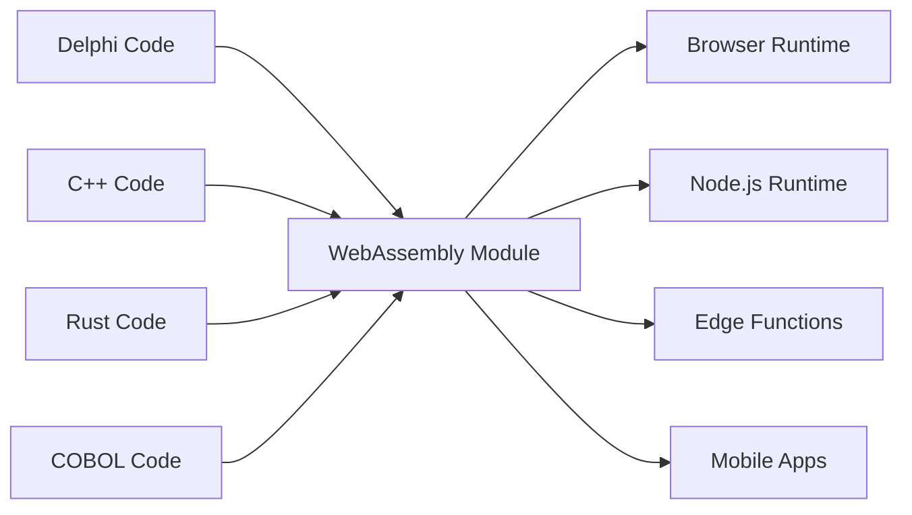

# The Universal Fabricator

"Making binaries for linux desktop applications is a major pain in the ass. You want to just compile one binary and have it work, preferably forever, and preferably across all the linux distributions." - Linus Torvalds, 2014

## دو دروغی که قبول نمی‌کنیم

### دروغ قدیمی: "همه چیز را بازنویسی کنید"

شکایت معروف لینوس درباره کابوس توزیع نرم‌افزار علامتی از دروغ بزرگتر و پرهزینه‌تری است که صنعت نرم‌افزار به خود می‌گوید: کد قدیمی بدهی فنی است و تنها راه نوسازی، دور انداختن دهه‌ها منطق کسب‌وکار آزمایش‌شده در نبرد و شروع از صفر است.

این جنون است. آن کد Delphi، COBOL یا C++ کار می‌کند. سال‌ها دانش کسب‌وکار را کدگذاری می‌کند، حالات لبه را مدیریت کرده و باگ‌ها را رفع کرده است. بازنویسی آن فقط ریسک معرفی نمی‌کند—دانش سازمانی جایگزین‌ناپذیر را نابود می‌کند.

Universal Fabricator بر یک رد ساده و قدرتمند تأسیس شده است: **ما قبول نمی‌کنیم که این تنها راه است**. اگر بتوانید منطق قدیمی خود را در هر جا بدون بازنویسی اجرا کنید چه؟ نه از طریق ترجمه. از طریق **اجرای جهانی و قطعی**.

### معضل مدرن: "سرعت یا عملکرد"

اما این فقط درباره گذشته نیست. در دوران مدرن، با یک انتخاب دروغین جدید روبرو هستیم: معضل بین سرعت نمونه‌سازی (TypeScript، Python) و عملکرد تولید (Rust، Go). تیم‌ها مجبورند یک تصمیم دردناک بگیرند: با نمونه کند بمانند یا برای تولید یک بازنویسی پرخطر و کامل را آغاز کنند.

Universal Fabricator این انتخاب را نیز رد می‌کند. پلی فراهم می‌کند—نه فقط از گذشته به حال، بلکه از حال به آینده با عملکرد بالاتر، بدون قربانی کردن سرعت توسعه شما.

> **منطق کسب‌وکار شما به بازنویسی نیاز ندارد. به رنسانس نیاز دارد.**

## چگونه کار می‌کند

Universal Fabricator به عنوان Hatcher Functions Polyglot ظاهر می‌شود—کد قدیمی شما کامپایل‌شده به WebAssembly—که به طور امن بسته‌بندی شده و در یک Hatcher EGG اجرا می‌شود. این معماری توسط سه کامپوننت کلیدی تقویت می‌شود:

### جادوی WebAssembly

WebAssembly (WASM) پیشرفتی است که این را ممکن می‌سازد. هر زبانی که بتواند به WASM کامپایل شود می‌تواند در هر جا اجرا شود—مرورگر، سرور، edge، موبایل. کد قدیمی شما بدون تغییر یک خط قابل حمل می‌شود.



### Hatcher Functions: توابع بدون مرز

lambdaهای سنتی در کلود اجرا می‌شوند. Hatcher Functions ما در همه جا اجرا می‌شوند:

```typescript
// محاسبه مالیاتی Delphi 20 ساله شما
const taxCalculator = await loadWASM('./legacy/tax-engine.wasm')

// مانند یک تابع JavaScript مدرن از آن استفاده کنید
const tax = await taxCalculator.calculateTax({
  income: 75000,
  deductions: 12000,
  state: 'NY',
})

// با سرعت بومی، به صورت محلی، با دقت کامل اجرا می‌شود
```

### معماری EGGs

EGGs (Enforced Governance Guardrails) ظروفی برای منطق جهانی شما هستند:

```yaml
egg: payroll-processor
version: 2.1.0
engine: wasm

modules:
  - name: tax-calculator
    source: delphi
    binary: tax-engine.wasm
    interface: ./interfaces/tax.ts

  - name: compliance-checker
    source: cobol
    binary: compliance.wasm
    interface: ./interfaces/compliance.ts

  - name: optimization-engine
    source: cpp
    binary: optimizer.wasm
    interface: ./interfaces/optimizer.ts

orchestration:
  entry: orchestrate.js
  runtime: node
```

## دارایی‌های خود را حفظ کنید

### زندگی دوم کد شما

آن برنامه Delphi از 2001؟ تبدیل می‌شود به:

- یک microservice در کلاستر Kubernetes شما
- یک تابع در برنامه React شما
- یک edge worker برای توزیع جهانی
- یک کتابخانه در pipeline داده Python شما

بدون تغییر کد اصلی. بدون از دست دادن منطق کسب‌وکار. بدون ریسک بازنویسی.

### مثال: انقلاب بانکی

```javascript
// اصلی: پردازشگر تراکنش COBOL 30 ساله
// اکنون: API وب مدرن

import { loadCOBOLModule } from '@hatcher/eggs'

const transactionProcessor = await loadCOBOLModule('./legacy/transactions.wasm')

// API Express.js مدرن
app.post('/api/transfer', async (req, res) => {
  // اعتبارسنجی مدرن
  const validated = await validateRequest(req.body)

  // منطق کسب‌وکار قدیمی (دقت کامل)
  const result = await transactionProcessor.processTransfer({
    fromAccount: validated.from,
    toAccount: validated.to,
    amount: validated.amount,
  })

  // پاسخ مدرن
  res.json({
    success: result.success,
    transactionId: result.id,
    timestamp: new Date().toISOString(),
  })
})
```

## بدون ریسک تکامل یابید

### نوسازی تدریجی

نیازی نیست همه چیز را به یکباره نوسازی کنید:

```typescript
class HybridPayrollSystem {
  // محاسبه پیچیده را در Delphi نگه دارید
  private legacyCalculator = loadWASM('./legacy/payroll.wasm')

  // ویژگی‌های مدرن را در TypeScript اضافه کنید
  async calculatePayroll(employee: Employee) {
    // از قدیمی برای محاسبه اصلی استفاده کنید
    const base = await this.legacyCalculator.calculate(employee)

    // با ویژگی‌های مدرن بهبود دهید
    const withBenefits = this.addModernBenefits(base)
    const withAnalytics = this.trackAnalytics(withBenefits)

    return withAnalytics
  }

  // ویژگی‌های جدید در کد مدرن
  private addModernBenefits(payroll: Payroll) {
    // محاسبه مزایای مدرن
  }
}
```

### قابلیت همکاری زبان

زبان‌های مختلف برای نقاط قوت مختلف:

```javascript
// از هر زبان برای آنچه بهترین است استفاده کنید
const system = {
  // Rust برای حیاتی عملکرد
  imageProcessor: await loadWASM('./rust/image-processor.wasm'),

  // Delphi برای منطق کسب‌وکار
  businessRules: await loadWASM('./delphi/rules-engine.wasm'),

  // C++ برای الگوریتم‌ها
  optimizer: await loadWASM('./cpp/optimizer.wasm'),

  // JavaScript برای هماهنگی
  async process(input) {
    const image = await this.imageProcessor.prepare(input.image)
    const rules = await this.businessRules.evaluate(input.data)
    const optimized = await this.optimizer.optimize(rules)

    return { image, result: optimized }
  },
}
```

## آینده خود را بهینه کنید: از نمونه به عملکرد

Hatcher همچنین یک پلتفرم بهینه‌سازی تدریجی برای برنامه‌های مدرن است. می‌توانید کل برنامه خود را در TypeScript نمونه‌سازی کنید تا product-market fit پیدا کنید، سپس به طور جراحی گلوگاه‌های عملکرد را با ماژول‌های Rust یا Go با کارایی بالا جایگزین کنید بدون بازنویسی کامل.

### گردش کار تبدیل: The Alchemist's Playbook

Hatcher یک گردش کار انقلابی برای تکامل نمونه مدرن به برنامه با کارایی بالا فراهم می‌کند. شما بازنویسی نمی‌کنید؛ تبدیل می‌کنید. می‌توانید کل برنامه خود را در TypeScript نمونه‌سازی کنید، سپس از هوش مصنوعی به عنوان شریک برای ارتقای ایمن و سیستماتیک منطق حیاتی به زبان‌های با کارایی بالا مانند Rust یا Go استفاده کنید.

#### مرحله 1: نمونه (TypeScript)

با کد TypeScript کار، اما شاید "کثیف" یا کند، شروع می‌کنید.

```ts
// نمونه اولیه شما برای محاسبه تخفیف کاربر.
// کار می‌کند، اما منطق پیچیده دارد و به اندازه کافی سریع نیست.
function calculateDiscount(user, cart) {
  let discount = 0
  if (user.isVip) discount += 0.1
  if (cart.total > 100) discount += 0.05
  // ... قوانین پیچیده و کند بیشتر
  return Math.min(discount, 0.25) // محدودیت تخفیف
}
```

#### مرحله 2: مشخصات تولیدشده با هوش مصنوعی (کد → ACها)

تابع را انتخاب کنید و به Hatcher فرمان دهید: "این منطق را به عنوان معیارهای پذیرش شرح دهید." هوش مصنوعی کد را تجزیه‌وتحلیل کرده و قوانین کسب‌وکار را معکوس‌سازی می‌کند.

```Gherkin
# معیارهای پذیرش تولیدشده با هوش مصنوعی

Feature: User Discount Calculation

Scenario: VIP user with large cart
Given a user is a "VIP"
And the cart total is over 100
Then the final discount should be 15%

Scenario: Non-VIP user
Given a user is not a "VIP"
Then the discount is based only on cart total

Scenario: Discount Capping
When any combination of rules results in a discount over 25%
Then the final discount must be capped at 25%
```

#### مرحله 3: بهبود انسانی (نقطه کنترل)

اکنون، شما، توسعه‌دهنده، این ACها را به زبان ساده بررسی و بهبود می‌دهید. یک حالت لبه که هوش مصنوعی از دست داده را می‌گیرید و سناریوی جدیدی اضافه می‌کنید. این نقطه کنترل شماست.

#### مرحله 4: تولید تست-محور (ACها → تست‌ها → کد)

با ACهای تأییدشده توسط انسان به عنوان قرارداد، به Hatcher فرمان می‌دهید: "کد Rust و تست‌های واحد تولید کنید تا این معیارها را برآورده کنند."

1. Hatcher ابتدا تست‌ها را در Rust تولید می‌کند، که مستقیماً ACها را منعکس می‌کنند.

2. سپس، کد Rust را تولید می‌کند که آن تست‌ها را پاس می‌کند.

```rust
// کد نهایی Rust با کارایی بالا، که توسط تست‌ها تضمین شده
// با منطق کسب‌وکار تأییدشده توسط انسان مطابقت دارد.
pub fn calculate_discount(user: &User, cart: &Cart) -> f64 {
    // منطق Rust بسیار سریع و ایمن...
}
```

#### مرحله 5: مصنوع زنده

خروجی نهایی فقط ماژول .wasm کامپایل‌شده نیست. ماژول **همراه با مشخصات قابل خواندن توسط انسان** است. ACها در کنار lambda حفظ می‌شوند و مستندات زنده برای نگهداری و تکامل آینده ایجاد می‌کنند.

این رؤیای کیمیاگر است: یک فرآیند ایمن و ساختاریافته برای تبدیل نمونه به برنامه با کارایی بالا، بدون ریسک، و با وضوح کامل.

## با اطمینان اجرا کنید

### اتاق تمیز WASM

هر ماژول WASM در یک sandbox اجرا می‌شود:

```typescript
interface WASMSandbox {
  memory: {
    limit: '100MB'
    shared: false
  }

  cpu: {
    timeout: '5s'
    priority: 'normal'
  }

  io: {
    filesystem: 'none'
    network: 'none'
    system: 'none'
  }
}
```

کد قدیمی شما نمی‌تواند:

- به فایل‌سیستم دسترسی داشته باشد (مگر صراحتاً داده شود)
- تماس‌های شبکه برقرار کند (مگر صراحتاً داده شود)
- فرآیند میزبان را خراب کند
- حافظه نشت کند
- با ماژول‌های دیگر تداخل کند

### رابط‌های Type-Safe

رابط‌های TypeScript را از کد قدیمی خود تولید کنید:

```typescript
// خودکار تولیدشده از امضاهای تابع Delphi
export interface TaxEngine {
  calculateFederalTax(income: number, deductions: number): Promise<number>
  calculateStateTax(income: number, state: string): Promise<number>
  getDeductionLimit(filingStatus: FilingStatus): Promise<number>
}

// استفاده type-safe
const engine: TaxEngine = await loadWASM('./tax-engine.wasm')
const tax = await engine.calculateFederalTax(100000, 12000) // بررسی نوع!
```

## اثبات‌شده در سنگرها

### سناریو 1: غول بیمه

یک شرکت بیمه 40 ساله با میلیون‌ها خط COBOL:

```yaml
قبل:
  problem: 'COBOL mainframe costs $2M/year'
  solution: '5-year, $50M rewrite project (failed twice)'

بعد:
  solution: 'Compile COBOL to WASM'
  timeline: '3 months'
  result:
    - اجرا روی سخت‌افزار معمولی
    - مقیاس افقی
    - حفظ تمام منطق کسب‌وکار
    - لایه API مدرن
  savings: '$1.8M/year'
```

### سناریو 2: شرکت معاملات

الگوریتم‌های معاملات با فرکانس بالا در C++:

```javascript
// اصلی: C++ روی سخت‌افزار تخصصی
// اکنون: همان C++ در همه جا

const tradingEngine = await loadWASM('./trading/algorithm.wasm')

// به مکان‌های edge به صورت جهانی مستقر کنید
const edgeLocations = ['nyc', 'london', 'tokyo', 'singapore']

for (const location of edgeLocations) {
  deployToEdge(location, tradingEngine)
  // همان الگوریتم، تأخیر میکروثانیه‌ای، توزیع جهانی
}
```

### سناریو 3: سیستم تولیدی

کد C embedded از کنترل‌کننده‌های صنعتی:

```typescript
// کد C 30 ساله از تجهیزات تولیدی
const controller = await loadWASM('./embedded/controller.wasm')

// اکنون یک داشبورد وب مدرن را تقویت می‌کند
const Dashboard = () => {
  const [status, setStatus] = useState()

  useEffect(() => {
    const interval = setInterval(async () => {
      const data = await controller.getSystemStatus()
      setStatus(data)
    }, 1000)

    return () => clearInterval(interval)
  }, [])

  return <ModernUIComponent data={status} />
}
```

### سناریو 4: استارتاپ هوش مصنوعی

یک استارتاپ سریع‌حرکت pipeline پردازش داده خود را در Python نمونه‌سازی می‌کند.

```yaml
قبل:
  problem: 'نمونه Python برای مشتریان تولید خیلی کند است.'
  solution: "برنامه‌ریزی یک پروژه 6 ماهه 'بازنویسی در Go'، توقف تمام توسعه ویژگی."
بعد:
  solution: 'شناسایی و بازنویسی 3 تابع حیاتی در Rust با Hatcher.'
  timeline: '2 هفته.'
  result:
    - 90% از codebase در Python قابل تکرار آسان باقی می‌ماند.
    - مسیر حیاتی اکنون 120 برابر سریع‌تر است.
    - برای مشتریان تولید ماه بعد ارسال شد.
    - پروژه بازنویسی لغو شد.
```

## شروع

### مرحله 1: منطق خود را شناسایی کنید

چه منطق کسب‌وکاری در کد قدیمی گیر افتاده؟

- موتورهای محاسبه
- قوانین کسب‌وکار
- منطق اعتبارسنجی
- الگوریتم‌های پردازش

### مرحله 2: کامپایل به WASM

اکثر زبان‌ها اکنون از کامپایل WASM پشتیبانی می‌کنند:

```bash
# Delphi
delphi2wasm your-code.pas -o output.wasm

# C/C++
emcc your-code.cpp -o output.wasm

# COBOL
cobol2wasm your-code.cob -o output.wasm

# Rust
cargo build --target wasm32-unknown-unknown
```

### مرحله 3: رابط‌ها بسازید

تعریف کنید کد مدرن چگونه تعامل خواهد کرد:

```typescript
// رابط را تعریف کنید
interface LegacyModule {
  initialize(): Promise<void>
  process(input: Input): Promise<Output>
  cleanup(): Promise<void>
}
```

### مرحله 4: یکپارچه کنید

از منطق قدیمی خود در برنامه‌های مدرن استفاده کنید:

```javascript
const legacy = await loadWASM('./legacy.wasm')
// کد 30 ساله شما اکنون یک ماژول مدرن است
```

## فلسفه

Universal Fabricator یک باور اساسی را تجسم می‌کند: **کد یک دارایی است، نه یک بدهی**. هر خط کد کار نشان‌دهنده مسائل حل‌شده، حالات لبه مدیریت‌شده و دانش embedded است. سن کد ارزش آن را کاهش نمی‌دهد—آن را اثبات می‌کند.

ما کتاب‌ها را فقط به این دلیل که قدیمی هستند دور نمی‌اندازیم. ساختمان‌ها را فقط به این دلیل که با ابزارهای مختلف ساخته شده‌اند، تخریب نمی‌کنیم. چرا اصرار داریم کدی که کار می‌کند را بازنویسی کنیم؟

Universal Fabricator حفظ از طریق پیشرفت است. نوسازی بدون تخریب است. پل بین آنچه ساخته شده و آنچه باید ساخته شود است.

---

_Universal Fabricator فقط کد قدیمی شما را اجرا نمی‌کند—آن را آزاد می‌کند. منطق کسب‌وکار شما، آزاد شده از زندان runtimeهای منسوخ، واقعاً جهانی می‌شود. یک بار بنویسید، برای همیشه، در همه جا اجرا کنید._

<PageCTA
  title="کد قدیمی خود را آزاد کنید"
  subtitle="دهه‌ها منطق کسب‌وکار را به ماژول‌های مدرن و جهانی تبدیل کنید"
  buttonText="Fabricator را کاوش کنید"
  buttonLink="/fa/features-universal-fabricator"
  buttonStyle="secondary"
  footer="کد شما یک دارایی است، نه یک بدهی. آن را حفظ کنید. نوسازی کنید."
/>
