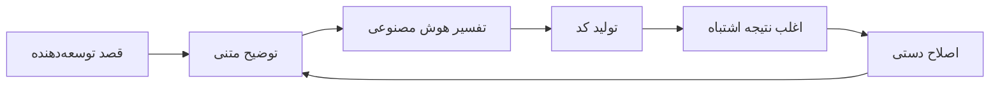

# پل Visual-to-Code

پل Visual-to-Code ویژگی امضای Hatcher است که نحوه تعامل توسعه‌دهندگان با دستیارهای کدنویسی هوش مصنوعی را متحول می‌کند. به جای توصیف تغییرات در متن، مستقیماً رابط بصری برنامه خود را دستکاری می‌کنید و Hatcher اقدامات شما را به تغییرات کد دقیق ترجمه می‌کند.

## چگونه کار می‌کند

### مشکل سنتی



**مثال چرخه ناامید‌کننده:**

- توسعه‌دهنده: "Make the header blue and center it"
- هوش مصنوعی: CSS تولید می‌کند که عنصر اشتباه را آبی می‌کند
- توسعه‌دهنده: "No, the main header, not the sidebar header"
- هوش مصنوعی: سایه اشتباه آبی را می‌سازد
- توسعه‌دهنده: "Make it #3B82F6 and also increase the font size"
- ... و همین‌طور ادامه دارد

### رویکرد Visual-to-Code Hatcher: حالت‌های دوگانه پل

پل Visual-to-Code بسته به ماموریت پروژه شما متفاوت عمل می‌کند و تعادل مناسب آزادی و کنترل را فراهم می‌کند.

**در حالت Generative: ایجاد کمک‌شده با هوش مصنوعی**

در یک پروژه `Generative`، پل به عنوان یک سیستم هدف‌یابی با دقت بالا برای هوش مصنوعی عمل می‌کند. گردش کار:

1. **زمینه را لنگر می‌اندازید:** برای انتخاب یک عنصر کلیک کنید.

2. **فرمان را ارائه می‌دهید:** از زبان طبیعی برای توصیف تغییر مورد نظر استفاده کنید.

3. **هوش مصنوعی اجرا می‌کند:** کد لازم را تولید می‌کند، محدود به دامنه‌ای که تعریف کردید.

**در یک EGG: دستکاری قطعی**

در یک EGG (Enforced Governance Guardrails)، پل به ابزار دستکاری مستقیم تبدیل می‌شود که تولید کد هوش مصنوعی برای تغییرات بصری استفاده نمی‌شود. گردش کار 100% قطعی است:

1. **مستقیماً دستکاری می‌کنید:** درگ، تغییر اندازه یا ویرایش ویژگی‌ها در یک پانل بصری.

2. **موتور رویداد را ضبط می‌کند:** Hatcher تغییر را به عنوان یک به‌روزرسانی ساختاریافته ثبت می‌کند.

3. **پیکربندی به‌روزرسانی می‌شود:** تغییر به فایل پیکربندی پروژه نوشته می‌شود، نه به عنوان کد منبع جدید تولید شده.

## ویژگی‌های اصلی

### 1. انتخاب عنصر

**سیستم انتخاب هوشمند**

- روی هر عنصر برای انتخاب آن کلیک کنید
- نگه دارید برای پیش‌نمایش مرزهای انتخاب
- عناصر متعدد را برای عملیات دسته‌ای انتخاب کنید
- انتخاب سلسله‌مراتبی (فرزند، والد، خواهر و برادرها)

```typescript
// مثال: انتخاب یک دکمه
const selection = {
  element: 'button.submit-btn',
  properties: {
    position: { x: 120, y: 45 },
    dimensions: { width: 100, height: 36 },
    styles: {
      backgroundColor: '#3B82F6',
      borderRadius: '6px',
      fontSize: '14px',
    },
  },
  context: {
    parent: 'form.checkout-form',
    siblings: ['input.email', 'input.password'],
    framework: 'Vue 3',
    component: 'SubmitButton.vue',
  },
}
```

### 2. دستکاری بصری

**ویرایش مستقیم ویژگی**

- عناصر را به موقعیت‌های جدید بکشید
- با کشیدن گوشه‌ها اندازه تغییر دهید
- انتخابگر رنگ برای پس‌زمینه و متن
- کنترل‌های تایپوگرافی (فونت، اندازه، وزن)
- کنترل‌های فاصله (margin، padding)

**پیش‌نمایش زنده**

- تغییرات را فوراً در برنامه خود ببینید
- نیازی به refresh یا rebuild نیست
- یکپارچه‌سازی hot module replacement
- به‌روزرسانی‌های CSS لحظه‌ای

### 3. تشخیص قصد

Hatcher تغییرات بصری شما را تجزیه‌وتحلیل می‌کند و درک می‌کند:

**تغییرات چیدمان**

- تغییرات موقعیت (absolute، relative، flex)
- تنظیمات اندازه (width، height، responsive)
- تغییرات همترازی (center، flex، grid)

**تغییرات استایل**

- تغییرات رنگ (hex، RGB، HSL، متغیرهای CSS)
- به‌روزرسانی‌های تایپوگرافی (خانواده فونت، اندازه، وزن، ارتفاع خط)
- افکت‌های بصری (سایه‌ها، حاشیه‌ها، گرادیان‌ها)

**تغییرات کامپوننت**

- تغییرات props
- به‌روزرسانی‌های state
- افزودن event handler

### 4. تولید کد

بر اساس قصد بصری شما، Hatcher تولید می‌کند:

**کد خاص Framework**

```vue
<!-- مثال Vue 3 -->
<template>
  <button
    class="submit-btn"
    :style="{
      transform: `translate(${position.x}px, ${position.y}px)`,
      backgroundColor: '#3B82F6',
    }"
    @click="handleSubmit"
  >
    Submit
  </button>
</template>
```

**به‌روزرسانی‌های CSS**

```css
.submit-btn {
  position: absolute;
  left: 120px;
  top: 45px;
  background-color: #3b82f6;
  width: 100px;
  height: 36px;
  border-radius: 6px;
  font-size: 14px;
}
```

**یکپارچه‌سازی TypeScript**

```typescript
interface ButtonProps {
  position: { x: number; y: number }
  variant: 'primary' | 'secondary'
  size: 'sm' | 'md' | 'lg'
}
```

## قابلیت‌های پیشرفته

### 1. طراحی Responsive

**ویرایش چندنقطه‌شکست**

- اندازه‌های مختلف صفحه را به طور همزمان ویرایش کنید
- به طور خودکار CSS responsive تولید کنید
- سازگاری طراحی را در دستگاه‌ها حفظ کنید

```css
/* کد responsive تولیدشده */
.submit-btn {
  /* موبایل */
  width: 100%;
  margin: 0 16px;
}

@media (min-width: 768px) {
  /* تبلت */
  .submit-btn {
    width: 200px;
    margin: 0 auto;
  }
}

@media (min-width: 1024px) {
  /* دسکتاپ */
  .submit-btn {
    width: 150px;
    position: absolute;
    left: 120px;
  }
}
```

### 2. تغییرات آگاه به کامپوننت

**تشخیص هوشمند کامپوننت**

- کامپوننت‌های Vue، React، Svelte را تشخیص می‌دهد
- props و state کامپوننت را درک می‌کند
- مرزهای کامپوننت را حفظ می‌کند

**مثال: تغییر یک کامپوننت Vue**

```vue
<!-- قبل -->
<UserCard :user="currentUser" size="medium" />

<!-- بعد از تغییر بصری -->
<UserCard
  :user="currentUser"
  size="large"
  :style="{ marginTop: '24px' }"
  show-avatar
/>
```

### 3. یکپارچه‌سازی سیستم طراحی

**استفاده خودکار از Token**

- tokenهای سیستم طراحی را تشخیص می‌دهد
- مقادیر مناسب را پیشنهاد می‌کند
- سازگاری را حفظ می‌کند

```css
/* به جای مقادیر دلخواه */
color: #3b82f6;
padding: 12px;

/* از tokenهای طراحی استفاده می‌کند */
color: var(--color-primary-500);
padding: var(--spacing-3);
```

## مثال‌های گردش کار

### مثال 1: تنظیم چیدمان

**هدف**: جابجایی sidebar از سمت چپ به راست

1. **انتخاب**: روی کامپوننت sidebar کلیک کنید
2. **درگ**: آن را به سمت راست صفحه بکشید
3. **بررسی**: تغییرات flex/grid تولیدشده را ببینید
4. **اعمال**: تغییرات CSS را بپذیرید

**کد تولیدشده**:

```css
.layout-container {
  display: flex;
  flex-direction: row; /* از row-reverse تغییر کرد */
}

.sidebar {
  order: 2; /* از 1 تغییر کرد */
  margin-left: auto; /* اضافه شد */
}
```

### مثال 2: استایل کامپوننت

**هدف**: تغییر ظاهر دکمه برای مطابقت با طراحی

1. **انتخاب**: روی دکمه کلیک کنید
2. **استایل**: از انتخابگر رنگ استفاده کنید، اندازه را تنظیم کنید، حاشیه را تغییر دهید
3. **پیش‌نمایش**: تغییرات را زنده در برنامه ببینید
4. **تولید**: به‌روزرسانی‌های props کامپوننت را دریافت کنید

**کد تولیدشده**:

```vue
<script setup>
const buttonStyle = {
  variant: 'primary',
  size: 'lg',
  rounded: true,
}
</script>

<template>
  <AppButton v-bind="buttonStyle"> Submit Order </AppButton>
</template>
```

### مثال 3: تنظیم Responsive

**هدف**: responsive کردن یک grid

1. **انتخاب**: ظرف grid را انتخاب کنید
2. **تغییر اندازه**: ستون‌ها را برای نقاط شکست مختلف تنظیم کنید
3. **تست**: روی موبایل/تبلت/دسکتاپ پیش‌نمایش کنید
4. **اعمال**: CSS Grid responsive تولید کنید

**کد تولیدشده**:

```css
.product-grid {
  display: grid;
  gap: 1rem;
  grid-template-columns: 1fr; /* موبایل */
}

@media (min-width: 640px) {
  .product-grid {
    grid-template-columns: repeat(2, 1fr); /* تبلت */
  }
}

@media (min-width: 1024px) {
  .product-grid {
    grid-template-columns: repeat(3, 1fr); /* دسکتاپ */
  }
}
```

## یکپارچه‌سازی با موتورهای هوش مصنوعی

پل Visual-to-Code به طور یکپارچه با موتورهای هوش مصنوعی پشتیبانی‌شده کار می‌کند:

### یکپارچه‌سازی Claude Code

```typescript
const visualIntent = captureVisualChange(selection, modification)
const codeChange = await claudeCode.generateChange({
  intent: visualIntent,
  context: projectContext,
  playbook: teamPlaybook,
})
```

### یکپارچه‌سازی Gemini CLI

```typescript
const prompt = buildVisualPrompt(visualIntent, codeContext)
const suggestion = await geminiCLI.complete(prompt)
const refinedCode = refineWithPlaybook(suggestion)
```

## بهترین شیوه‌ها

### 1. کوچک شروع کنید

- تغییرات بصری تدریجی ایجاد کنید
- هر تغییر را قبل از رفتن به بعدی تست کنید
- تغییرات پیچیده را از مراحل کوچکتر بسازید

### 2. از Playbooks استفاده کنید

- الگوهای کامپوننت را در playbooksتان تعریف کنید
- قوانین استایل سازگار تأسیس کنید
- الگوهای طراحی رایج را مستند کنید

### 3. کد تولیدشده را بررسی کنید

- همیشه diff کد را قبل از اعمال بررسی کنید
- اطمینان حاصل کنید کد تولیدشده از استانداردهای شما پیروی می‌کند
- در صورت نیاز promptها را برای نتایج بهتر بهبود دهید

### 4. به طور کامل تست کنید

- از تست‌های خودکار برای اعتبارسنجی تغییرات استفاده کنید
- رفتار responsive را بررسی کنید
- انطباق دسترسی‌پذیری را تأیید کنید

---

پل Visual-to-Code نشان‌دهنده یک تغییر اساسی در نحوه تعامل ما با هوش مصنوعی برای توسعه است. با حذف لایه ترجمه بین قصد و پیاده‌سازی، یک تجربه توسعه شهودی‌تر، دقیق‌تر و کارآمدتر ایجاد می‌کند.
