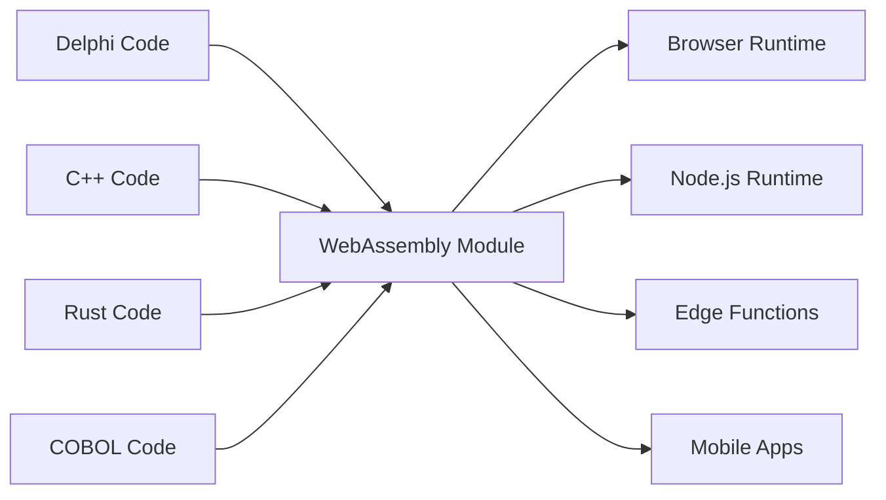

# Le Fabricateur Universel

"Making binaries for linux desktop applications is a major pain in the ass. You want to just compile one binary and have it work, preferably forever, and preferably across all the linux distributions." - Linus Torvalds, 2014

## Deux Mensonges Que Nous Refusons d'Accepter

### Le Mensonge Legacy: "Tout Réécrire"

La célèbre diatribe de Linus sur le cauchemar de la distribution de logiciels est un symptôme d'un mensonge plus vaste et plus coûteux que l'industrie logicielle se raconte: que le code legacy est une dette technique, et que la seule façon de moderniser est de jeter des décennies de logique métier éprouvée et de repartir de zéro.

C'est de la folie. Ce code Delphi, COBOL ou C++ fonctionne. Il encode des années de connaissances métier, a géré des cas limites et corrigé des bugs. Le réécrire n'introduit pas seulement du risque—il détruit des connaissances institutionnelles irremplaçables.

Le Fabricateur Universel est fondé sur un refus simple et puissant: **nous refusons d'accepter que ce soit la seule façon**. Et si vous pouviez exécuter votre logique legacy n'importe où, sans réécriture? Pas par traduction. Par **exécution universelle et déterministe**.

### Le Dilemme Moderne: "Vitesse ou Performance"

Mais ce n'est pas seulement une question de passé. À l'ère moderne, nous faisons face à un nouveau faux choix: le dilemme entre vitesse de prototypage (TypeScript, Python) et performance de production (Rust, Go). Les équipes sont forcées dans une décision douloureuse: rester avec le prototype lent, ou se lancer dans une réécriture complète et risquée pour la production.

Le Fabricateur Universel rejette aussi ce choix. Il fournit un pont—pas seulement du passé au présent, mais du présent vers un avenir plus performant, sans sacrifier votre vélocité de développement.

> **Votre logique métier n'a pas besoin d'une réécriture. Elle a besoin d'une renaissance.**

## Comment Ça Fonctionne

Le Fabricateur Universel se manifeste comme des Hatcher Functions Polyglottes—votre code legacy compilé en WebAssembly—qui sont emballées et exécutées de manière sécurisée dans un Hatcher EGG. Cette architecture est alimentée par trois composants clés:

### La Magie de WebAssembly

WebAssembly (WASM) est la percée qui rend cela possible. Tout langage qui peut compiler en WASM peut s'exécuter n'importe où—navigateur, serveur, edge, mobile. Votre code legacy devient portable sans changer une seule ligne.



### Hatcher Functions: Fonctions Sans Frontières

Les lambdas traditionnels s'exécutent dans le cloud. Nos Hatcher Functions s'exécutent partout:

```typescript
// Your 20-year-old Delphi tax calculation
const taxCalculator = await loadWASM('./legacy/tax-engine.wasm')

// Use it like a modern JavaScript function
const tax = await taxCalculator.calculateTax({
  income: 75000,
  deductions: 12000,
  state: 'NY',
})

// It runs at native speed, locally, with perfect accuracy
```

### L'Architecture EGGs

Les EGGs (Enforced Governance Guardrails) sont les conteneurs pour votre logique universelle:

```yaml
egg: payroll-processor
version: 2.1.0
engine: wasm

modules:
  - name: tax-calculator
    source: delphi
    binary: tax-engine.wasm
    interface: ./interfaces/tax.ts

  - name: compliance-checker
    source: cobol
    binary: compliance.wasm
    interface: ./interfaces/compliance.ts

  - name: optimization-engine
    source: cpp
    binary: optimizer.wasm
    interface: ./interfaces/optimizer.ts

orchestration:
  entry: orchestrate.js
  runtime: node
```

## Préservez Vos Actifs

### La Seconde Vie de Votre Code

Cette application Delphi de 2001? Elle devient:

- Un microservice dans votre cluster Kubernetes
- Une fonction dans votre application React
- Un edge worker pour distribution globale
- Une bibliothèque dans votre pipeline de données Python

Sans changer le code original. Sans perdre la logique métier. Sans le risque de réécrire.

### Exemple: La Révolution Bancaire

```javascript
// Original: 30-year-old COBOL transaction processor
// Now: Modern web API

import { loadCOBOLModule } from '@hatcher/eggs'

const transactionProcessor = await loadCOBOLModule('./legacy/transactions.wasm')

// Modern Express.js API
app.post('/api/transfer', async (req, res) => {
  // Modern validation
  const validated = await validateRequest(req.body)

  // Legacy business logic (perfect accuracy)
  const result = await transactionProcessor.processTransfer({
    fromAccount: validated.from,
    toAccount: validated.to,
    amount: validated.amount,
  })

  // Modern response
  res.json({
    success: result.success,
    transactionId: result.id,
    timestamp: new Date().toISOString(),
  })
})
```

## Évoluez Sans Risque

### Modernisation Graduelle

Vous n'avez pas besoin de tout moderniser d'un coup:

```typescript
class HybridPayrollSystem {
  // Keep the complex calculation in Delphi
  private legacyCalculator = loadWASM('./legacy/payroll.wasm')

  // Add modern features in TypeScript
  async calculatePayroll(employee: Employee) {
    // Use legacy for core calculation
    const base = await this.legacyCalculator.calculate(employee)

    // Enhance with modern features
    const withBenefits = this.addModernBenefits(base)
    const withAnalytics = this.trackAnalytics(withBenefits)

    return withAnalytics
  }

  // New features in modern code
  private addModernBenefits(payroll: Payroll) {
    // Modern benefits calculation
  }
}
```

### Interopérabilité Linguistique

Différents langages pour différentes forces:

```javascript
// Use each language for what it does best
const system = {
  // Rust for performance-critical
  imageProcessor: await loadWASM('./rust/image-processor.wasm'),

  // Delphi for business logic
  businessRules: await loadWASM('./delphi/rules-engine.wasm'),

  // C++ for algorithms
  optimizer: await loadWASM('./cpp/optimizer.wasm'),

  // JavaScript for orchestration
  async process(input) {
    const image = await this.imageProcessor.prepare(input.image)
    const rules = await this.businessRules.evaluate(input.data)
    const optimized = await this.optimizer.optimize(rules)

    return { image, result: optimized }
  },
}
```

## Optimisez Votre Avenir: Du Prototype à la Performance

Hatcher est aussi une plateforme d'optimisation graduelle pour applications modernes. Vous pouvez prototyper votre application entière en TypeScript pour trouver l'adéquation produit-marché, puis remplacer chirurgicalement les goulots d'étranglement de performance par des modules Rust ou Go haute performance sans réécriture complète.

### Optimisez Votre Avenir: Le Workflow de Transmutation

Hatcher fournit un workflow révolutionnaire pour faire évoluer un prototype moderne en une application haute performance. Vous ne réécrivez pas; vous transmutez. Vous pouvez prototyper votre application entière en TypeScript, puis utiliser l'IA comme partenaire pour mettre à niveau de manière sûre et systématique la logique critique vers des langages haute performance comme Rust ou Go.

C'est le Playbook de l'Alchimiste.

#### Étape 1: Le Prototype (TypeScript)

Vous commencez avec du code TypeScript fonctionnel, mais peut-être "sale" ou lent.

```ts
// Your initial prototype for calculating user discounts.
// It works, but has complex logic and isn't fast enough.
function calculateDiscount(user, cart) {
  let discount = 0
  if (user.isVip) discount += 0.1
  if (cart.total > 100) discount += 0.05
  // ... many more complex and slow rules
  return Math.min(discount, 0.25) // cap discount
}
```

#### Étape 2: Spécification Alimentée par l'IA (Code → ACs)

Vous sélectionnez la fonction et commandez à Hatcher: "Describe this logic as Acceptance Criteria." L'IA analyse le code et rétro-conçoit les règles métier.

```Gherkin
# AI-Generated Acceptance Criteria

Feature: User Discount Calculation

Scenario: VIP user with large cart
Given a user is a "VIP"
And the cart total is over 100
Then the final discount should be 15%

Scenario: Non-VIP user
Given a user is not a "VIP"
Then the discount is based only on cart total

Scenario: Discount Capping
When any combination of rules results in a discount over 25%
Then the final discount must be capped at 25%
```

#### **Étape 3: Raffinement Humain (Le Point de Contrôle)**

Maintenant, vous, le développeur, révisez et améliorez ces ACs en anglais simple. Vous attrapez un cas limite que l'IA a manqué et ajoutez un nouveau scénario. C'est votre point de contrôle.

#### Étape 4: Génération Pilotée par Tests (ACs → Tests → Code)

Avec les ACs approuvés par l'humain comme contrat, vous commandez à Hatcher: "Generate Rust code and unit tests to satisfy these criteria."

1. Hatcher génère d'abord les tests en Rust, reflétant directement les ACs.

2. Ensuite, il génère le code Rust qui fait passer ces tests.

```rust
// The final, high-performance Rust code, guaranteed by tests
// to match the human-approved business logic.
pub fn calculate_discount(user: &User, cart: &Cart) -> f64 {
    // Blazingly fast, safe Rust logic...
}
```

#### Étape 5: L'Artefact Vivant

La sortie finale n'est pas seulement le module .wasm compilé. C'est le module **associé à sa spécification lisible par l'humain**. Les ACs sont préservés aux côtés du lambda, créant une documentation vivante pour la maintenance et l'évolution futures.

C'est le rêve de l'Alchimiste: un processus sûr et structuré pour transmuter un prototype en application haute performance, sans risque et avec une clarté parfaite.

## Exécutez Avec Confiance

### La Salle Blanche WASM

Chaque module WASM s'exécute dans un bac à sable:

```typescript
interface WASMSandbox {
  memory: {
    limit: '100MB'
    shared: false
  }

  cpu: {
    timeout: '5s'
    priority: 'normal'
  }

  io: {
    filesystem: 'none'
    network: 'none'
    system: 'none'
  }
}
```

Votre code legacy ne peut pas:

- Accéder au système de fichiers (sauf si explicitement autorisé)
- Faire des appels réseau (sauf si explicitement autorisé)
- Planter le processus hôte
- Fuiter de la mémoire
- Interférer avec d'autres modules

### Interfaces Type-Safe

Générez des interfaces TypeScript depuis votre code legacy:

```typescript
// Auto-generated from Delphi function signatures
export interface TaxEngine {
  calculateFederalTax(income: number, deductions: number): Promise<number>
  calculateStateTax(income: number, state: string): Promise<number>
  getDeductionLimit(filingStatus: FilingStatus): Promise<number>
}

// Type-safe usage
const engine: TaxEngine = await loadWASM('./tax-engine.wasm')
const tax = await engine.calculateFederalTax(100000, 12000) // Type-checked!
```

## Prouvé sur le Terrain

### Scénario 1: Le Géant de l'Assurance

Une compagnie d'assurance vieille de 40 ans avec des millions de lignes de COBOL:

```yaml
before:
  problem: 'COBOL mainframe costs $2M/year'
  solution: '5-year, $50M rewrite project (failed twice)'

after:
  solution: 'Compile COBOL to WASM'
  timeline: '3 months'
  result:
    - Run on commodity hardware
    - Scale horizontally
    - Keep all business logic
    - Modern API layer
  savings: '$1.8M/year'
```

### Scénario 2: La Firme de Trading

Algorithmes de trading haute fréquence en C++:

```javascript
// Original: C++ running on specialized hardware
// Now: Same C++ running everywhere

const tradingEngine = await loadWASM('./trading/algorithm.wasm')

// Deploy to edge locations globally
const edgeLocations = ['nyc', 'london', 'tokyo', 'singapore']

for (const location of edgeLocations) {
  deployToEdge(location, tradingEngine)
  // Same algorithm, microsecond latency, global distribution
}
```

### Scénario 3: Le Système de Fabrication

Code C embarqué de contrôleurs industriels:

```typescript
// 30-year-old C code from manufacturing equipment
const controller = await loadWASM('./embedded/controller.wasm')

// Now it powers a modern web dashboard
const Dashboard = () => {
  const [status, setStatus] = useState()

  useEffect(() => {
    const interval = setInterval(async () => {
      const data = await controller.getSystemStatus()
      setStatus(data)
    }, 1000)

    return () => clearInterval(interval)
  }, [])

  return <ModernUIComponent data={status} />
}
```

### Scénario 4: La Startup IA

Une startup rapide prototype son pipeline de traitement de données en Python.

```yaml
before:
  problem: 'Python prototype is too slow for production customers.'
  solution: "Plan a 6-month 'rewrite it in Go' project, pausing all feature development."
after:
  solution: 'Identify and rewrite 3 critical functions in Rust with Hatcher.'
  timeline: '2 weeks.'
  result:
    - 90% of the codebase remains in easy-to-iterate Python.
    - Critical path is now 120x faster.
    - Shipped to production customers next month.
    - Rewrite project cancelled.
```

## Premiers Pas

### Étape 1: Identifiez Votre Logique

Quelle logique métier est piégée dans du code legacy?

- Moteurs de calcul
- Règles métier
- Logique de validation
- Algorithmes de traitement

### Étape 2: Compilez en WASM

La plupart des langages supportent maintenant la compilation WASM:

```bash
# Delphi
delphi2wasm your-code.pas -o output.wasm

# C/C++
emcc your-code.cpp -o output.wasm

# COBOL
cobol2wasm your-code.cob -o output.wasm

# Rust
cargo build --target wasm32-unknown-unknown
```

### Étape 3: Créez des Interfaces

Définissez comment le code moderne va interagir:

```typescript
// Define the interface
interface LegacyModule {
  initialize(): Promise<void>
  process(input: Input): Promise<Output>
  cleanup(): Promise<void>
}
```

### Étape 4: Intégrez

Utilisez votre logique legacy dans des applications modernes:

```javascript
const legacy = await loadWASM('./legacy.wasm')
// Your 30-year-old code is now a modern module
```

## La Philosophie

Le Fabricateur Universel incarne une croyance fondamentale: **le code est un actif, pas un passif**. Chaque ligne de code fonctionnel représente des problèmes résolus, des cas limites gérés et des connaissances intégrées. L'âge du code ne diminue pas sa valeur—il la prouve.

Nous ne jetons pas les livres parce qu'ils sont vieux. Nous ne démolissons pas les bâtiments parce qu'ils ont été construits avec des outils différents. Pourquoi insistons-nous pour réécrire du code qui fonctionne?

Le Fabricateur Universel est la préservation par le progrès. C'est la modernisation sans destruction. C'est le pont entre ce qui a été construit et ce qui doit être construit.

---

_Le Fabricateur Universel n'exécute pas seulement votre code legacy—il le libère. Votre logique métier, libérée de la prison des runtimes obsolètes, devient vraiment universelle. Écrivez une fois, exécutez pour toujours, partout._

<PageCTA
  title="Libérez Votre Code Legacy"
  subtitle="Transformez des décennies de logique métier en modules modernes et universels"
  buttonText="Explorez le Fabricateur"
  buttonLink="/fr/features-universal-fabricator"
  buttonStyle="secondary"
  footer="Votre code est un actif, pas un passif. Préservez-le. Modernisez-le."
/>
