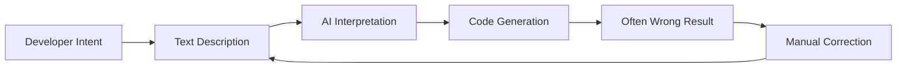

# Pont Visuel-vers-Code

Le Pont Visuel-vers-Code est la fonctionnalité signature de Hatcher qui révolutionne la façon dont les développeurs interagissent avec les assistants de codage IA. Au lieu de décrire les changements en texte, vous manipulez directement l'interface visuelle de votre application, et Hatcher traduit vos actions en modifications de code précises.

## Comment Ça Fonctionne

### Le Problème Traditionnel



**Exemple du cycle frustrant:**

- Développeur: "Make the header blue and center it"
- IA: Génère du CSS qui rend le mauvais élément bleu
- Développeur: "No, the main header, not the sidebar header"
- IA: Le rend de la mauvaise nuance de bleu
- Développeur: "Make it #3B82F6 and also increase the font size"
- ... et ainsi de suite

### Approche Visuel-vers-Code de Hatcher: Les Modes Duaux du Pont

Le Pont Visuel-vers-Code opère différemment selon la mission de votre projet, fournissant le bon équilibre entre liberté et contrôle.

**En Mode Génératif: Création Assistée par IA**

Dans un projet `Generative`, le pont agit comme un système de ciblage de haute précision pour l'IA. Le workflow est:

1. **Vous ancrez le contexte:** Cliquez pour sélectionner un élément.

2. **Vous fournissez la commande:** Utilisez le langage naturel pour décrire le changement désiré.

3. **L'IA exécute:** Elle génère le code nécessaire, contraint à la portée que vous avez définie.

**Dans un EGG: Manipulation Déterministe**

Dans un EGG (Enforced Governance Guardrails), le pont devient un outil de manipulation directe où la génération de code IA n'est pas utilisée pour les changements visuels. Le workflow est 100% déterministe:

1. **Vous manipulez directement:** Glissez, redimensionnez ou éditez les propriétés dans un panneau visuel.

2. **Le moteur capture l'événement:** Hatcher enregistre le changement comme une mise à jour structurée.

3- **La configuration est mise à jour:** Le changement est écrit dans un fichier de configuration de projet, pas généré comme nouveau code source.

## Fonctionnalités Principales

### 1. Sélection d'Éléments

**Système de Sélection Intelligent**

- Cliquez sur n'importe quel élément pour le sélectionner
- Survolez pour prévisualiser les limites de sélection
- Sélectionnez plusieurs éléments pour des opérations par lot
- Sélection hiérarchique (enfant, parent, frères et sœurs)

```typescript
// Example: Selecting a button
const selection = {
  element: 'button.submit-btn',
  properties: {
    position: { x: 120, y: 45 },
    dimensions: { width: 100, height: 36 },
    styles: {
      backgroundColor: '#3B82F6',
      borderRadius: '6px',
      fontSize: '14px',
    },
  },
  context: {
    parent: 'form.checkout-form',
    siblings: ['input.email', 'input.password'],
    framework: 'Vue 3',
    component: 'SubmitButton.vue',
  },
}
```

### 2. Manipulation Visuelle

**Édition Directe de Propriétés**

- Glissez les éléments vers de nouvelles positions
- Redimensionnez en glissant les coins
- Sélecteur de couleur pour arrière-plans et texte
- Contrôles typographiques (police, taille, poids)
- Contrôles d'espacement (marge, padding)

**Prévisualisation en Direct**

- Voyez les changements instantanément dans votre application
- Pas besoin de rafraîchir ou reconstruire
- Intégration de remplacement de module à chaud
- Mises à jour CSS en temps réel

### 3. Reconnaissance d'Intention

Hatcher analyse vos changements visuels et comprend:

**Changements de Mise en Page**

- Modifications de position (absolue, relative, flex)
- Ajustements de taille (largeur, hauteur, responsive)
- Changements d'alignement (centre, flex, grid)

**Changements de Style**

- Modifications de couleur (hex, RGB, HSL, variables CSS)
- Mises à jour typographiques (famille de police, taille, poids, hauteur de ligne)
- Effets visuels (ombres, bordures, dégradés)

**Changements de Composant**

- Modifications de props
- Mises à jour d'état
- Ajouts de gestionnaires d'événements

### 4. Génération de Code

Basé sur votre intention visuelle, Hatcher génère:

**Code Spécifique au Framework**

```vue
<!-- Vue 3 Example -->
<template>
  <button
    class="submit-btn"
    :style="{
      transform: `translate(${position.x}px, ${position.y}px)`,
      backgroundColor: '#3B82F6',
    }"
    @click="handleSubmit"
  >
    Submit
  </button>
</template>
```

**Mises à Jour CSS**

```css
.submit-btn {
  position: absolute;
  left: 120px;
  top: 45px;
  background-color: #3b82f6;
  width: 100px;
  height: 36px;
  border-radius: 6px;
  font-size: 14px;
}
```

**Intégration TypeScript**

```typescript
interface ButtonProps {
  position: { x: number; y: number }
  variant: 'primary' | 'secondary'
  size: 'sm' | 'md' | 'lg'
}
```

## Capacités Avancées

### 1. Design Responsive

**Édition Multi-Points de Rupture**

- Éditez différentes tailles d'écran simultanément
- Générez du CSS responsive automatiquement
- Maintenez la cohérence du design sur tous les appareils

```css
/* Generated responsive code */
.submit-btn {
  /* Mobile */
  width: 100%;
  margin: 0 16px;
}

@media (min-width: 768px) {
  /* Tablet */
  .submit-btn {
    width: 200px;
    margin: 0 auto;
  }
}

@media (min-width: 1024px) {
  /* Desktop */
  .submit-btn {
    width: 150px;
    position: absolute;
    left: 120px;
  }
}
```

### 2. Changements Conscients des Composants

**Détection Intelligente de Composants**

- Reconnaît les composants Vue, React, Svelte
- Comprend les props et l'état des composants
- Maintient les limites des composants

**Exemple: Modification d'un Composant Vue**

```vue
<!-- Before -->
<UserCard :user="currentUser" size="medium" />

<!-- After visual modification -->
<UserCard
  :user="currentUser"
  size="large"
  :style="{ marginTop: '24px' }"
  show-avatar
/>
```

### 3. Intégration Système de Design

**Utilisation Automatique de Tokens**

- Reconnaît les tokens du système de design
- Suggère les valeurs appropriées
- Maintient la cohérence

```css
/* Instead of arbitrary values */
color: #3b82f6;
padding: 12px;

/* Uses design tokens */
color: var(--color-primary-500);
padding: var(--spacing-3);
```

## Exemples de Workflow

### Exemple 1: Ajustement de Mise en Page

**Objectif**: Déplacer une barre latérale du côté gauche au côté droit

1. **Sélectionner**: Cliquer sur le composant de la barre latérale
2. **Glisser**: Le glisser vers le côté droit de l'écran
3. **Réviser**: Voir les changements flex/grid générés
4. **Appliquer**: Accepter les modifications CSS

**Code Généré**:

```css
.layout-container {
  display: flex;
  flex-direction: row; /* Changed from row-reverse */
}

.sidebar {
  order: 2; /* Changed from 1 */
  margin-left: auto; /* Added */
}
```

### Exemple 2: Stylisation de Composant

**Objectif**: Changer l'apparence du bouton pour correspondre au design

1. **Sélectionner**: Cliquer sur le bouton
2. **Styliser**: Utiliser le sélecteur de couleur, ajuster la taille, modifier la bordure
3. **Prévisualiser**: Voir les changements en direct dans l'application
4. **Générer**: Obtenir les mises à jour de props du composant

**Code Généré**:

```vue
<script setup>
const buttonStyle = {
  variant: 'primary',
  size: 'lg',
  rounded: true,
}
</script>

<template>
  <AppButton v-bind="buttonStyle"> Submit Order </AppButton>
</template>
```

### Exemple 3: Ajustement Responsive

**Objectif**: Rendre une grille responsive

1. **Sélectionner**: Choisir le conteneur de grille
2. **Redimensionner**: Ajuster les colonnes pour différents points de rupture
3. **Tester**: Prévisualiser sur mobile/tablette/desktop
4. **Appliquer**: Générer du CSS Grid responsive

**Code Généré**:

```css
.product-grid {
  display: grid;
  gap: 1rem;
  grid-template-columns: 1fr; /* Mobile */
}

@media (min-width: 640px) {
  .product-grid {
    grid-template-columns: repeat(2, 1fr); /* Tablet */
  }
}

@media (min-width: 1024px) {
  .product-grid {
    grid-template-columns: repeat(3, 1fr); /* Desktop */
  }
}
```

## Intégration avec les Moteurs IA

Le Pont Visuel-vers-Code fonctionne de manière transparente avec les moteurs IA supportés:

### Intégration Claude Code

```typescript
const visualIntent = captureVisualChange(selection, modification)
const codeChange = await claudeCode.generateChange({
  intent: visualIntent,
  context: projectContext,
  playbook: teamPlaybook,
})
```

### Intégration Gemini CLI

```typescript
const prompt = buildVisualPrompt(visualIntent, codeContext)
const suggestion = await geminiCLI.complete(prompt)
const refinedCode = refineWithPlaybook(suggestion)
```

## Meilleures Pratiques

### 1. Commencez Petit

- Faites des changements visuels incrémentaux
- Testez chaque modification avant de passer à la suivante
- Construisez des changements complexes à travers des étapes plus petites

### 2. Utilisez les Playbooks

- Définissez les patterns de composants dans vos playbooks
- Établissez des règles de stylisation cohérentes
- Documentez les patterns de design communs

### 3. Révisez le Code Généré

- Révisez toujours le diff de code avant d'appliquer
- Assurez-vous que le code généré suit vos standards
- Raffinez les prompts si nécessaire pour de meilleurs résultats

### 4. Testez Thoroughement

- Utilisez des tests automatisés pour valider les changements
- Vérifiez le comportement responsive
- Vérifiez la conformité d'accessibilité

---

Le Pont Visuel-vers-Code représente un changement fondamental dans la façon dont nous interagissons avec l'IA pour le développement. En éliminant la couche de traduction entre intention et implémentation, il crée une expérience de développement plus intuitive, précise et efficace.
