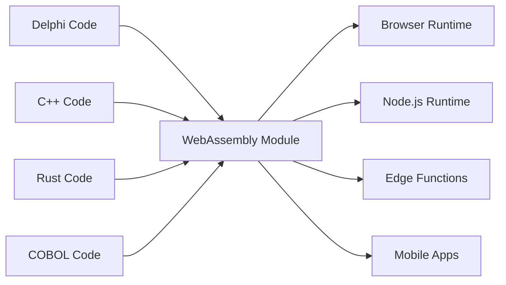

# Universal Fabricator

"Making binaries for linux desktop applications is a major pain in the ass. You want to just compile one binary and have it work, preferably forever, and preferably across all the linux distributions." - Linus Torvalds, 2014

## दो झूठ जिन्हें हम स्वीकार करने से इनकार करते हैं

### विरासत झूठ: "सब कुछ फिर से लिखें"

Linus का सॉफ्टवेयर वितरण के दुःस्वप्न के बारे में प्रसिद्ध विवाद एक बड़े, अधिक महंगे झूठ का लक्षण है जो सॉफ्टवेयर उद्योग खुद से बताता है: कि विरासत कोड तकनीकी ऋण है, और आधुनिकीकरण का एकमात्र तरीका दशकों के युद्ध-परीक्षित व्यवसाय तर्क को फेंक देना और शुरू से शुरू करना है।

यह पागलपन है। वह Delphi, COBOL, या C++ कोड काम करता है। यह वर्षों के व्यवसाय ज्ञान को एन्कोड करता है, edge cases को संभाला है, और बग को ठीक किया है। इसे फिर से लिखना केवल जोखिम नहीं लाता—यह अमूल्य संस्थागत ज्ञान को नष्ट करता है।

Universal Fabricator एक सरल, शक्तिशाली इनकार पर स्थापित है: **हम इनकार करते हैं कि यह एकमात्र तरीका है**। क्या होगा अगर आप अपने विरासत तर्क को कहीं भी चला सकें, बिना फिर से लिखे? अनुवाद के माध्यम से नहीं। **सार्वभौमिक, नियतात्मक निष्पादन** के माध्यम से।

### आधुनिक दुविधा: "गति या प्रदर्शन"

लेकिन यह केवल अतीत के बारे में नहीं है। आधुनिक युग में, हम एक नए गलत विकल्प का सामना करते हैं: प्रोटोटाइप गति (TypeScript, Python) और उत्पादन प्रदर्शन (Rust, Go) के बीच दुविधा। टीमों को एक दर्दनाक निर्णय में मजबूर किया जाता है: धीमी प्रोटोटाइप के साथ रहें, या उत्पादन के लिए जोखिम भरी, पूर्ण फिर से लिखाई शुरू करें।

Universal Fabricator इस विकल्प को भी अस्वीकार करता है। यह एक पुल प्रदान करता है—न केवल अतीत से वर्तमान तक, बल्कि वर्तमान से एक उच्च-प्रदर्शन भविष्य तक, आपकी विकास गति का त्याग किए बिना।

> **आपके व्यवसाय तर्क को फिर से लिखाई की आवश्यकता नहीं है। इसे पुनर्जागरण की आवश्यकता है।**

## यह कैसे काम करता है

Universal Fabricator Polyglot Hatcher Functions के रूप में प्रकट होता है—आपका विरासत कोड WebAssembly में संकलित—जो सुरक्षित रूप से पैक किया गया है और Hatcher EGG के भीतर निष्पादित किया गया है। यह वास्तुकला तीन प्रमुख घटकों द्वारा संचालित है:

### WebAssembly का जादू

WebAssembly (WASM) वह सफलता है जो इसे संभव बनाती है। कोई भी भाषा जो WASM में संकलित हो सकती है वह कहीं भी चल सकती है—ब्राउज़र, सर्वर, edge, mobile। आपका विरासत कोड एक भी पंक्ति बदले बिना पोर्टेबल बन जाता है।



### Hatcher Functions: सीमाओं के बिना फ़ंक्शन

पारंपरिक lambdas क्लाउड में चलते हैं। हमारे Hatcher Functions हर जगह चलते हैं:

```typescript
// Your 20-year-old Delphi tax calculation
const taxCalculator = await loadWASM('./legacy/tax-engine.wasm')

// Use it like a modern JavaScript function
const tax = await taxCalculator.calculateTax({
  income: 75000,
  deductions: 12000,
  state: 'NY',
})

// It runs at native speed, locally, with perfect accuracy
```

### EGGs आर्किटेक्चर

EGGs (Enforced Governance Guardrails) आपके सार्वभौमिक तर्क के लिए कंटेनर हैं:

```yaml
egg: payroll-processor
version: 2.1.0
engine: wasm

modules:
  - name: tax-calculator
    source: delphi
    binary: tax-engine.wasm
    interface: ./interfaces/tax.ts

  - name: compliance-checker
    source: cobol
    binary: compliance.wasm
    interface: ./interfaces/compliance.ts

  - name: optimization-engine
    source: cpp
    binary: optimizer.wasm
    interface: ./interfaces/optimizer.ts

orchestration:
  entry: orchestrate.js
  runtime: node
```

## अपनी संपत्ति संरक्षित करें

### आपके कोड का दूसरा जीवन

2001 से वह Delphi एप्लिकेशन? यह बन जाता है:

- आपके Kubernetes क्लस्टर में एक microservice
- आपकी React ऐप में एक function
- वैश्विक वितरण के लिए एक edge worker
- आपकी Python डेटा पाइपलाइन में एक library

मूल कोड को बदले बिना। व्यवसाय तर्क खोए बिना। फिर से लिखाई के जोखिम के बिना।

### उदाहरण: बैंकिंग क्रांति

```javascript
// Original: 30-year-old COBOL transaction processor
// Now: Modern web API

import { loadCOBOLModule } from '@hatcher/eggs'

const transactionProcessor = await loadCOBOLModule('./legacy/transactions.wasm')

// Modern Express.js API
app.post('/api/transfer', async (req, res) => {
  // Modern validation
  const validated = await validateRequest(req.body)

  // Legacy business logic (perfect accuracy)
  const result = await transactionProcessor.processTransfer({
    fromAccount: validated.from,
    toAccount: validated.to,
    amount: validated.amount,
  })

  // Modern response
  res.json({
    success: result.success,
    transactionId: result.id,
    timestamp: new Date().toISOString(),
  })
})
```

## जोखिम के बिना विकसित करें

### क्रमिक आधुनिकीकरण

आपको सब कुछ एक बार में आधुनिक बनाने की आवश्यकता नहीं है:

```typescript
class HybridPayrollSystem {
  // Keep the complex calculation in Delphi
  private legacyCalculator = loadWASM('./legacy/payroll.wasm')

  // Add modern features in TypeScript
  async calculatePayroll(employee: Employee) {
    // Use legacy for core calculation
    const base = await this.legacyCalculator.calculate(employee)

    // Enhance with modern features
    const withBenefits = this.addModernBenefits(base)
    const withAnalytics = this.trackAnalytics(withBenefits)

    return withAnalytics
  }

  // New features in modern code
  private addModernBenefits(payroll: Payroll) {
    // Modern benefits calculation
  }
}
```

### भाषा अंतर-संचालनीयता

विभिन्न शक्तियों के लिए विभिन्न भाषाएं:

```javascript
// Use each language for what it does best
const system = {
  // Rust for performance-critical
  imageProcessor: await loadWASM('./rust/image-processor.wasm'),

  // Delphi for business logic
  businessRules: await loadWASM('./delphi/rules-engine.wasm'),

  // C++ for algorithms
  optimizer: await loadWASM('./cpp/optimizer.wasm'),

  // JavaScript for orchestration
  async process(input) {
    const image = await this.imageProcessor.prepare(input.image)
    const rules = await this.businessRules.evaluate(input.data)
    const optimized = await this.optimizer.optimize(rules)

    return { image, result: optimized }
  },
}
```

## अपने भविष्य को अनुकूलित करें: प्रोटोटाइप से प्रदर्शन तक

Hatcher आधुनिक अनुप्रयोगों के लिए एक क्रमिक अनुकूलन मंच भी है। आप product-market fit खोजने के लिए TypeScript में अपने पूरे एप्लिकेशन का प्रोटोटाइप बना सकते हैं, फिर पूर्ण फिर से लिखाई के बिना उच्च-प्रदर्शन Rust या Go मॉड्यूल के साथ प्रदर्शन बाधाओं को शल्य चिकित्सा से बदल सकते हैं।

### अपने भविष्य को अनुकूलित करें: रूपांतरण कार्यप्रवाह

Hatcher आधुनिक प्रोटोटाइप को उच्च-प्रदर्शन एप्लिकेशन में विकसित करने के लिए एक क्रांतिकारी कार्यप्रवाह प्रदान करता है। आप फिर से नहीं लिखते; आप रूपांतरित करते हैं। आप TypeScript में अपने पूरे एप्लिकेशन का प्रोटोटाइप बना सकते हैं, फिर AI को साथी के रूप में उपयोग करके सुरक्षित और व्यवस्थित रूप से महत्वपूर्ण तर्क को Rust या Go जैसी उच्च-प्रदर्शन भाषाओं में अपग्रेड कर सकते हैं।

यह Alchemist का Playbook है।

#### चरण 1: प्रोटोटाइप (TypeScript)

आप काम करने वाले, लेकिन शायद "गंदे" या धीमे, TypeScript कोड के साथ शुरू करते हैं।

```ts
// Your initial prototype for calculating user discounts.
// It works, but has complex logic and isn't fast enough.
function calculateDiscount(user, cart) {
  let discount = 0
  if (user.isVip) discount += 0.1
  if (cart.total > 100) discount += 0.05
  // ... many more complex and slow rules
  return Math.min(discount, 0.25) // cap discount
}
```

#### चरण 2: AI-संचालित विनिर्देश (Code → ACs)

आप फ़ंक्शन का चयन करते हैं और Hatcher को कमांड देते हैं: "इस तर्क को स्वीकृति मानदंड के रूप में वर्णित करें।" AI कोड का विश्लेषण करता है और व्यवसाय नियमों को रिवर्स-इंजीनियर करता है।

```Gherkin
# AI-Generated Acceptance Criteria

Feature: User Discount Calculation

Scenario: VIP user with large cart
Given a user is a "VIP"
And the cart total is over 100
Then the final discount should be 15%

Scenario: Non-VIP user
Given a user is not a "VIP"
Then the discount is based only on cart total

Scenario: Discount Capping
When any combination of rules results in a discount over 25%
Then the final discount must be capped at 25%
```

#### **चरण 3: मानव परिशोधन (नियंत्रण बिंदु)**

अब, आप, डेवलपर, इन ACs की समीक्षा करते हैं और सरल अंग्रेजी में सुधार करते हैं। आप एक edge case पकड़ते हैं जो AI ने छोड़ दी और एक नया परिदृश्य जोड़ते हैं। यह आपका नियंत्रण बिंदु है।

#### चरण 4: परीक्षण-संचालित उत्पादन (ACs → Tests → Code)

मानव-अनुमोदित ACs को अनुबंध के रूप में रखते हुए, आप Hatcher को कमांड देते हैं: "इन मानदंडों को संतुष्ट करने के लिए Rust कोड और यूनिट टेस्ट उत्पन्न करें।"

1. Hatcher पहले Rust में टेस्ट उत्पन्न करता है, सीधे ACs को प्रतिबिंबित करते हुए।

2. फिर, यह Rust कोड उत्पन्न करता है जो उन टेस्ट को पास करता है।

```rust
// The final, high-performance Rust code, guaranteed by tests
// to match the human-approved business logic.
pub fn calculate_discount(user: &User, cart: &Cart) -> f64 {
    // Blazingly fast, safe Rust logic...
}
```

#### चरण 5: जीवित कलाकृति

अंतिम आउटपुट केवल संकलित .wasm मॉड्यूल नहीं है। यह मॉड्यूल **इसके मानव-पठनीय विनिर्देश के साथ युग्मित** है। ACs lambda के साथ संरक्षित हैं, भविष्य के रखरखाव और विकास के लिए जीवित दस्तावेज़ीकरण बनाते हैं।

यह Alchemist का सपना है: एक प्रोटोटाइप को उच्च-प्रदर्शन एप्लिकेशन में रूपांतरित करने के लिए एक सुरक्षित, संरचित प्रक्रिया, जोखिम के बिना, और पूर्ण स्पष्टता के साथ।

## विश्वास के साथ निष्पादित करें

### WASM Cleanroom

प्रत्येक WASM मॉड्यूल एक sandbox में चलता है:

```typescript
interface WASMSandbox {
  memory: {
    limit: '100MB'
    shared: false
  }

  cpu: {
    timeout: '5s'
    priority: 'normal'
  }

  io: {
    filesystem: 'none'
    network: 'none'
    system: 'none'
  }
}
```

आपका विरासत कोड नहीं कर सकता:

- फाइल सिस्टम तक पहुंचें (जब तक स्पष्ट रूप से नहीं दिया गया)
- नेटवर्क कॉल करें (जब तक स्पष्ट रूप से नहीं दिया गया)
- होस्ट प्रक्रिया को क्रैश करें
- मेमोरी लीक करें
- अन्य मॉड्यूल में हस्तक्षेप करें

### टाइप-सुरक्षित इंटरफेस

अपने विरासत कोड से TypeScript इंटरफेस उत्पन्न करें:

```typescript
// Auto-generated from Delphi function signatures
export interface TaxEngine {
  calculateFederalTax(income: number, deductions: number): Promise<number>
  calculateStateTax(income: number, state: string): Promise<number>
  getDeductionLimit(filingStatus: FilingStatus): Promise<number>
}

// Type-safe usage
const engine: TaxEngine = await loadWASM('./tax-engine.wasm')
const tax = await engine.calculateFederalTax(100000, 12000) // Type-checked!
```

## खाइयों में सिद्ध

### परिदृश्य 1: बीमा दिग्गज

40 साल पुरानी बीमा कंपनी COBOL की लाखों लाइनों के साथ:

```yaml
before:
  problem: 'COBOL mainframe costs $2M/year'
  solution: '5-year, $50M rewrite project (failed twice)'

after:
  solution: 'Compile COBOL to WASM'
  timeline: '3 months'
  result:
    - Run on commodity hardware
    - Scale horizontally
    - Keep all business logic
    - Modern API layer
  savings: '$1.8M/year'
```

### परिदृश्य 2: ट्रेडिंग फर्म

C++ में उच्च-आवृत्ति ट्रेडिंग एल्गोरिदम:

```javascript
// Original: C++ running on specialized hardware
// Now: Same C++ running everywhere

const tradingEngine = await loadWASM('./trading/algorithm.wasm')

// Deploy to edge locations globally
const edgeLocations = ['nyc', 'london', 'tokyo', 'singapore']

for (const location of edgeLocations) {
  deployToEdge(location, tradingEngine)
  // Same algorithm, microsecond latency, global distribution
}
```

### परिदृश्य 3: विनिर्माण प्रणाली

औद्योगिक नियंत्रकों से एम्बेडेड C कोड:

```typescript
// 30-year-old C code from manufacturing equipment
const controller = await loadWASM('./embedded/controller.wasm')

// Now it powers a modern web dashboard
const Dashboard = () => {
  const [status, setStatus] = useState()

  useEffect(() => {
    const interval = setInterval(async () => {
      const data = await controller.getSystemStatus()
      setStatus(data)
    }, 1000)

    return () => clearInterval(interval)
  }, [])

  return <ModernUIComponent data={status} />
}
```

### परिदृश्य 4: AI स्टार्टअप

एक तेज़ गति से चलने वाला स्टार्टअप Python में अपनी डेटा प्रोसेसिंग पाइपलाइन का प्रोटोटाइप बनाता है।

```yaml
before:
  problem: 'Python prototype is too slow for production customers.'
  solution: "Plan a 6-month 'rewrite it in Go' project, pausing all feature development."
after:
  solution: 'Identify and rewrite 3 critical functions in Rust with Hatcher.'
  timeline: '2 weeks.'
  result:
    - 90% of the codebase remains in easy-to-iterate Python.
    - Critical path is now 120x faster.
    - Shipped to production customers next month.
    - Rewrite project cancelled.
```

## शुरुआत करना

### चरण 1: अपने तर्क की पहचान करें

कौन सा व्यवसाय तर्क विरासत कोड में फंसा है?

- गणना इंजन
- व्यवसाय नियम
- सत्यापन तर्क
- प्रसंस्करण एल्गोरिदम

### चरण 2: WASM में संकलित करें

अधिकांश भाषाएं अब WASM संकलन का समर्थन करती हैं:

```bash
# Delphi
delphi2wasm your-code.pas -o output.wasm

# C/C++
emcc your-code.cpp -o output.wasm

# COBOL
cobol2wasm your-code.cob -o output.wasm

# Rust
cargo build --target wasm32-unknown-unknown
```

### चरण 3: इंटरफेस बनाएं

परिभाषित करें कि आधुनिक कोड कैसे इंटरैक्ट करेगा:

```typescript
// Define the interface
interface LegacyModule {
  initialize(): Promise<void>
  process(input: Input): Promise<Output>
  cleanup(): Promise<void>
}
```

### चरण 4: एकीकृत करें

आधुनिक अनुप्रयोगों में अपने विरासत तर्क का उपयोग करें:

```javascript
const legacy = await loadWASM('./legacy.wasm')
// Your 30-year-old code is now a modern module
```

## दर्शन

Universal Fabricator एक मौलिक विश्वास को मूर्त रूप देता है: **कोड एक संपत्ति है, दायित्व नहीं**। काम करने वाले कोड की हर पंक्ति हल की गई समस्याओं, संभाले गए edge cases, और एम्बेडेड ज्ञान का प्रतिनिधित्व करती है। कोड की उम्र इसके मूल्य को कम नहीं करती—यह इसे साबित करती है।

हम किताबों को इसलिए नहीं फेंकते क्योंकि वे पुरानी हैं। हम इमारतों को इसलिए नहीं गिराते क्योंकि वे विभिन्न उपकरणों से बनाई गई थीं। हम कोड को फिर से लिखने पर क्यों जोर देते हैं जो काम करता है?

Universal Fabricator प्रगति के माध्यम से संरक्षण है। यह विनाश के बिना आधुनिकीकरण है। यह जो बनाया गया था और जो बनाने की जरूरत है के बीच का पुल है।

---

_Universal Fabricator केवल आपके विरासत कोड को नहीं चलाता—यह इसे मुक्त करता है। आपका व्यवसाय तर्क, पुराने रनटाइम की जेल से मुक्त, सही मायने में सार्वभौमिक बन जाता है। एक बार लिखें, हमेशा के लिए, हर जगह चलाएं।_

<PageCTA
  title="अपने विरासत कोड को मुक्त करें"
  subtitle="व्यवसाय तर्क के दशकों को आधुनिक, सार्वभौमिक मॉड्यूल में बदलें"
  buttonText="Fabricator का अन्वेषण करें"
  buttonLink="/hi/features-universal-fabricator"
  buttonStyle="secondary"
  footer="आपका कोड एक संपत्ति है, दायित्व नहीं। इसे संरक्षित करें। इसे आधुनिक बनाएं।"
/>
