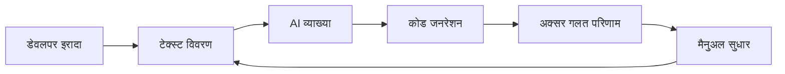

# Visual-to-Code Bridge

Visual-to-Code Bridge Hatcher की हस्ताक्षर फीचर है जो AI कोडिंग सहायकों के साथ डेवलपर्स की इंटरैक्शन में क्रांति लाता है। टेक्स्ट में परिवर्तनों का वर्णन करने के बजाय, आप सीधे अपने एप्लिकेशन के दृश्य इंटरफ़ेस को हेरफेर करते हैं, और Hatcher आपकी क्रियाओं को सटीक कोड संशोधनों में अनुवाद करता है।

## यह कैसे काम करता है

### पारंपरिक समस्या



**निराशाजनक चक्र का उदाहरण:**

- डेवलपर: "हेडर को नीला बनाएं और इसे केंद्रित करें"
- AI: गलत तत्व को नीला बनाने वाला CSS उत्पन्न करता है
- डेवलपर: "नहीं, मुख्य हेडर, साइडबार हेडर नहीं"
- AI: इसे नीले रंग का गलत शेड बनाता है
- डेवलपर: "इसे #3B82F6 बनाएं और फ़ॉन्ट साइज़ भी बढ़ाएं"
- ... और इसी तरह

### Hatcher का Visual-to-Code दृष्टिकोण: ब्रिज के दोहरे मोड

Visual-to-Code Bridge आपके प्रोजेक्ट के मिशन के आधार पर अलग-अलग तरीके से काम करता है, स्वतंत्रता और नियंत्रण का सही संतुलन प्रदान करता है।

**Generative मोड में: AI-सहायक निर्माण**

एक `Generative` प्रोजेक्ट में, ब्रिज AI के लिए एक उच्च-सटीकता लक्ष्यीकरण प्रणाली के रूप में कार्य करता है। वर्कफ़्लो है:

1. **आप संदर्भ को एंकर करते हैं:** एक तत्व का चयन करने के लिए क्लिक करें।

2. **आप कमांड प्रदान करते हैं:** वांछित परिवर्तन का वर्णन करने के लिए प्राकृतिक भाषा का उपयोग करें।

3. **AI निष्पादित करता है:** यह आवश्यक कोड उत्पन्न करता है, आपके द्वारा परिभाषित दायरे तक सीमित।

**एक EGG में: नियतात्मक हेरफेर**

एक EGG (Enforced Governance Guardrails) में, ब्रिज एक प्रत्यक्ष हेरफेर उपकरण बन जाता है जहां दृश्य परिवर्तनों के लिए AI कोड जनरेशन का उपयोग नहीं किया जाता है। वर्कफ़्लो 100% नियतात्मक है:

1. **आप सीधे हेरफेर करते हैं:** एक दृश्य पैनल में गुणों को खींचें, आकार बदलें या संपादित करें।

2. **इंजन इवेंट को कैप्चर करता है:** Hatcher परिवर्तन को एक संरचित अपडेट के रूप में रिकॉर्ड करता है।

3. **कॉन्फ़िगरेशन अपडेट किया जाता है:** परिवर्तन को एक प्रोजेक्ट कॉन्फ़िगरेशन फ़ाइल में लिखा जाता है, नए सोर्स कोड के रूप में उत्पन्न नहीं किया जाता है।

## मुख्य फीचर्स

### 1. तत्व चयन

**स्मार्ट चयन प्रणाली**

- इसे चुनने के लिए किसी भी तत्व पर क्लिक करें
- चयन सीमाओं का पूर्वावलोकन करने के लिए होवर करें
- बैच संचालन के लिए एकाधिक तत्वों का चयन करें
- पदानुक्रमित चयन (बाल, माता-पिता, भाई-बहन)

```typescript
// उदाहरण: एक बटन का चयन करना
const selection = {
  element: 'button.submit-btn',
  properties: {
    position: { x: 120, y: 45 },
    dimensions: { width: 100, height: 36 },
    styles: {
      backgroundColor: '#3B82F6',
      borderRadius: '6px',
      fontSize: '14px',
    },
  },
  context: {
    parent: 'form.checkout-form',
    siblings: ['input.email', 'input.password'],
    framework: 'Vue 3',
    component: 'SubmitButton.vue',
  },
}
```

### 2. दृश्य हेरफेर

**प्रत्यक्ष संपत्ति संपादन**

- तत्वों को नए स्थानों पर खींचें
- कोनों को खींचकर आकार बदलें
- पृष्ठभूमि और टेक्स्ट के लिए कलर पिकर
- टाइपोग्राफी नियंत्रण (फ़ॉन्ट, साइज़, वेट)
- स्पेसिंग नियंत्रण (मार्जिन, पैडिंग)

**लाइव पूर्वावलोकन**

- अपने एप्लिकेशन में तुरंत परिवर्तन देखें
- रिफ्रेश या रीबिल्ड करने की आवश्यकता नहीं
- हॉट मॉड्यूल रिप्लेसमेंट इंटीग्रेशन
- रीयल-टाइम CSS अपडेट

### 3. इरादा पहचान

Hatcher आपके दृश्य परिवर्तनों का विश्लेषण करता है और समझता है:

**लेआउट परिवर्तन**

- स्थिति संशोधन (पूर्ण, सापेक्ष, flex)
- साइज़ समायोजन (चौड़ाई, ऊंचाई, रिस्पॉन्सिव)
- संरेखण परिवर्तन (केंद्र, flex, grid)

**स्टाइल परिवर्तन**

- रंग संशोधन (hex, RGB, HSL, CSS वेरिएबल्स)
- टाइपोग्राफी अपडेट (फ़ॉन्ट परिवार, साइज़, वेट, लाइन हाइट)
- दृश्य प्रभाव (छाया, बॉर्डर, ग्रेडिएंट)

**कंपोनेंट परिवर्तन**

- Props संशोधन
- स्टेट अपडेट
- इवेंट हैंडलर जोड़

### 4. कोड जनरेशन

आपके दृश्य इरादे के आधार पर, Hatcher उत्पन्न करता है:

**फ्रेमवर्क-विशिष्ट कोड**

```vue
<!-- Vue 3 उदाहरण -->
<template>
  <button
    class="submit-btn"
    :style="{
      transform: `translate(${position.x}px, ${position.y}px)`,
      backgroundColor: '#3B82F6',
    }"
    @click="handleSubmit"
  >
    Submit
  </button>
</template>
```

**CSS अपडेट**

```css
.submit-btn {
  position: absolute;
  left: 120px;
  top: 45px;
  background-color: #3b82f6;
  width: 100px;
  height: 36px;
  border-radius: 6px;
  font-size: 14px;
}
```

**TypeScript इंटीग्रेशन**

```typescript
interface ButtonProps {
  position: { x: number; y: number }
  variant: 'primary' | 'secondary'
  size: 'sm' | 'md' | 'lg'
}
```

## उन्नत क्षमताएं

### 1. रिस्पॉन्सिव डिज़ाइन

**मल्टी-ब्रेकपॉइंट संपादन**

- विभिन्न स्क्रीन साइज़ को एक साथ संपादित करें
- स्वचालित रूप से रिस्पॉन्सिव CSS उत्पन्न करें
- डिवाइसों में डिज़ाइन स्थिरता बनाए रखें

```css
/* जेनरेटेड रिस्पॉन्सिव कोड */
.submit-btn {
  /* मोबाइल */
  width: 100%;
  margin: 0 16px;
}

@media (min-width: 768px) {
  /* टैबलेट */
  .submit-btn {
    width: 200px;
    margin: 0 auto;
  }
}

@media (min-width: 1024px) {
  /* डेस्कटॉप */
  .submit-btn {
    width: 150px;
    position: absolute;
    left: 120px;
  }
}
```

### 2. कंपोनेंट-जागरूक परिवर्तन

**स्मार्ट कंपोनेंट डिटेक्शन**

- Vue, React, Svelte कंपोनेंट को पहचानता है
- कंपोनेंट props और स्टेट को समझता है
- कंपोनेंट सीमाओं को बनाए रखता है

**उदाहरण: एक Vue कंपोनेंट को संशोधित करना**

```vue
<!-- पहले -->
<UserCard :user="currentUser" size="medium" />

<!-- दृश्य संशोधन के बाद -->
<UserCard
  :user="currentUser"
  size="large"
  :style="{ marginTop: '24px' }"
  show-avatar
/>
```

### 3. डिज़ाइन सिस्टम इंटीग्रेशन

**स्वचालित टोकन उपयोग**

- डिज़ाइन सिस्टम टोकन को पहचानता है
- उपयुक्त मानों का सुझाव देता है
- स्थिरता बनाए रखता है

```css
/* मनमाने मूल्यों के बजाय */
color: #3b82f6;
padding: 12px;

/* डिज़ाइन टोकन का उपयोग करता है */
color: var(--color-primary-500);
padding: var(--spacing-3);
```

## वर्कफ़्लो उदाहरण

### उदाहरण 1: लेआउट समायोजन

**लक्ष्य**: साइडबार को बाएं से दाईं ओर ले जाएं

1. **चयन करें**: साइडबार कंपोनेंट पर क्लिक करें
2. **खींचें**: इसे स्क्रीन के दाईं ओर खींचें
3. **समीक्षा करें**: उत्पन्न flex/grid परिवर्तन देखें
4. **लागू करें**: CSS संशोधनों को स्वीकार करें

**जेनरेटेड कोड**:

```css
.layout-container {
  display: flex;
  flex-direction: row; /* row-reverse से बदला गया */
}

.sidebar {
  order: 2; /* 1 से बदला गया */
  margin-left: auto; /* जोड़ा गया */
}
```

### उदाहरण 2: कंपोनेंट स्टाइलिंग

**लक्ष्य**: डिज़ाइन से मेल खाने के लिए बटन की उपस्थिति बदलें

1. **चयन करें**: बटन पर क्लिक करें
2. **स्टाइल करें**: कलर पिकर का उपयोग करें, साइज़ समायोजित करें, बॉर्डर संशोधित करें
3. **पूर्वावलोकन**: एप्लिकेशन में लाइव परिवर्तन देखें
4. **उत्पन्न करें**: कंपोनेंट prop अपडेट प्राप्त करें

**जेनरेटेड कोड**:

```vue
<script setup>
const buttonStyle = {
  variant: 'primary',
  size: 'lg',
  rounded: true,
}
</script>

<template>
  <AppButton v-bind="buttonStyle"> Submit Order </AppButton>
</template>
```

### उदाहरण 3: रिस्पॉन्सिव समायोजन

**लक्ष्य**: एक ग्रिड को रिस्पॉन्सिव बनाएं

1. **चयन करें**: ग्रिड कंटेनर चुनें
2. **आकार बदलें**: विभिन्न ब्रेकपॉइंट के लिए कॉलम समायोजित करें
3. **परीक्षण करें**: मोबाइल/टैबलेट/डेस्कटॉप पर पूर्वावलोकन करें
4. **लागू करें**: रिस्पॉन्सिव CSS Grid उत्पन्न करें

**जेनरेटेड कोड**:

```css
.product-grid {
  display: grid;
  gap: 1rem;
  grid-template-columns: 1fr; /* मोबाइल */
}

@media (min-width: 640px) {
  .product-grid {
    grid-template-columns: repeat(2, 1fr); /* टैबलेट */
  }
}

@media (min-width: 1024px) {
  .product-grid {
    grid-template-columns: repeat(3, 1fr); /* डेस्कटॉप */
  }
}
```

## AI इंजनों के साथ इंटीग्रेशन

Visual-to-Code Bridge समर्थित AI इंजनों के साथ सहजता से काम करता है:

### Claude Code इंटीग्रेशन

```typescript
const visualIntent = captureVisualChange(selection, modification)
const codeChange = await claudeCode.generateChange({
  intent: visualIntent,
  context: projectContext,
  playbook: teamPlaybook,
})
```

### Gemini CLI इंटीग्रेशन

```typescript
const prompt = buildVisualPrompt(visualIntent, codeContext)
const suggestion = await geminiCLI.complete(prompt)
const refinedCode = refineWithPlaybook(suggestion)
```

## सर्वोत्तम प्रथाएं

### 1. छोटी शुरुआत करें

- वृद्धिशील दृश्य परिवर्तन करें
- अगले पर जाने से पहले प्रत्येक संशोधन का परीक्षण करें
- छोटे चरणों के माध्यम से जटिल परिवर्तन बनाएं

### 2. Playbooks का उपयोग करें

- अपने playbooks में कंपोनेंट पैटर्न परिभाषित करें
- सुसंगत स्टाइलिंग नियम स्थापित करें
- सामान्य डिज़ाइन पैटर्न दस्तावेज़ित करें

### 3. जेनरेटेड कोड की समीक्षा करें

- लागू करने से पहले हमेशा कोड diff की समीक्षा करें
- सुनिश्चित करें कि जेनरेटेड कोड आपके मानकों का पालन करता है
- बेहतर परिणामों के लिए आवश्यकतानुसार प्रॉम्प्ट को परिष्कृत करें

### 4. पूरी तरह से परीक्षण करें

- परिवर्तनों को मान्य करने के लिए स्वचालित परीक्षणों का उपयोग करें
- रिस्पॉन्सिव व्यवहार की जांच करें
- एक्सेसिबिलिटी अनुपालन सत्यापित करें

---

Visual-to-Code Bridge विकास के लिए AI के साथ हम कैसे इंटरैक्ट करते हैं, इसमें एक मौलिक बदलाव का प्रतिनिधित्व करता है। इरादे और कार्यान्वयन के बीच अनुवाद परत को समाप्त करके, यह एक अधिक सहज, सटीक और कुशल विकास अनुभव बनाता है।
