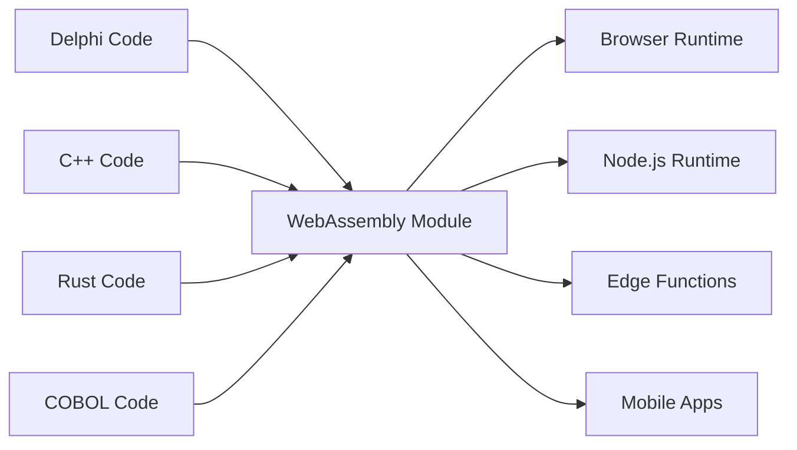

# The Universal Fabricator

"Making binaries for linux desktop applications is a major pain in the ass. You want to just compile one binary and have it work, preferably forever, and preferably across all the linux distributions." - Linus Torvalds, 2014

## Dua Kebohongan yang Kami Tolak untuk Diterima

### Kebohongan Legacy: "Tulis Ulang Semuanya"

Rant terkenal Linus tentang mimpi buruk distribusi software adalah gejala dari kebohongan yang lebih besar dan lebih mahal yang diceritakan industri software kepada dirinya sendiri: bahwa kode legacy adalah technical debt, dan satu-satunya cara untuk memodernisasi adalah membuang puluhan tahun logika bisnis yang teruji pertempuran dan memulai dari awal.

Ini adalah kegilaan. Kode Delphi, COBOL, atau C++ itu bekerja. Ini mengkodekan bertahun-tahun pengetahuan bisnis, menangani edge case, dan memperbaiki bug. Menulis ulangnya tidak hanya memperkenalkan risiko—itu menghancurkan pengetahuan institusional yang tidak tergantikan.

Universal Fabricator didirikan pada penolakan sederhana dan kuat: **kami menolak menerima ini adalah satu-satunya cara**. Bagaimana jika Anda dapat menjalankan logika legacy Anda di mana saja, tanpa penulisan ulang? Bukan melalui terjemahan. Melalui **eksekusi universal yang deterministik**.

### Dilema Modern: "Kecepatan atau Performa"

Tetapi ini bukan hanya tentang masa lalu. Di era modern, kami menghadapi pilihan palsu baru: dilema antara kecepatan prototyping (TypeScript, Python) dan performa produksi (Rust, Go). Tim dipaksa membuat keputusan yang menyakitkan: tetap dengan prototipe yang lambat, atau memulai penulisan ulang penuh yang berisiko untuk produksi.

Universal Fabricator menolak pilihan ini juga. Ini menyediakan jembatan—bukan hanya dari masa lalu ke masa kini, tetapi dari masa kini ke masa depan yang berkinerja lebih tinggi, tanpa mengorbankan kecepatan pengembangan Anda.

> **Logika bisnis Anda tidak memerlukan penulisan ulang. Ia membutuhkan renaissance.**

## Cara Kerjanya

Universal Fabricator terwujud sebagai Hatcher Functions Polyglot—kode legacy Anda yang dikompilasi ke WebAssembly—yang dikemas dan dieksekusi secara aman dalam Hatcher EGG. Arsitektur ini didukung oleh tiga komponen kunci:

### Keajaiban WebAssembly

WebAssembly (WASM) adalah terobosan yang membuat ini mungkin. Bahasa apa pun yang dapat dikompilasi ke WASM dapat berjalan di mana saja—browser, server, edge, mobile. Kode legacy Anda menjadi portabel tanpa mengubah satu baris pun.



### Hatcher Functions: Fungsi Tanpa Batas

Lambda tradisional berjalan di cloud. Hatcher Functions kami berjalan di mana saja:

```typescript
// Perhitungan pajak Delphi Anda yang berusia 20 tahun
const taxCalculator = await loadWASM('./legacy/tax-engine.wasm')

// Gunakan seperti fungsi JavaScript modern
const tax = await taxCalculator.calculateTax({
  income: 75000,
  deductions: 12000,
  state: 'NY',
})

// Berjalan dengan kecepatan native, lokal, dengan akurasi sempurna
```

### Arsitektur EGGs

EGGs (Enforced Governance Guardrails) adalah kontainer untuk logika universal Anda:

```yaml
egg: payroll-processor
version: 2.1.0
engine: wasm

modules:
  - name: tax-calculator
    source: delphi
    binary: tax-engine.wasm
    interface: ./interfaces/tax.ts

  - name: compliance-checker
    source: cobol
    binary: compliance.wasm
    interface: ./interfaces/compliance.ts

  - name: optimization-engine
    source: cpp
    binary: optimizer.wasm
    interface: ./interfaces/optimizer.ts

orchestration:
  entry: orchestrate.js
  runtime: node
```

## Pertahankan Aset Anda

### Kehidupan Kedua Kode Anda

Aplikasi Delphi dari 2001 itu? Itu menjadi:

- Microservice dalam cluster Kubernetes Anda
- Fungsi dalam aplikasi React Anda
- Edge worker untuk distribusi global
- Library dalam pipeline data Python Anda

Tanpa mengubah kode asli. Tanpa kehilangan logika bisnis. Tanpa risiko penulisan ulang.

### Contoh: Revolusi Perbankan

```javascript
// Asli: Pemroses transaksi COBOL berusia 30 tahun
// Sekarang: API web modern

import { loadCOBOLModule } from '@hatcher/eggs'

const transactionProcessor = await loadCOBOLModule('./legacy/transactions.wasm')

// API Express.js modern
app.post('/api/transfer', async (req, res) => {
  // Validasi modern
  const validated = await validateRequest(req.body)

  // Logika bisnis legacy (akurasi sempurna)
  const result = await transactionProcessor.processTransfer({
    fromAccount: validated.from,
    toAccount: validated.to,
    amount: validated.amount,
  })

  // Respons modern
  res.json({
    success: result.success,
    transactionId: result.id,
    timestamp: new Date().toISOString(),
  })
})
```

## Berkembang Tanpa Risiko

### Modernisasi Bertahap

Anda tidak harus memodernisasi semuanya sekaligus:

```typescript
class HybridPayrollSystem {
  // Simpan perhitungan kompleks dalam Delphi
  private legacyCalculator = loadWASM('./legacy/payroll.wasm')

  // Tambahkan fitur modern dalam TypeScript
  async calculatePayroll(employee: Employee) {
    // Gunakan legacy untuk perhitungan inti
    const base = await this.legacyCalculator.calculate(employee)

    // Tingkatkan dengan fitur modern
    const withBenefits = this.addModernBenefits(base)
    const withAnalytics = this.trackAnalytics(withBenefits)

    return withAnalytics
  }

  // Fitur baru dalam kode modern
  private addModernBenefits(payroll: Payroll) {
    // Perhitungan benefits modern
  }
}
```

### Interoperabilitas Bahasa

Bahasa berbeda untuk kekuatan berbeda:

```javascript
// Gunakan setiap bahasa untuk apa yang terbaik dilakukannya
const system = {
  // Rust untuk kinerja-kritis
  imageProcessor: await loadWASM('./rust/image-processor.wasm'),

  // Delphi untuk logika bisnis
  businessRules: await loadWASM('./delphi/rules-engine.wasm'),

  // C++ untuk algoritma
  optimizer: await loadWASM('./cpp/optimizer.wasm'),

  // JavaScript untuk orkestrasi
  async process(input) {
    const image = await this.imageProcessor.prepare(input.image)
    const rules = await this.businessRules.evaluate(input.data)
    const optimized = await this.optimizer.optimize(rules)

    return { image, result: optimized }
  },
}
```

## Optimalkan Masa Depan Anda: Dari Prototipe ke Performa

Hatcher juga platform optimisasi bertahap untuk aplikasi modern. Anda dapat mem-prototipe seluruh aplikasi Anda dalam TypeScript untuk menemukan product-market fit, kemudian mengganti bottleneck performa secara bedah dengan modul Rust atau Go berkinerja tinggi tanpa penulisan ulang penuh.

### Optimalkan Masa Depan Anda: Alur Kerja Transmutasi

Hatcher menyediakan alur kerja revolusioner untuk mengevolusi prototipe modern menjadi aplikasi berkinerja tinggi. Anda tidak menulis ulang; Anda transmutasi. Anda dapat mem-prototipe seluruh aplikasi Anda dalam TypeScript, kemudian menggunakan AI sebagai partner untuk secara aman dan sistematis meng-upgrade logika kritis ke bahasa berkinerja tinggi seperti Rust atau Go.

Ini adalah Playbook Alchemist.

#### Step 1: Prototipe (TypeScript)

Anda mulai dengan kode TypeScript yang bekerja, tetapi mungkin "kotor" atau lambat.

```ts
// Prototipe awal Anda untuk menghitung diskon pengguna.
// Ini bekerja, tetapi memiliki logika kompleks dan tidak cukup cepat.
function calculateDiscount(user, cart) {
  let discount = 0
  if (user.isVip) discount += 0.1
  if (cart.total > 100) discount += 0.05
  // ... banyak aturan kompleks dan lambat lainnya
  return Math.min(discount, 0.25) // cap discount
}
```

#### Step 2: Spesifikasi yang Didukung AI (Code → ACs)

Anda memilih fungsi dan mengkomando Hatcher: "Jelaskan logika ini sebagai Acceptance Criteria." AI menganalisis kode dan melakukan reverse-engineering aturan bisnis.

```Gherkin
# AI-Generated Acceptance Criteria

Feature: User Discount Calculation

Scenario: VIP user with large cart
Given a user is a "VIP"
And the cart total is over 100
Then the final discount should be 15%

Scenario: Non-VIP user
Given a user is not a "VIP"
Then the discount is based only on cart total

Scenario: Discount Capping
When any combination of rules results in a discount over 25%
Then the final discount must be capped at 25%
```

#### **Step 3: Perbaikan Manusia (Control Point)**

Sekarang, Anda, developer, meninjau dan meningkatkan AC ini dalam bahasa Inggris sederhana. Anda menangkap edge case yang terlewat AI dan menambahkan skenario baru. Ini adalah control point Anda.

#### Step 4: Pembuatan Test-Driven (ACs → Tests → Code)

Dengan AC yang disetujui manusia sebagai kontrak, Anda mengkomando Hatcher: "Hasilkan kode Rust dan unit tests untuk memenuhi kriteria ini."

1. Hatcher pertama menghasilkan tests dalam Rust, langsung mencerminkan AC.

2. Kemudian, ia menghasilkan kode Rust yang membuat tests tersebut lulus.

```rust
// Kode Rust akhir berkinerja tinggi, dijamin oleh tests
// untuk sesuai dengan logika bisnis yang disetujui manusia.
pub fn calculate_discount(user: &User, cart: &Cart) -> f64 {
    // Logika Rust yang sangat cepat dan aman...
}
```

#### Step 5: Artefak Hidup

Output akhir bukan hanya modul .wasm yang dikompilasi. Ini modul **dipasangkan dengan spesifikasi yang dapat dibaca manusia**. AC dipertahankan bersama lambda, menciptakan dokumentasi hidup untuk pemeliharaan dan evolusi masa depan.

Ini adalah mimpi Alchemist: proses yang aman dan terstruktur untuk transmutasi prototipe menjadi aplikasi berkinerja tinggi, tanpa risiko, dan dengan kejelasan sempurna.

## Eksekusi dengan Percaya Diri

### WASM Cleanroom

Setiap modul WASM berjalan dalam sandbox:

```typescript
interface WASMSandbox {
  memory: {
    limit: '100MB'
    shared: false
  }

  cpu: {
    timeout: '5s'
    priority: 'normal'
  }

  io: {
    filesystem: 'none'
    network: 'none'
    system: 'none'
  }
}
```

Kode legacy Anda tidak dapat:

- Mengakses filesystem (kecuali secara eksplisit diberikan)
- Membuat panggilan jaringan (kecuali secara eksplisit diberikan)
- Merusak proses host
- Kebocoran memori
- Mengganggu modul lain

### Antarmuka Type-Safe

Hasilkan antarmuka TypeScript dari kode legacy Anda:

```typescript
// Auto-generated dari signature fungsi Delphi
export interface TaxEngine {
  calculateFederalTax(income: number, deductions: number): Promise<number>
  calculateStateTax(income: number, state: string): Promise<number>
  getDeductionLimit(filingStatus: FilingStatus): Promise<number>
}

// Penggunaan type-safe
const engine: TaxEngine = await loadWASM('./tax-engine.wasm')
const tax = await engine.calculateFederalTax(100000, 12000) // Type-checked!
```

## Terbukti di Lapangan

### Skenario 1: Raksasa Asuransi

Perusahaan asuransi berusia 40 tahun dengan jutaan baris COBOL:

```yaml
before:
  problem: 'COBOL mainframe costs $2M/year'
  solution: '5-year, $50M rewrite project (failed twice)'

after:
  solution: 'Compile COBOL to WASM'
  timeline: '3 months'
  result:
    - Run on commodity hardware
    - Scale horizontally
    - Keep all business logic
    - Modern API layer
  savings: '$1.8M/year'
```

### Skenario 2: Perusahaan Trading

Algoritma trading frekuensi tinggi dalam C++:

```javascript
// Asli: C++ berjalan pada hardware khusus
// Sekarang: C++ yang sama berjalan di mana saja

const tradingEngine = await loadWASM('./trading/algorithm.wasm')

// Deploy ke lokasi edge secara global
const edgeLocations = ['nyc', 'london', 'tokyo', 'singapore']

for (const location of edgeLocations) {
  deployToEdge(location, tradingEngine)
  // Algoritma yang sama, latensi mikrodetik, distribusi global
}
```

### Skenario 3: Sistem Manufaktur

Kode C embedded dari controller industri:

```typescript
// Kode C berusia 30 tahun dari peralatan manufaktur
const controller = await loadWASM('./embedded/controller.wasm')

// Sekarang menggerakkan dashboard web modern
const Dashboard = () => {
  const [status, setStatus] = useState()

  useEffect(() => {
    const interval = setInterval(async () => {
      const data = await controller.getSystemStatus()
      setStatus(data)
    }, 1000)

    return () => clearInterval(interval)
  }, [])

  return <ModernUIComponent data={status} />
}
```

### Skenario 4: Startup AI

Startup yang bergerak cepat mem-prototipe pipeline pemrosesan data mereka dalam Python.

```yaml
before:
  problem: 'Python prototype is too slow for production customers.'
  solution: "Plan a 6-month 'rewrite it in Go' project, pausing all feature development."
after:
  solution: 'Identify and rewrite 3 critical functions in Rust with Hatcher.'
  timeline: '2 weeks.'
  result:
    - 90% of the codebase remains in easy-to-iterate Python.
    - Critical path is now 120x faster.
    - Shipped to production customers next month.
    - Rewrite project cancelled.
```

## Memulai

### Step 1: Identifikasi Logika Anda

Logika bisnis apa yang terjebak dalam kode legacy?

- Mesin perhitungan
- Aturan bisnis
- Logika validasi
- Algoritma pemrosesan

### Step 2: Kompilasi ke WASM

Sebagian besar bahasa sekarang mendukung kompilasi WASM:

```bash
# Delphi
delphi2wasm your-code.pas -o output.wasm

# C/C++
emcc your-code.cpp -o output.wasm

# COBOL
cobol2wasm your-code.cob -o output.wasm

# Rust
cargo build --target wasm32-unknown-unknown
```

### Step 3: Buat Antarmuka

Tentukan bagaimana kode modern akan berinteraksi:

```typescript
// Tentukan antarmuka
interface LegacyModule {
  initialize(): Promise<void>
  process(input: Input): Promise<Output>
  cleanup(): Promise<void>
}
```

### Step 4: Integrasikan

Gunakan logika legacy Anda dalam aplikasi modern:

```javascript
const legacy = await loadWASM('./legacy.wasm')
// Kode Anda yang berusia 30 tahun sekarang adalah modul modern
```

## Filosofi

Universal Fabricator mewujudkan keyakinan fundamental: **kode adalah aset, bukan liabilitas**. Setiap baris kode yang bekerja mewakili masalah yang terpecahkan, edge case yang ditangani, dan pengetahuan yang tertanam. Usia kode tidak mengurangi nilainya—itu membuktikannya.

Kami tidak membuang buku karena mereka tua. Kami tidak menghancurkan bangunan karena dibangun dengan alat berbeda. Mengapa kami bersikeras menulis ulang kode yang bekerja?

Universal Fabricator adalah pelestarian melalui kemajuan. Ini modernisasi tanpa penghancuran. Ini jembatan antara apa yang dibangun dan apa yang perlu dibangun.

---

_Universal Fabricator tidak hanya menjalankan kode legacy Anda—ia membebaskannya. Logika bisnis Anda, dibebaskan dari penjara runtime yang ketinggalan zaman, menjadi benar-benar universal. Tulis sekali, jalankan selamanya, di mana saja._

<PageCTA
  title="Bebaskan Kode Legacy Anda"
  subtitle="Transformasikan puluhan tahun logika bisnis menjadi modul modern dan universal"
  buttonText="Jelajahi Fabricator"
  buttonLink="/id/features-universal-fabricator"
  buttonStyle="secondary"
  footer="Kode Anda adalah aset, bukan liabilitas. Pertahankan. Modernisasi."
/>
