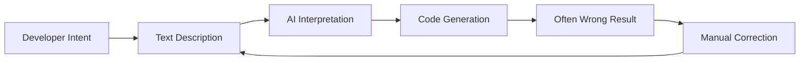

# Visual-to-Code Bridge

Visual-to-Code Bridge adalah fitur unggulan Hatcher yang merevolusi cara developer berinteraksi dengan asisten coding AI. Alih-alih mendeskripsikan perubahan dalam teks, Anda memanipulasi antarmuka visual aplikasi Anda secara langsung, dan Hatcher menerjemahkan tindakan Anda menjadi modifikasi kode yang tepat.

## Cara Kerjanya

### Masalah Tradisional



**Contoh siklus yang membuat frustrasi:**

- Developer: "Make the header blue and center it"
- AI: Menghasilkan CSS yang membuat elemen salah biru
- Developer: "No, the main header, not the sidebar header"
- AI: Membuatnya warna biru yang salah
- Developer: "Make it #3B82F6 and also increase the font size"
- ... dan seterusnya

### Pendekatan Visual-to-Code Hatcher: Mode Ganda Bridge

Visual-to-Code Bridge beroperasi secara berbeda tergantung pada misi proyek Anda, memberikan keseimbangan yang tepat antara kebebasan dan kontrol.

**Dalam Mode Generative: Kreasi yang Dibantu AI**

Dalam proyek `Generative`, bridge bertindak sebagai sistem penargetan presisi tinggi untuk AI. Alur kerjanya adalah:

1. **Anda menambatkan konteks:** Klik untuk memilih elemen.

2. **Anda memberikan perintah:** Gunakan bahasa natural untuk mendeskripsikan perubahan yang diinginkan.

3. **AI mengeksekusi:** Ia menghasilkan kode yang diperlukan, dibatasi pada scope yang Anda definisikan.

**Dalam EGG: Manipulasi Deterministik**

Dalam EGG (Enforced Governance Guardrails), bridge menjadi alat manipulasi langsung di mana pembuatan kode AI tidak digunakan untuk perubahan visual. Alur kerjanya 100% deterministik:

1. **Anda memanipulasi secara langsung:** Drag, resize, atau edit properti dalam panel visual.

2. **Engine menangkap event:** Hatcher merekam perubahan sebagai update terstruktur.

3. **Konfigurasi diperbarui:** Perubahan ditulis ke file konfigurasi proyek, tidak dihasilkan sebagai source code baru.

## Fitur Inti

### 1. Pemilihan Elemen

**Sistem Seleksi Cerdas**

- Klik elemen apa pun untuk memilihnya
- Hover untuk preview batas seleksi
- Pilih beberapa elemen untuk operasi batch
- Seleksi hierarkis (child, parent, siblings)

```typescript
// Contoh: Memilih tombol
const selection = {
  element: 'button.submit-btn',
  properties: {
    position: { x: 120, y: 45 },
    dimensions: { width: 100, height: 36 },
    styles: {
      backgroundColor: '#3B82F6',
      borderRadius: '6px',
      fontSize: '14px',
    },
  },
  context: {
    parent: 'form.checkout-form',
    siblings: ['input.email', 'input.password'],
    framework: 'Vue 3',
    component: 'SubmitButton.vue',
  },
}
```

### 2. Manipulasi Visual

**Pengeditan Properti Langsung**

- Drag elemen ke posisi baru
- Resize dengan drag sudut
- Color picker untuk background dan teks
- Kontrol tipografi (font, size, weight)
- Kontrol spacing (margin, padding)

**Live Preview**

- Lihat perubahan secara instan dalam aplikasi Anda
- Tidak perlu refresh atau rebuild
- Integrasi hot module replacement
- Update CSS real-time

### 3. Pengenalan Niat

Hatcher menganalisis perubahan visual Anda dan memahami:

**Perubahan Layout**

- Modifikasi posisi (absolute, relative, flex)
- Penyesuaian ukuran (width, height, responsive)
- Perubahan alignment (center, flex, grid)

**Perubahan Style**

- Modifikasi warna (hex, RGB, HSL, CSS variables)
- Update tipografi (font family, size, weight, line height)
- Efek visual (shadows, borders, gradients)

**Perubahan Komponen**

- Modifikasi props
- Update state
- Penambahan event handler

### 4. Pembuatan Kode

Berdasarkan niat visual Anda, Hatcher menghasilkan:

**Kode Spesifik Framework**

```vue
<!-- Contoh Vue 3 -->
<template>
  <button
    class="submit-btn"
    :style="{
      transform: `translate(${position.x}px, ${position.y}px)`,
      backgroundColor: '#3B82F6',
    }"
    @click="handleSubmit"
  >
    Submit
  </button>
</template>
```

**Update CSS**

```css
.submit-btn {
  position: absolute;
  left: 120px;
  top: 45px;
  background-color: #3b82f6;
  width: 100px;
  height: 36px;
  border-radius: 6px;
  font-size: 14px;
}
```

**Integrasi TypeScript**

```typescript
interface ButtonProps {
  position: { x: number; y: number }
  variant: 'primary' | 'secondary'
  size: 'sm' | 'md' | 'lg'
}
```

## Kemampuan Lanjutan

### 1. Desain Responsif

**Pengeditan Multi-Breakpoint**

- Edit ukuran layar berbeda secara bersamaan
- Hasilkan CSS responsif secara otomatis
- Pertahankan konsistensi desain di seluruh perangkat

```css
/* Kode responsif yang dihasilkan */
.submit-btn {
  /* Mobile */
  width: 100%;
  margin: 0 16px;
}

@media (min-width: 768px) {
  /* Tablet */
  .submit-btn {
    width: 200px;
    margin: 0 auto;
  }
}

@media (min-width: 1024px) {
  /* Desktop */
  .submit-btn {
    width: 150px;
    position: absolute;
    left: 120px;
  }
}
```

### 2. Perubahan Sadar Komponen

**Deteksi Komponen Cerdas**

- Mengenali komponen Vue, React, Svelte
- Memahami props dan state komponen
- Mempertahankan batas komponen

**Contoh: Memodifikasi Komponen Vue**

```vue
<!-- Sebelum -->
<UserCard :user="currentUser" size="medium" />

<!-- Setelah modifikasi visual -->
<UserCard
  :user="currentUser"
  size="large"
  :style="{ marginTop: '24px' }"
  show-avatar
/>
```

### 3. Integrasi Design System

**Penggunaan Token Otomatis**

- Mengenali token design system
- Menyarankan nilai yang sesuai
- Mempertahankan konsistensi

```css
/* Alih-alih nilai arbitrary */
color: #3b82f6;
padding: 12px;

/* Gunakan design tokens */
color: var(--color-primary-500);
padding: var(--spacing-3);
```

## Contoh Alur Kerja

### Contoh 1: Penyesuaian Layout

**Tujuan**: Pindahkan sidebar dari kiri ke kanan

1. **Pilih**: Klik pada komponen sidebar
2. **Drag**: Drag ke sisi kanan layar
3. **Tinjau**: Lihat perubahan flex/grid yang dihasilkan
4. **Terapkan**: Terima modifikasi CSS

**Kode yang Dihasilkan**:

```css
.layout-container {
  display: flex;
  flex-direction: row; /* Changed from row-reverse */
}

.sidebar {
  order: 2; /* Changed from 1 */
  margin-left: auto; /* Added */
}
```

### Contoh 2: Styling Komponen

**Tujuan**: Ubah tampilan tombol agar sesuai desain

1. **Pilih**: Klik tombol
2. **Style**: Gunakan color picker, sesuaikan ukuran, modifikasi border
3. **Preview**: Lihat perubahan langsung dalam aplikasi
4. **Hasilkan**: Dapatkan update prop komponen

**Kode yang Dihasilkan**:

```vue
<script setup>
const buttonStyle = {
  variant: 'primary',
  size: 'lg',
  rounded: true,
}
</script>

<template>
  <AppButton v-bind="buttonStyle"> Submit Order </AppButton>
</template>
```

### Contoh 3: Penyesuaian Responsif

**Tujuan**: Buat grid responsif

1. **Pilih**: Pilih kontainer grid
2. **Resize**: Sesuaikan kolom untuk breakpoint berbeda
3. **Test**: Preview pada mobile/tablet/desktop
4. **Terapkan**: Hasilkan CSS Grid responsif

**Kode yang Dihasilkan**:

```css
.product-grid {
  display: grid;
  gap: 1rem;
  grid-template-columns: 1fr; /* Mobile */
}

@media (min-width: 640px) {
  .product-grid {
    grid-template-columns: repeat(2, 1fr); /* Tablet */
  }
}

@media (min-width: 1024px) {
  .product-grid {
    grid-template-columns: repeat(3, 1fr); /* Desktop */
  }
}
```

## Integrasi dengan AI Engines

Visual-to-Code Bridge bekerja mulus dengan AI engines yang didukung:

### Integrasi Claude Code

```typescript
const visualIntent = captureVisualChange(selection, modification)
const codeChange = await claudeCode.generateChange({
  intent: visualIntent,
  context: projectContext,
  playbook: teamPlaybook,
})
```

### Integrasi Gemini CLI

```typescript
const prompt = buildVisualPrompt(visualIntent, codeContext)
const suggestion = await geminiCLI.complete(prompt)
const refinedCode = refineWithPlaybook(suggestion)
```

## Praktik Terbaik

### 1. Mulai Kecil

- Buat perubahan visual incremental
- Test setiap modifikasi sebelum pindah ke berikutnya
- Bangun perubahan kompleks melalui langkah-langkah kecil

### 2. Gunakan Playbooks

- Definisikan pola komponen dalam playbooks Anda
- Tetapkan aturan styling yang konsisten
- Dokumentasikan pola desain umum

### 3. Tinjau Kode yang Dihasilkan

- Selalu tinjau code diff sebelum menerapkan
- Pastikan kode yang dihasilkan mengikuti standar Anda
- Perbaiki prompt jika diperlukan untuk hasil yang lebih baik

### 4. Test Secara Menyeluruh

- Gunakan automated tests untuk validasi perubahan
- Periksa perilaku responsif
- Verifikasi kepatuhan accessibility

---

Visual-to-Code Bridge mewakili pergeseran fundamental dalam cara kita berinteraksi dengan AI untuk pengembangan. Dengan menghilangkan lapisan terjemahan antara niat dan implementasi, ini menciptakan pengalaman pengembangan yang lebih intuitif, tepat, dan efisien.
