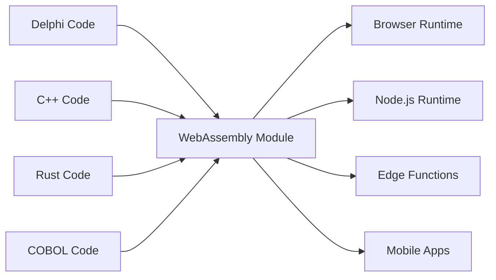

# The Universal Fabricator

「Linux デスクトップアプリケーションのバイナリを作成するのは、非常に面倒です。1つのバイナリをコンパイルして、できれば永遠に、できればすべての Linux ディストリビューション全体で動作させたいのです。」 - Linus Torvalds、2014年

## 受け入れることを拒否する2つの嘘

### レガシーの嘘: 「すべてを書き直す」

ソフトウェア配布の悪夢についての Linus の有名な暴言は、ソフトウェア業界が自分自身に語る、より大きく、よりコストのかかる嘘の症状です: レガシーコードは技術的負債であり、モダナイズする唯一の方法は、何十年もの実戦でテストされたビジネスロジックを捨てて、ゼロから始めることだという嘘。

これは狂気です。その Delphi、COBOL、または C++ コードは機能します。何年ものビジネス知識をエンコードし、エッジケースを処理し、バグを修正しました。それを書き直すことは、リスクを導入するだけでなく、かけがえのない制度的知識を破壊します。

Universal Fabricator は、シンプルで強力な拒否に基づいています: **これが唯一の方法であることを受け入れることを拒否します**。レガシーロジックを書き直すことなく、どこでも実行できるとしたらどうでしょうか? 翻訳を通じてではありません。**普遍的で決定論的な実行**を通じて。

### モダンなジレンマ: 「速度またはパフォーマンス」

しかし、これは過去だけの話ではありません。モダンな時代には、新しい誤った選択に直面しています: プロトタイピング速度(TypeScript、Python)と本番パフォーマンス(Rust、Go)の間のジレンマ。チームは、遅いプロトタイプにとどまるか、本番のためにリスクの高い完全な書き直しに着手するかという、苦痛な決定を強いられます。

Universal Fabricator は、この選択も拒否します。過去から現在への橋だけでなく、現在からより高性能な未来への橋を提供し、開発速度を犠牲にしません。

> **ビジネスロジックは書き直しは必要ありません。ルネッサンスが必要です。**

## 仕組み

Universal Fabricator は、Polyglot Hatcher Functions として現れます — レガシーコードを WebAssembly にコンパイルしたもの — Hatcher EGG 内で安全にパッケージ化され実行されます。このアーキテクチャは、3つの主要コンポーネントによって駆動されます:

### WebAssembly の魔法

WebAssembly (WASM) は、これを可能にする画期的なものです。WASM にコンパイルできるすべての言語は、どこでも実行できます — ブラウザ、サーバー、エッジ、モバイル。レガシーコードは、1行も変更せずにポータブルになります。



### Hatcher Functions: 国境のない関数

従来のラムダはクラウドで実行されます。Hatcher Functions はどこでも実行されます:

```typescript
// 20年前の Delphi 税計算
const taxCalculator = await loadWASM('./legacy/tax-engine.wasm')

// モダンな JavaScript 関数のように使用
const tax = await taxCalculator.calculateTax({
  income: 75000,
  deductions: 12000,
  state: 'NY',
})

// ネイティブ速度、ローカル、完璧な精度で実行
```

### EGGs アーキテクチャ

EGGs (Enforced Governance Guardrails) は、ユニバーサルロジックのコンテナです:

```yaml
egg: payroll-processor
version: 2.1.0
engine: wasm

modules:
  - name: tax-calculator
    source: delphi
    binary: tax-engine.wasm
    interface: ./interfaces/tax.ts

  - name: compliance-checker
    source: cobol
    binary: compliance.wasm
    interface: ./interfaces/compliance.ts

  - name: optimization-engine
    source: cpp
    binary: optimizer.wasm
    interface: ./interfaces/optimizer.ts

orchestration:
  entry: orchestrate.js
  runtime: node
```

## 資産を保存

### コードの第二の人生

2001年からのその Delphi アプリケーション? それは次のようになります:

- Kubernetes クラスターのマイクロサービス
- React アプリの関数
- グローバル配布のためのエッジワーカー
- Python データパイプラインのライブラリ

元のコードを変更せずに。ビジネスロジックを失うことなく。書き直しのリスクなしに。

### 例: 銀行革命

```javascript
// オリジナル: 30年前の COBOL トランザクションプロセッサ
// 現在: モダンな Web API

import { loadCOBOLModule } from '@hatcher/eggs'

const transactionProcessor = await loadCOBOLModule('./legacy/transactions.wasm')

// モダンな Express.js API
app.post('/api/transfer', async (req, res) => {
  // モダンな検証
  const validated = await validateRequest(req.body)

  // レガシービジネスロジック (完璧な精度)
  const result = await transactionProcessor.processTransfer({
    fromAccount: validated.from,
    toAccount: validated.to,
    amount: validated.amount,
  })

  // モダンなレスポンス
  res.json({
    success: result.success,
    transactionId: result.id,
    timestamp: new Date().toISOString(),
  })
})
```

## リスクなしで進化

### 段階的なモダナイゼーション

すべてを一度にモダナイズする必要はありません:

```typescript
class HybridPayrollSystem {
  // 複雑な計算を Delphi で保持
  private legacyCalculator = loadWASM('./legacy/payroll.wasm')

  // TypeScript でモダンな機能を追加
  async calculatePayroll(employee: Employee) {
    // コア計算にレガシーを使用
    const base = await this.legacyCalculator.calculate(employee)

    // モダンな機能で強化
    const withBenefits = this.addModernBenefits(base)
    const withAnalytics = this.trackAnalytics(withBenefits)

    return withAnalytics
  }

  // モダンなコードで新機能
  private addModernBenefits(payroll: Payroll) {
    // モダンな福利厚生計算
  }
}
```

### 言語相互運用性

さまざまな強みのためのさまざまな言語:

```javascript
// 各言語を得意なことに使用
const system = {
  // パフォーマンスクリティカルには Rust
  imageProcessor: await loadWASM('./rust/image-processor.wasm'),

  // ビジネスロジックには Delphi
  businessRules: await loadWASM('./delphi/rules-engine.wasm'),

  // アルゴリズムには C++
  optimizer: await loadWASM('./cpp/optimizer.wasm'),

  // オーケストレーションには JavaScript
  async process(input) {
    const image = await this.imageProcessor.prepare(input.image)
    const rules = await this.businessRules.evaluate(input.data)
    const optimized = await this.optimizer.optimize(rules)

    return { image, result: optimized }
  },
}
```

## 未来を最適化: プロトタイプからパフォーマンスへ

Hatcher は、モダンなアプリケーションのための段階的最適化プラットフォームでもあります。TypeScript で全体のアプリケーションをプロトタイプし、製品市場適合を見つけ、完全な書き直しなしに、高性能な Rust または Go モジュールでパフォーマンスボトルネックを外科的に置き換えることができます。

### 未来を最適化: 変換ワークフロー

Hatcher は、モダンなプロトタイプを高性能アプリケーションに進化させるための革命的なワークフローを提供します。書き直しではなく、変換します。TypeScript で全体のアプリケーションをプロトタイプし、AI をパートナーとして使用して、重要なロジックを Rust や Go などの高性能言語に安全かつ体系的にアップグレードできます。

これが Alchemist's Playbook です。

#### ステップ 1: プロトタイプ (TypeScript)

動作するが、おそらく「汚い」または遅い TypeScript コードから始めます。

```ts
// ユーザー割引を計算するための初期プロトタイプ。
// 動作しますが、複雑なロジックがあり、十分に速くありません。
function calculateDiscount(user, cart) {
  let discount = 0
  if (user.isVip) discount += 0.1
  if (cart.total > 100) discount += 0.05
  // ... さらに多くの複雑で遅いルール
  return Math.min(discount, 0.25) // 割引の上限
}
```

#### ステップ 2: AI 駆動仕様 (コード → AC)

関数を選択して Hatcher に指示します: 「このロジックを受入基準として記述してください。」AI はコードを分析し、ビジネスルールを逆エンジニアリングします。

```Gherkin
# AI 生成受入基準

Feature: User Discount Calculation

Scenario: VIP user with large cart
Given a user is a "VIP"
And the cart total is over 100
Then the final discount should be 15%

Scenario: Non-VIP user
Given a user is not a "VIP"
Then the discount is based only on cart total

Scenario: Discount Capping
When any combination of rules results in a discount over 25%
Then the final discount must be capped at 25%
```

#### **ステップ 3: 人間による洗練 (制御ポイント)**

次に、開発者であるあなたが、プレーンな英語でこれらの AC をレビューし、改善します。AI が見逃したエッジケースをキャッチし、新しいシナリオを追加します。これがあなたの制御ポイントです。

#### ステップ 4: テスト駆動生成 (AC → テスト → コード)

人間が承認した AC を契約として使用して、Hatcher に指示します: 「これらの基準を満たす Rust コードと単体テストを生成してください。」

1. Hatcher は最初に、AC を直接反映する Rust のテストを生成します。

2. 次に、それらのテストに合格する Rust コードを生成します。

```rust
// 最終的な高性能 Rust コード、テストによって保証される
// 人間が承認したビジネスロジックに一致します。
pub fn calculate_discount(user: &User, cart: &Cart) -> f64 {
    // 非常に高速で安全な Rust ロジック...
}
```

#### ステップ 5: 生きたアーティファクト

最終的な出力は、コンパイルされた .wasm モジュールだけではありません。**人間が読める仕様と組み合わされた**モジュールです。AC はラムダと一緒に保存され、将来のメンテナンスと進化のための生きたドキュメントを作成します。

これが Alchemist の夢です: プロトタイプを高性能アプリケーションに変換するための、リスクなしで完璧な明確性を持つ、安全で構造化されたプロセス。

## 自信を持って実行

### WASM クリーンルーム

すべての WASM モジュールはサンドボックスで実行されます:

```typescript
interface WASMSandbox {
  memory: {
    limit: '100MB'
    shared: false
  }

  cpu: {
    timeout: '5s'
    priority: 'normal'
  }

  io: {
    filesystem: 'none'
    network: 'none'
    system: 'none'
  }
}
```

レガシーコードは以下のことができません:

- ファイルシステムにアクセス(明示的に許可されない限り)
- ネットワーク呼び出しを行う(明示的に許可されない限り)
- ホストプロセスをクラッシュ
- メモリリーク
- 他のモジュールに干渉

### 型安全なインターフェース

レガシーコードから TypeScript インターフェースを生成:

```typescript
// Delphi 関数シグネチャから自動生成
export interface TaxEngine {
  calculateFederalTax(income: number, deductions: number): Promise<number>
  calculateStateTax(income: number, state: string): Promise<number>
  getDeductionLimit(filingStatus: FilingStatus): Promise<number>
}

// 型安全な使用
const engine: TaxEngine = await loadWASM('./tax-engine.wasm')
const tax = await engine.calculateFederalTax(100000, 12000) // 型チェック!
```

## 実戦で証明済み

### シナリオ 1: 保険大手

数百万行の COBOL を持つ40年の歴史を持つ保険会社:

```yaml
before:
  problem: 'COBOL mainframe costs $2M/year'
  solution: '5-year, $50M rewrite project (failed twice)'

after:
  solution: 'Compile COBOL to WASM'
  timeline: '3 months'
  result:
    - Run on commodity hardware
    - Scale horizontally
    - Keep all business logic
    - Modern API layer
  savings: '$1.8M/year'
```

### シナリオ 2: トレーディング会社

C++ での高頻度取引アルゴリズム:

```javascript
// オリジナル: 専用ハードウェアで実行される C++
// 現在: どこでも実行される同じ C++

const tradingEngine = await loadWASM('./trading/algorithm.wasm')

// グローバルにエッジロケーションに展開
const edgeLocations = ['nyc', 'london', 'tokyo', 'singapore']

for (const location of edgeLocations) {
  deployToEdge(location, tradingEngine)
  // 同じアルゴリズム、マイクロ秒のレイテンシ、グローバル配布
}
```

### シナリオ 3: 製造システム

産業用コントローラーからの組み込み C コード:

```typescript
// 製造設備からの30年前の C コード
const controller = await loadWASM('./embedded/controller.wasm')

// 現在、モダンな Web ダッシュボードを駆動
const Dashboard = () => {
  const [status, setStatus] = useState()

  useEffect(() => {
    const interval = setInterval(async () => {
      const data = await controller.getSystemStatus()
      setStatus(data)
    }, 1000)

    return () => clearInterval(interval)
  }, [])

  return <ModernUIComponent data={status} />
}
```

### シナリオ 4: AI スタートアップ

急速に動く スタートアップが Python でデータ処理パイプラインをプロトタイプ。

```yaml
before:
  problem: 'Python prototype is too slow for production customers.'
  solution: "Plan a 6-month 'rewrite it in Go' project, pausing all feature development."
after:
  solution: 'Identify and rewrite 3 critical functions in Rust with Hatcher.'
  timeline: '2 weeks.'
  result:
    - 90% of the codebase remains in easy-to-iterate Python.
    - Critical path is now 120x faster.
    - Shipped to production customers next month.
    - Rewrite project cancelled.
```

## 始め方

### ステップ 1: ロジックを特定

レガシーコードにトラップされているビジネスロジックは何ですか?

- 計算エンジン
- ビジネスルール
- 検証ロジック
- 処理アルゴリズム

### ステップ 2: WASM にコンパイル

ほとんどの言語が現在 WASM コンパイルをサポートしています:

```bash
# Delphi
delphi2wasm your-code.pas -o output.wasm

# C/C++
emcc your-code.cpp -o output.wasm

# COBOL
cobol2wasm your-code.cob -o output.wasm

# Rust
cargo build --target wasm32-unknown-unknown
```

### ステップ 3: インターフェースを作成

モダンなコードがどのように相互作用するかを定義:

```typescript
// インターフェースを定義
interface LegacyModule {
  initialize(): Promise<void>
  process(input: Input): Promise<Output>
  cleanup(): Promise<void>
}
```

### ステップ 4: 統合

モダンなアプリケーションでレガシーロジックを使用:

```javascript
const legacy = await loadWASM('./legacy.wasm')
// 30年前のコードが現在モダンなモジュールです
```

## 哲学

Universal Fabricator は、根本的な信念を具現化しています: **コードは負債ではなく、資産です**。動作するコードの各行は、解決された問題、処理されたエッジケース、組み込まれた知識を表します。コードの年齢は価値を減少させません — それは証明します。

古いからといって本を捨てません。異なるツールで建てられたからといって建物を取り壊しません。なぜ、動作するコードを書き直すことに固執するのでしょうか?

Universal Fabricator は、進歩を通じた保存です。破壊なしのモダナイゼーションです。構築されたものと構築する必要があるものの間の橋です。

---

_Universal Fabricator は、レガシーコードを実行するだけでなく、解放します。時代遅れのランタイムの牢獄から解放されたビジネスロジックは、真にユニバーサルになります。一度書いて、永遠に、どこでも実行します。_

<PageCTA
  title="レガシーコードを解放"
  subtitle="何十年ものビジネスロジックをモダンでユニバーサルなモジュールに変換"
  buttonText="Fabricator を探索"
  buttonLink="/ja/features-universal-fabricator"
  buttonStyle="secondary"
  footer="コードは負債ではなく、資産です。保存してください。モダナイズしてください。"
/>
