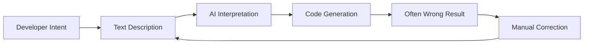

# Visual-to-Code Bridge

Visual-to-Code Bridge は、開発者が AI コーディングアシスタントとやり取りする方法を革新する Hatcher の特徴的な機能です。テキストで変更を説明する代わりに、アプリケーションのビジュアルインターフェースを直接操作し、Hatcher があなたのアクションを正確なコード変更に変換します。

## 仕組み

### 従来の問題



**イライラするサイクルの例:**

- 開発者: 「ヘッダーを青くして中央に配置」
- AI: 間違った要素を青にする CSS を生成
- 開発者: 「いいえ、サイドバーヘッダーではなく、メインヘッダー」
- AI: 間違った色の青にする
- 開発者: 「#3B82F6 にして、フォントサイズも大きくして」
- ... など

### Hatcher の Visual-to-Code アプローチ: Bridge のデュアルモード

Visual-to-Code Bridge は、プロジェクトのミッションに応じて異なる動作をし、適切な自由と制御のバランスを提供します。

**Generative モード: AI 支援作成**

`Generative` プロジェクトでは、ブリッジは AI の高精度ターゲティングシステムとして機能します。ワークフローは:

1. **コンテキストを固定:** 要素をクリックして選択します。

2. **コマンドを提供:** 自然言語を使用して、希望する変更を説明します。

3. **AI が実行:** 定義したスコープに制約された、必要なコードを生成します。

**EGG: 決定論的操作**

EGG (Enforced Governance Guardrails) では、ブリッジは、ビジュアル変更に AI コード生成が使用されない直接操作ツールになります。ワークフローは100%決定論的です:

1. **直接操作:** ビジュアルパネルでドラッグ、リサイズ、またはプロパティを編集します。

2. **エンジンがイベントをキャプチャ:** Hatcher は変更を構造化された更新として記録します。

3- **設定が更新:** 変更は、新しいソースコードとして生成されるのではなく、プロジェクト設定ファイルに書き込まれます。

## コア機能

### 1. 要素選択

**スマート選択システム**

- 任意の要素をクリックして選択
- ホバーして選択境界をプレビュー
- バッチ操作のために複数の要素を選択
- 階層選択 (子、親、兄弟)

```typescript
// 例: ボタンを選択
const selection = {
  element: 'button.submit-btn',
  properties: {
    position: { x: 120, y: 45 },
    dimensions: { width: 100, height: 36 },
    styles: {
      backgroundColor: '#3B82F6',
      borderRadius: '6px',
      fontSize: '14px',
    },
  },
  context: {
    parent: 'form.checkout-form',
    siblings: ['input.email', 'input.password'],
    framework: 'Vue 3',
    component: 'SubmitButton.vue',
  },
}
```

### 2. ビジュアル操作

**直接プロパティ編集**

- 新しい位置に要素をドラッグ
- コーナーをドラッグしてリサイズ
- 背景とテキストのカラーピッカー
- タイポグラフィ制御 (フォント、サイズ、ウェイト)
- スペーシング制御 (マージン、パディング)

**ライブプレビュー**

- アプリケーションで変更を即座に確認
- リフレッシュまたはリビルドの必要なし
- ホットモジュール置換統合
- リアルタイム CSS 更新

### 3. 意図認識

Hatcher はビジュアル変更を分析し、理解します:

**レイアウト変更**

- 位置変更 (absolute、relative、flex)
- サイズ調整 (width、height、responsive)
- 配置変更 (center、flex、grid)

**スタイル変更**

- 色変更 (hex、RGB、HSL、CSS 変数)
- タイポグラフィ更新 (フォントファミリー、サイズ、ウェイト、行の高さ)
- ビジュアルエフェクト (シャドウ、ボーダー、グラデーション)

**コンポーネント変更**

- Props 変更
- 状態更新
- イベントハンドラー追加

### 4. コード生成

ビジュアル意図に基づいて、Hatcher は生成します:

**フレームワーク固有のコード**

```vue
<!-- Vue 3 Example -->
<template>
  <button
    class="submit-btn"
    :style="{
      transform: `translate(${position.x}px, ${position.y}px)`,
      backgroundColor: '#3B82F6',
    }"
    @click="handleSubmit"
  >
    Submit
  </button>
</template>
```

**CSS 更新**

```css
.submit-btn {
  position: absolute;
  left: 120px;
  top: 45px;
  background-color: #3b82f6;
  width: 100px;
  height: 36px;
  border-radius: 6px;
  font-size: 14px;
}
```

**TypeScript 統合**

```typescript
interface ButtonProps {
  position: { x: number; y: number }
  variant: 'primary' | 'secondary'
  size: 'sm' | 'md' | 'lg'
}
```

## 高度な機能

### 1. レスポンシブデザイン

**マルチブレークポイント編集**

- 異なる画面サイズを同時に編集
- レスポンシブ CSS を自動生成
- デバイス全体でデザインの一貫性を維持

```css
/* 生成されたレスポンシブコード */
.submit-btn {
  /* モバイル */
  width: 100%;
  margin: 0 16px;
}

@media (min-width: 768px) {
  /* タブレット */
  .submit-btn {
    width: 200px;
    margin: 0 auto;
  }
}

@media (min-width: 1024px) {
  /* デスクトップ */
  .submit-btn {
    width: 150px;
    position: absolute;
    left: 120px;
  }
}
```

### 2. コンポーネント認識変更

**スマートコンポーネント検出**

- Vue、React、Svelte コンポーネントを認識
- コンポーネントの props と state を理解
- コンポーネントの境界を維持

**例: Vue コンポーネントの変更**

```vue
<!-- Before -->
<UserCard :user="currentUser" size="medium" />

<!-- After visual modification -->
<UserCard
  :user="currentUser"
  size="large"
  :style="{ marginTop: '24px' }"
  show-avatar
/>
```

### 3. デザインシステム統合

**自動トークン使用**

- デザインシステムトークンを認識
- 適切な値を提案
- 一貫性を維持

```css
/* 任意の値の代わりに */
color: #3b82f6;
padding: 12px;

/* デザイントークンを使用 */
color: var(--color-primary-500);
padding: var(--spacing-3);
```

## ワークフロー例

### 例 1: レイアウト調整

**目標**: サイドバーを左側から右側に移動

1. **選択**: サイドバーコンポーネントをクリック
2. **ドラッグ**: 画面の右側にドラッグ
3. **レビュー**: 生成された flex/grid 変更を確認
4. **適用**: CSS 変更を受け入れる

**生成されたコード**:

```css
.layout-container {
  display: flex;
  flex-direction: row; /* Changed from row-reverse */
}

.sidebar {
  order: 2; /* Changed from 1 */
  margin-left: auto; /* Added */
}
```

### 例 2: コンポーネントスタイリング

**目標**: ボタンの外観をデザインに合わせて変更

1. **選択**: ボタンをクリック
2. **スタイル**: カラーピッカーを使用、サイズを調整、ボーダーを変更
3. **プレビュー**: アプリケーションで変更をライブで確認
4. **生成**: コンポーネント prop 更新を取得

**生成されたコード**:

```vue
<script setup>
const buttonStyle = {
  variant: 'primary',
  size: 'lg',
  rounded: true,
}
</script>

<template>
  <AppButton v-bind="buttonStyle"> Submit Order </AppButton>
</template>
```

### 例 3: レスポンシブ調整

**目標**: グリッドをレスポンシブにする

1. **選択**: グリッドコンテナを選択
2. **リサイズ**: さまざまなブレークポイントの列を調整
3. **テスト**: モバイル/タブレット/デスクトップでプレビュー
4. **適用**: レスポンシブ CSS Grid を生成

**生成されたコード**:

```css
.product-grid {
  display: grid;
  gap: 1rem;
  grid-template-columns: 1fr; /* Mobile */
}

@media (min-width: 640px) {
  .product-grid {
    grid-template-columns: repeat(2, 1fr); /* Tablet */
  }
}

@media (min-width: 1024px) {
  .product-grid {
    grid-template-columns: repeat(3, 1fr); /* Desktop */
  }
}
```

## AI エンジンとの統合

Visual-to-Code Bridge は、サポートされている AI エンジンとシームレスに動作します:

### Claude Code 統合

```typescript
const visualIntent = captureVisualChange(selection, modification)
const codeChange = await claudeCode.generateChange({
  intent: visualIntent,
  context: projectContext,
  playbook: teamPlaybook,
})
```

### Gemini CLI 統合

```typescript
const prompt = buildVisualPrompt(visualIntent, codeContext)
const suggestion = await geminiCLI.complete(prompt)
const refinedCode = refineWithPlaybook(suggestion)
```

## ベストプラクティス

### 1. 小さく始める

- 増分的なビジュアル変更を行う
- 次に進む前に各変更をテスト
- より小さなステップで複雑な変更を構築

### 2. Playbooks を使用

- playbooks でコンポーネントパターンを定義
- 一貫したスタイリングルールを確立
- 一般的なデザインパターンを文書化

### 3. 生成されたコードをレビュー

- 適用する前に常にコード差分をレビュー
- 生成されたコードが標準に従っていることを確認
- より良い結果のために必要に応じてプロンプトを洗練

### 4. 徹底的にテスト

- 自動テストを使用して変更を検証
- レスポンシブ動作を確認
- アクセシビリティのコンプライアンスを検証

---

Visual-to-Code Bridge は、開発のために AI とやり取りする方法の根本的なシフトを表しています。意図と実装の間の翻訳層を排除することで、より直感的で、正確で、効率的な開発体験を作成します。
