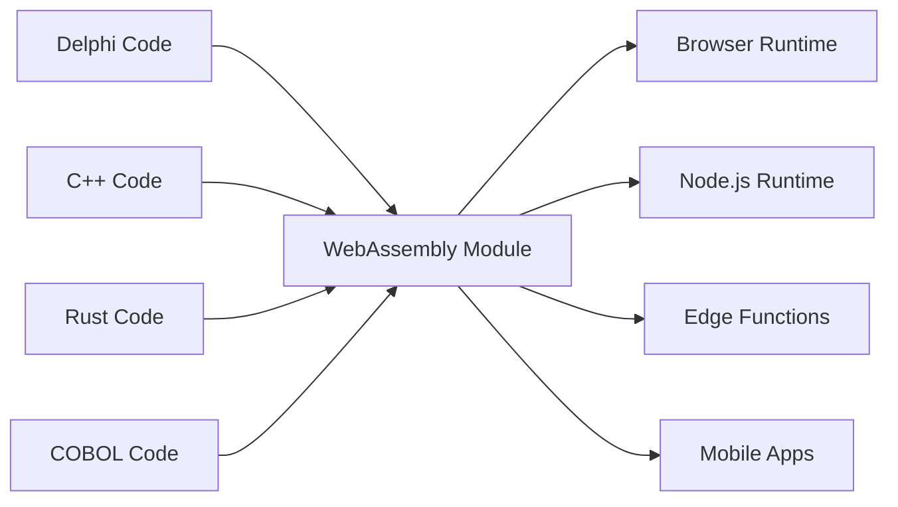

# Universal Fabricator

"리눅스 데스크톱 애플리케이션용 바이너리를 만드는 것은 엄청난 고통입니다. 하나의 바이너리를 컴파일하고 그것이 작동하기를, 바람직하게는 영원히, 바람직하게는 모든 리눅스 배포판에서 작동하기를 원합니다." - Linus Torvalds, 2014

## 우리가 받아들이기를 거부하는 두 가지 거짓말

### 레거시 거짓말: "모든 것을 다시 작성하라"

소프트웨어 배포의 악몽에 대한 Linus의 유명한 분노는 소프트웨어 산업이 스스로에게 하는 더 크고 비용이 많이 드는 거짓말의 증상입니다: 레거시 코드는 기술 부채이며, 현대화하는 유일한 방법은 수십 년간 실전 테스트된 비즈니스 로직을 버리고 처음부터 다시 시작하는 것입니다.

이것은 미친 짓입니다. 그 Delphi, COBOL, 또는 C++ 코드는 작동합니다. 수년간의 비즈니스 지식을 인코딩하고, 엣지 케이스를 처리하고, 버그를 수정했습니다. 다시 작성하는 것은 단지 위험을 도입하는 것이 아니라 대체 불가능한 제도적 지식을 파괴합니다.

Universal Fabricator는 간단하고 강력한 거부에 기반합니다: **우리는 이것이 유일한 방법이라는 것을 받아들이기를 거부합니다**. 레거시 로직을 다시 작성하지 않고 어디서나 실행할 수 있다면 어떨까요? 번역을 통해서가 아닙니다. **보편적이고 결정론적인 실행**을 통해서입니다.

### 현대적 딜레마: "속도 또는 성능"

그러나 이것은 과거에 관한 것만이 아닙니다. 현대 시대에 우리는 새로운 잘못된 선택에 직면합니다: 프로토타이핑 속도 (TypeScript, Python)와 프로덕션 성능 (Rust, Go) 사이의 딜레마입니다. 팀은 고통스러운 결정을 강요받습니다: 느린 프로토타입에 머물거나, 프로덕션을 위한 위험한 전면 재작성에 착수하거나.

Universal Fabricator는 이 선택도 거부합니다. 과거에서 현재로의 다리뿐만 아니라 현재에서 더 높은 성능의 미래로의 다리를 제공하며, 개발 속도를 희생하지 않습니다.

> **비즈니스 로직은 재작성이 필요 없습니다. 르네상스가 필요합니다.**

## 작동 방식

Universal Fabricator는 Polyglot Hatcher Functions로 나타납니다 - WebAssembly로 컴파일된 레거시 코드 - Hatcher EGG 내에서 안전하게 패키징되고 실행됩니다. 이 아키텍처는 세 가지 핵심 컴포넌트로 구동됩니다:

### WebAssembly의 마법

WebAssembly (WASM)는 이것을 가능하게 하는 돌파구입니다. WASM으로 컴파일할 수 있는 모든 언어는 브라우저, 서버, 엣지, 모바일 어디서나 실행될 수 있습니다. 레거시 코드는 한 줄도 변경하지 않고 이식 가능해집니다.



### Hatcher Functions: 국경 없는 함수

전통적인 람다는 클라우드에서 실행됩니다. Hatcher Functions는 어디서나 실행됩니다:

```typescript
// 20년 된 Delphi 세금 계산
const taxCalculator = await loadWASM('./legacy/tax-engine.wasm')

// 현대 JavaScript 함수처럼 사용
const tax = await taxCalculator.calculateTax({
  income: 75000,
  deductions: 12000,
  state: 'NY',
})

// 네이티브 속도로 로컬에서 완벽한 정확도로 실행
```

### EGGs 아키텍처

EGGs (Enforced Governance Guardrails)는 보편적 로직을 위한 컨테이너입니다:

```yaml
egg: payroll-processor
version: 2.1.0
engine: wasm

modules:
  - name: tax-calculator
    source: delphi
    binary: tax-engine.wasm
    interface: ./interfaces/tax.ts

  - name: compliance-checker
    source: cobol
    binary: compliance.wasm
    interface: ./interfaces/compliance.ts

  - name: optimization-engine
    source: cpp
    binary: optimizer.wasm
    interface: ./interfaces/optimizer.ts

orchestration:
  entry: orchestrate.js
  runtime: node
```

## 자산 보존

### 코드의 제2의 삶

2001년의 그 Delphi 애플리케이션? 다음이 됩니다:

- Kubernetes 클러스터의 마이크로서비스
- React 앱의 함수
- 글로벌 배포를 위한 엣지 워커
- Python 데이터 파이프라인의 라이브러리

원래 코드를 변경하지 않고. 비즈니스 로직을 잃지 않고. 다시 작성하는 위험 없이.

### 예: 은행 혁명

```javascript
// 원본: 30년 된 COBOL 거래 프로세서
// 현재: 현대 웹 API

import { loadCOBOLModule } from '@hatcher/eggs'

const transactionProcessor = await loadCOBOLModule('./legacy/transactions.wasm')

// 현대 Express.js API
app.post('/api/transfer', async (req, res) => {
  // 현대 검증
  const validated = await validateRequest(req.body)

  // 레거시 비즈니스 로직 (완벽한 정확도)
  const result = await transactionProcessor.processTransfer({
    fromAccount: validated.from,
    toAccount: validated.to,
    amount: validated.amount,
  })

  // 현대 응답
  res.json({
    success: result.success,
    transactionId: result.id,
    timestamp: new Date().toISOString(),
  })
})
```

## 위험 없이 진화

### 점진적 현대화

모든 것을 한 번에 현대화할 필요가 없습니다:

```typescript
class HybridPayrollSystem {
  // 복잡한 계산을 Delphi로 유지
  private legacyCalculator = loadWASM('./legacy/payroll.wasm')

  // TypeScript로 현대 기능 추가
  async calculatePayroll(employee: Employee) {
    // 핵심 계산에 레거시 사용
    const base = await this.legacyCalculator.calculate(employee)

    // 현대 기능으로 향상
    const withBenefits = this.addModernBenefits(base)
    const withAnalytics = this.trackAnalytics(withBenefits)

    return withAnalytics
  }

  // 현대 코드로 새 기능
  private addModernBenefits(payroll: Payroll) {
    // 현대 복리후생 계산
  }
}
```

### 언어 상호 운용성

다양한 강점을 위한 다양한 언어:

```javascript
// 각 언어를 최선으로 사용
const system = {
  // 성능 중요한 부분을 위한 Rust
  imageProcessor: await loadWASM('./rust/image-processor.wasm'),

  // 비즈니스 로직을 위한 Delphi
  businessRules: await loadWASM('./delphi/rules-engine.wasm'),

  // 알고리즘을 위한 C++
  optimizer: await loadWASM('./cpp/optimizer.wasm'),

  // 오케스트레이션을 위한 JavaScript
  async process(input) {
    const image = await this.imageProcessor.prepare(input.image)
    const rules = await this.businessRules.evaluate(input.data)
    const optimized = await this.optimizer.optimize(rules)

    return { image, result: optimized }
  },
}
```

## 미래 최적화: 프로토타입에서 성능으로

Hatcher는 현대 애플리케이션을 위한 점진적 최적화 플랫폼이기도 합니다. 제품-시장 적합성을 찾기 위해 TypeScript로 전체 애플리케이션을 프로토타입할 수 있으며, 전면 재작성 없이 성능 병목 현상을 고성능 Rust 또는 Go 모듈로 수술적으로 교체할 수 있습니다.

### 미래 최적화: 변환 워크플로우

Hatcher는 현대 프로토타입을 고성능 애플리케이션으로 진화시키는 혁명적 워크플로우를 제공합니다. 다시 작성하지 않고 변환합니다. 전체 애플리케이션을 TypeScript로 프로토타입할 수 있으며, AI를 파트너로 사용하여 중요한 로직을 Rust 또는 Go와 같은 고성능 언어로 안전하고 체계적으로 업그레이드할 수 있습니다.

이것이 Alchemist's Playbook입니다.

#### 단계 1: 프로토타입 (TypeScript)

작동하지만 "지저분하거나" 느린 TypeScript 코드로 시작합니다.

```ts
// 사용자 할인 계산을 위한 초기 프로토타입.
// 작동하지만 복잡한 로직이 있고 충분히 빠르지 않습니다.
function calculateDiscount(user, cart) {
  let discount = 0
  if (user.isVip) discount += 0.1
  if (cart.total > 100) discount += 0.05
  // ... 훨씬 더 복잡하고 느린 규칙들
  return Math.min(discount, 0.25) // 할인 상한
}
```

#### 단계 2: AI 기반 사양 (코드 → ACs)

함수를 선택하고 Hatcher에 명령: "이 로직을 Acceptance Criteria로 설명하세요." AI가 코드를 분석하고 비즈니스 규칙을 역엔지니어링합니다.

```Gherkin
# AI 생성 Acceptance Criteria

Feature: User Discount Calculation

Scenario: VIP user with large cart
Given a user is a "VIP"
And the cart total is over 100
Then the final discount should be 15%

Scenario: Non-VIP user
Given a user is not a "VIP"
Then the discount is based only on cart total

Scenario: Discount Capping
When any combination of rules results in a discount over 25%
Then the final discount must be capped at 25%
```

#### **단계 3: 인간 개선 (제어 지점)**

이제 당신, 개발자가 이 ACs를 평범한 영어로 검토하고 개선합니다. AI가 놓친 엣지 케이스를 발견하고 새 시나리오를 추가합니다. 이것이 제어 지점입니다.

#### 단계 4: 테스트 주도 생성 (ACs → 테스트 → 코드)

인간 승인 ACs를 계약으로 하여, Hatcher에 명령: "이 기준을 만족하는 Rust 코드와 단위 테스트 생성."

1. Hatcher가 먼저 ACs를 직접 반영하는 Rust 테스트를 생성합니다.

2. 그런 다음 그 테스트를 통과하는 Rust 코드를 생성합니다.

```rust
// 최종 고성능 Rust 코드, 테스트에 의해 보장됨
// 인간 승인 비즈니스 로직과 일치합니다.
pub fn calculate_discount(user: &User, cart: &Cart) -> f64 {
    // 엄청나게 빠른, 안전한 Rust 로직...
}
```

#### 단계 5: 살아있는 인공물

최종 출력은 컴파일된 .wasm 모듈만이 아닙니다. 모듈은 **인간이 읽을 수 있는 사양과 함께 쌍**을 이룹니다. ACs는 람다와 함께 보존되어 향후 유지 관리 및 진화를 위한 살아있는 문서를 만듭니다.

이것이 Alchemist의 꿈입니다: 위험 없이, 완벽한 명확성으로 프로토타입을 고성능 애플리케이션으로 변환하는 안전하고 구조화된 프로세스입니다.

## 자신감을 가지고 실행

### WASM Cleanroom

모든 WASM 모듈은 샌드박스에서 실행됩니다:

```typescript
interface WASMSandbox {
  memory: {
    limit: '100MB'
    shared: false
  }

  cpu: {
    timeout: '5s'
    priority: 'normal'
  }

  io: {
    filesystem: 'none'
    network: 'none'
    system: 'none'
  }
}
```

레거시 코드는 다음을 할 수 없습니다:

- 파일시스템 액세스 (명시적으로 부여되지 않는 한)
- 네트워크 호출 (명시적으로 부여되지 않는 한)
- 호스트 프로세스 충돌
- 메모리 누수
- 다른 모듈 간섭

### 타입 안전 인터페이스

레거시 코드에서 TypeScript 인터페이스 생성:

```typescript
// Delphi 함수 시그니처에서 자동 생성
export interface TaxEngine {
  calculateFederalTax(income: number, deductions: number): Promise<number>
  calculateStateTax(income: number, state: string): Promise<number>
  getDeductionLimit(filingStatus: FilingStatus): Promise<number>
}

// 타입 안전 사용
const engine: TaxEngine = await loadWASM('./tax-engine.wasm')
const tax = await engine.calculateFederalTax(100000, 12000) // 타입 체크됨!
```

## 현장에서 검증됨

### 시나리오 1: 보험 거대 기업

수백만 줄의 COBOL이 있는 40년 된 보험 회사:

```yaml
before:
  problem: 'COBOL mainframe costs $2M/year'
  solution: '5-year, $50M rewrite project (failed twice)'

after:
  solution: 'Compile COBOL to WASM'
  timeline: '3 months'
  result:
    - Run on commodity hardware
    - Scale horizontally
    - Keep all business logic
    - Modern API layer
  savings: '$1.8M/year'
```

### 시나리오 2: 트레이딩 회사

C++의 고빈도 거래 알고리즘:

```javascript
// 원본: 특수 하드웨어에서 실행되는 C++
// 현재: 어디서나 실행되는 동일한 C++

const tradingEngine = await loadWASM('./trading/algorithm.wasm')

// 전 세계 엣지 위치에 배포
const edgeLocations = ['nyc', 'london', 'tokyo', 'singapore']

for (const location of edgeLocations) {
  deployToEdge(location, tradingEngine)
  // 동일한 알고리즘, 마이크로초 지연, 글로벌 배포
}
```

### 시나리오 3: 제조 시스템

산업 컨트롤러의 임베디드 C 코드:

```typescript
// 제조 장비의 30년 된 C 코드
const controller = await loadWASM('./embedded/controller.wasm')

// 이제 현대 웹 대시보드를 구동
const Dashboard = () => {
  const [status, setStatus] = useState()

  useEffect(() => {
    const interval = setInterval(async () => {
      const data = await controller.getSystemStatus()
      setStatus(data)
    }, 1000)

    return () => clearInterval(interval)
  }, [])

  return <ModernUIComponent data={status} />
}
```

### 시나리오 4: AI 스타트업

빠르게 움직이는 스타트업이 Python으로 데이터 처리 파이프라인을 프로토타입합니다.

```yaml
before:
  problem: 'Python prototype is too slow for production customers.'
  solution: "Plan a 6-month 'rewrite it in Go' project, pausing all feature development."
after:
  solution: 'Identify and rewrite 3 critical functions in Rust with Hatcher.'
  timeline: '2 weeks.'
  result:
    - 90% of the codebase remains in easy-to-iterate Python.
    - Critical path is now 120x faster.
    - Shipped to production customers next month.
    - Rewrite project cancelled.
```

## 시작하기

### 단계 1: 로직 식별

레거시 코드에 갇힌 비즈니스 로직은 무엇입니까?

- 계산 엔진
- 비즈니스 규칙
- 검증 로직
- 처리 알고리즘

### 단계 2: WASM으로 컴파일

대부분의 언어는 이제 WASM 컴파일을 지원합니다:

```bash
# Delphi
delphi2wasm your-code.pas -o output.wasm

# C/C++
emcc your-code.cpp -o output.wasm

# COBOL
cobol2wasm your-code.cob -o output.wasm

# Rust
cargo build --target wasm32-unknown-unknown
```

### 단계 3: 인터페이스 생성

현대 코드가 상호작용할 방법 정의:

```typescript
// 인터페이스 정의
interface LegacyModule {
  initialize(): Promise<void>
  process(input: Input): Promise<Output>
  cleanup(): Promise<void>
}
```

### 단계 4: 통합

현대 애플리케이션에서 레거시 로직 사용:

```javascript
const legacy = await loadWASM('./legacy.wasm')
// 30년 된 코드가 이제 현대 모듈입니다
```

## 철학

Universal Fabricator는 근본적 신념을 구현합니다: **코드는 자산이지 부채가 아닙니다**. 작동하는 코드의 모든 줄은 해결된 문제, 처리된 엣지 케이스, 내장된 지식을 나타냅니다. 코드의 나이는 그 가치를 감소시키지 않습니다 - 증명합니다.

우리는 오래되었다고 책을 버리지 않습니다. 다른 도구로 지어졌다고 건물을 철거하지 않습니다. 왜 작동하는 코드를 다시 작성해야 합니까?

Universal Fabricator는 진보를 통한 보존입니다. 파괴 없는 현대화입니다. 구축된 것과 구축되어야 할 것 사이의 다리입니다.

---

_Universal Fabricator는 단순히 레거시 코드를 실행하는 것이 아니라 해방시킵니다. 오래된 런타임의 감옥에서 해방된 비즈니스 로직은 진정으로 보편적이 됩니다. 한 번 작성하고, 영원히 실행하고, 어디서나._

<PageCTA
  title="레거시 코드 해방하기"
  subtitle="수십 년의 비즈니스 로직을 현대적이고 보편적인 모듈로 변환하세요"
  buttonText="Fabricator 탐험하기"
  buttonLink="/ko/features-universal-fabricator"
  buttonStyle="secondary"
  footer="코드는 자산이지 부채가 아닙니다. 보존하세요. 현대화하세요."
/>
