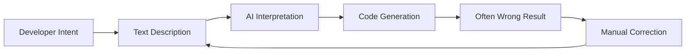

# Visual-to-Code Bridge

Visual-to-Code Bridge는 개발자가 AI 코딩 어시스턴트와 상호작용하는 방식을 혁신하는 Hatcher의 시그니처 기능입니다. 텍스트로 변경 사항을 설명하는 대신, 애플리케이션의 비주얼 인터페이스를 직접 조작하면 Hatcher가 작업을 정확한 코드 수정으로 변환합니다.

## 작동 방식

### 전통적 문제



**좌절스러운 사이클의 예:**

- 개발자: "헤더를 파란색으로 만들고 중앙 정렬"
- AI: 잘못된 요소를 파란색으로 만드는 CSS 생성
- 개발자: "아니요, 사이드바 헤더가 아니라 메인 헤더"
- AI: 잘못된 파란색 음영으로 만듦
- 개발자: "#3B82F6로 만들고 글꼴 크기도 늘려"
- ... 그리고 계속

### Hatcher의 Visual-to-Code 접근: Bridge의 이중 모드

Visual-to-Code Bridge는 프로젝트 미션에 따라 다르게 작동하여 자유와 제어의 올바른 균형을 제공합니다.

**Generative 모드: AI 지원 생성**

`Generative` 프로젝트에서 bridge는 AI를 위한 고정밀 타겟팅 시스템으로 작동합니다. 워크플로우는:

1. **컨텍스트 고정:** 요소를 클릭하여 선택.

2. **명령 제공:** 자연어를 사용하여 원하는 변경 설명.

3. **AI 실행:** 정의한 범위로 제약된 필요한 코드 생성.

**EGG에서: 결정론적 조작**

EGG (Enforced Governance Guardrails)에서 bridge는 비주얼 변경에 AI 코드 생성을 사용하지 않는 직접 조작 도구가 됩니다. 워크플로우는 100% 결정론적:

1. **직접 조작:** 비주얼 패널에서 드래그, 크기 조정 또는 속성 편집.

2. **엔진이 이벤트 캡처:** Hatcher가 변경을 구조화된 업데이트로 기록.

3. **구성 업데이트:** 변경은 새 소스 코드가 아닌 프로젝트 구성 파일에 작성됨.

## 핵심 기능

### 1. 요소 선택

**스마트 선택 시스템**

- 요소를 클릭하여 선택
- 호버하여 선택 경계 미리보기
- 배치 작업을 위해 여러 요소 선택
- 계층적 선택 (자식, 부모, 형제)

```typescript
// 예: 버튼 선택
const selection = {
  element: 'button.submit-btn',
  properties: {
    position: { x: 120, y: 45 },
    dimensions: { width: 100, height: 36 },
    styles: {
      backgroundColor: '#3B82F6',
      borderRadius: '6px',
      fontSize: '14px',
    },
  },
  context: {
    parent: 'form.checkout-form',
    siblings: ['input.email', 'input.password'],
    framework: 'Vue 3',
    component: 'SubmitButton.vue',
  },
}
```

### 2. 비주얼 조작

**직접 속성 편집**

- 새 위치로 요소 드래그
- 모서리를 드래그하여 크기 조정
- 배경 및 텍스트를 위한 색상 선택기
- 타이포그래피 제어 (글꼴, 크기, 굵기)
- 간격 제어 (여백, 패딩)

**라이브 미리보기**

- 애플리케이션에서 변경 사항 즉시 확인
- 새로고침이나 재빌드 불필요
- Hot module replacement 통합
- 실시간 CSS 업데이트

### 3. 의도 인식

Hatcher는 비주얼 변경을 분석하고 이해합니다:

**레이아웃 변경**

- 위치 수정 (absolute, relative, flex)
- 크기 조정 (width, height, responsive)
- 정렬 변경 (center, flex, grid)

**스타일 변경**

- 색상 수정 (hex, RGB, HSL, CSS variables)
- 타이포그래피 업데이트 (글꼴 패밀리, 크기, 굵기, 줄 높이)
- 비주얼 효과 (그림자, 테두리, 그라데이션)

**컴포넌트 변경**

- Props 수정
- 상태 업데이트
- 이벤트 핸들러 추가

### 4. 코드 생성

비주얼 의도에 따라 Hatcher가 생성:

**프레임워크별 코드**

```vue
<!-- Vue 3 Example -->
<template>
  <button
    class="submit-btn"
    :style="{
      transform: `translate(${position.x}px, ${position.y}px)`,
      backgroundColor: '#3B82F6',
    }"
    @click="handleSubmit"
  >
    Submit
  </button>
</template>
```

**CSS 업데이트**

```css
.submit-btn {
  position: absolute;
  left: 120px;
  top: 45px;
  background-color: #3b82f6;
  width: 100px;
  height: 36px;
  border-radius: 6px;
  font-size: 14px;
}
```

**TypeScript 통합**

```typescript
interface ButtonProps {
  position: { x: number; y: number }
  variant: 'primary' | 'secondary'
  size: 'sm' | 'md' | 'lg'
}
```

## 고급 기능

### 1. 반응형 디자인

**다중 브레이크포인트 편집**

- 다양한 화면 크기를 동시에 편집
- 반응형 CSS 자동 생성
- 디바이스 전반의 디자인 일관성 유지

```css
/* 생성된 반응형 코드 */
.submit-btn {
  /* Mobile */
  width: 100%;
  margin: 0 16px;
}

@media (min-width: 768px) {
  /* Tablet */
  .submit-btn {
    width: 200px;
    margin: 0 auto;
  }
}

@media (min-width: 1024px) {
  /* Desktop */
  .submit-btn {
    width: 150px;
    position: absolute;
    left: 120px;
  }
}
```

### 2. 컴포넌트 인식 변경

**스마트 컴포넌트 감지**

- Vue, React, Svelte 컴포넌트 인식
- 컴포넌트 props 및 상태 이해
- 컴포넌트 경계 유지

**예: Vue 컴포넌트 수정**

```vue
<!-- Before -->
<UserCard :user="currentUser" size="medium" />

<!-- After visual modification -->
<UserCard
  :user="currentUser"
  size="large"
  :style="{ marginTop: '24px' }"
  show-avatar
/>
```

### 3. 디자인 시스템 통합

**자동 토큰 사용**

- 디자인 시스템 토큰 인식
- 적절한 값 제안
- 일관성 유지

```css
/* 임의의 값 대신 */
color: #3b82f6;
padding: 12px;

/* 디자인 토큰 사용 */
color: var(--color-primary-500);
padding: var(--spacing-3);
```

## 워크플로우 예

### 예 1: 레이아웃 조정

**목표**: 사이드바를 왼쪽에서 오른쪽으로 이동

1. **선택**: 사이드바 컴포넌트 클릭
2. **드래그**: 화면 오른쪽으로 드래그
3. **검토**: 생성된 flex/grid 변경 확인
4. **적용**: CSS 수정 승인

**생성된 코드**:

```css
.layout-container {
  display: flex;
  flex-direction: row; /* Changed from row-reverse */
}

.sidebar {
  order: 2; /* Changed from 1 */
  margin-left: auto; /* Added */
}
```

### 예 2: 컴포넌트 스타일링

**목표**: 디자인에 맞게 버튼 모양 변경

1. **선택**: 버튼 클릭
2. **스타일**: 색상 선택기 사용, 크기 조정, 테두리 수정
3. **미리보기**: 애플리케이션에서 변경 사항 라이브 확인
4. **생성**: 컴포넌트 prop 업데이트 받기

**생성된 코드**:

```vue
<script setup>
const buttonStyle = {
  variant: 'primary',
  size: 'lg',
  rounded: true,
}
</script>

<template>
  <AppButton v-bind="buttonStyle"> Submit Order </AppButton>
</template>
```

### 예 3: 반응형 조정

**목표**: 그리드를 반응형으로 만들기

1. **선택**: 그리드 컨테이너 선택
2. **크기 조정**: 다양한 브레이크포인트에 대한 열 조정
3. **테스트**: 모바일/태블릿/데스크톱에서 미리보기
4. **적용**: 반응형 CSS Grid 생성

**생성된 코드**:

```css
.product-grid {
  display: grid;
  gap: 1rem;
  grid-template-columns: 1fr; /* Mobile */
}

@media (min-width: 640px) {
  .product-grid {
    grid-template-columns: repeat(2, 1fr); /* Tablet */
  }
}

@media (min-width: 1024px) {
  .product-grid {
    grid-template-columns: repeat(3, 1fr); /* Desktop */
  }
}
```

## AI 엔진과의 통합

Visual-to-Code Bridge는 지원되는 AI 엔진과 원활하게 작동합니다:

### Claude Code 통합

```typescript
const visualIntent = captureVisualChange(selection, modification)
const codeChange = await claudeCode.generateChange({
  intent: visualIntent,
  context: projectContext,
  playbook: teamPlaybook,
})
```

### Gemini CLI 통합

```typescript
const prompt = buildVisualPrompt(visualIntent, codeContext)
const suggestion = await geminiCLI.complete(prompt)
const refinedCode = refineWithPlaybook(suggestion)
```

## 모범 사례

### 1. 작게 시작

- 증분 비주얼 변경
- 다음으로 이동하기 전에 각 수정 테스트
- 더 작은 단계를 통해 복잡한 변경 구축

### 2. Playbooks 사용

- playbooks에서 컴포넌트 패턴 정의
- 일관된 스타일링 규칙 확립
- 일반적인 디자인 패턴 문서화

### 3. 생성된 코드 검토

- 적용하기 전에 항상 코드 차이 검토
- 생성된 코드가 표준을 따르는지 확인
- 더 나은 결과를 위해 필요시 프롬프트 개선

### 4. 철저히 테스트

- 변경 사항을 검증하기 위해 자동화된 테스트 사용
- 반응형 동작 확인
- 접근성 준수 검증

---

Visual-to-Code Bridge는 개발을 위해 AI와 상호작용하는 방식의 근본적 전환을 나타냅니다. 의도와 구현 사이의 번역 레이어를 제거함으로써 더 직관적이고 정확하며 효율적인 개발 경험을 만듭니다.
