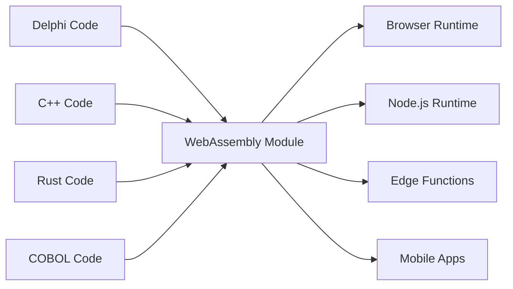

# The Universal Fabricator

"Making binaries for linux desktop applications is a major pain in the ass. You want to just compile one binary and have it work, preferably forever, and preferably across all the linux distributions." - Linus Torvalds, 2014

## The Lie We Refuse to Accept

Linus's famous rant about the nightmare of software distribution is a symptom of a larger, more costly lie the software industry tells itself: that legacy code is technical debt, and the only way to modernize is to throw away decades of battle-tested business logic and start from scratch.

This is insanity. That Delphi, COBOL, or C++ code works. It encodes years of business knowledge, handled edge cases, and fixed bugs. Rewriting it doesn't just introduce risk—it destroys irreplaceable institutional knowledge.

The Universal Fabricator is founded on a simple, powerful refusal: **we refuse to accept this is the only way**. What if you could run your legacy logic anywhere, without a rewrite? Not through translation. Through **universal, deterministic execution**.

But this isn't just about the past. In the modern era, we face a new dilemma: the choice between prototyping speed (TypeScript, Python) and production performance (Rust, Go). Teams are forced into a painful choice: stay with the slow prototype, or embark on a risky, full rewrite.

The Universal Fabricator rejects this choice, too. It provides a bridge—not just from the past to the present, but from the present to a higher-performance future.

> **Your business logic doesn't need a rewrite. It needs a renaissance.**

## How It Works

The Universal Fabricator manifests as Polyglot Hatcher Functions—your legacy code compiled to WebAssembly—which are securely packaged and executed within a Hatcher EGG. This architecture is powered by three key components:

### The Magic of WebAssembly

WebAssembly (WASM) is the breakthrough that makes this possible. Any language that can compile to WASM can run anywhere—browser, server, edge, mobile. Your legacy code becomes portable without changing a single line.



### Hatcher Functions: Functions Without Borders

Traditional lambdas run in the cloud. Our Hatcher Functions run everywhere:

```typescript
// Your 20-year-old Delphi tax calculation
const taxCalculator = await loadWASM('./legacy/tax-engine.wasm')

// Use it like a modern JavaScript function
const tax = await taxCalculator.calculateTax({
  income: 75000,
  deductions: 12000,
  state: 'NY',
})

// It runs at native speed, locally, with perfect accuracy
```

### The EGGs Architecture

EGGs (Enforced Governance Guardrails) are the containers for your universal logic:

```yaml
egg: payroll-processor
version: 2.1.0
engine: wasm

modules:
  - name: tax-calculator
    source: delphi
    binary: tax-engine.wasm
    interface: ./interfaces/tax.ts

  - name: compliance-checker
    source: cobol
    binary: compliance.wasm
    interface: ./interfaces/compliance.ts

  - name: optimization-engine
    source: cpp
    binary: optimizer.wasm
    interface: ./interfaces/optimizer.ts

orchestration:
  entry: orchestrate.js
  runtime: node
```

## Preserve Your Assets

### Your Code's Second Life

That Delphi application from 2001? It becomes:

- A microservice in your Kubernetes cluster
- A function in your React app
- An edge worker for global distribution
- A library in your Python data pipeline

Without changing the original code. Without losing the business logic. Without the risk of rewriting.

### Example: The Banking Revolution

```javascript
// Original: 30-year-old COBOL transaction processor
// Now: Modern web API

import { loadCOBOLModule } from '@hatcher/eggs'

const transactionProcessor = await loadCOBOLModule('./legacy/transactions.wasm')

// Modern Express.js API
app.post('/api/transfer', async (req, res) => {
  // Modern validation
  const validated = await validateRequest(req.body)

  // Legacy business logic (perfect accuracy)
  const result = await transactionProcessor.processTransfer({
    fromAccount: validated.from,
    toAccount: validated.to,
    amount: validated.amount,
  })

  // Modern response
  res.json({
    success: result.success,
    transactionId: result.id,
    timestamp: new Date().toISOString(),
  })
})
```

## Evolve Without Risk

### Gradual Modernization

You don't have to modernize everything at once:

```typescript
class HybridPayrollSystem {
  // Keep the complex calculation in Delphi
  private legacyCalculator = loadWASM('./legacy/payroll.wasm')

  // Add modern features in TypeScript
  async calculatePayroll(employee: Employee) {
    // Use legacy for core calculation
    const base = await this.legacyCalculator.calculate(employee)

    // Enhance with modern features
    const withBenefits = this.addModernBenefits(base)
    const withAnalytics = this.trackAnalytics(withBenefits)

    return withAnalytics
  }

  // New features in modern code
  private addModernBenefits(payroll: Payroll) {
    // Modern benefits calculation
  }
}
```

### Language Interoperability

Different languages for different strengths:

```javascript
// Use each language for what it does best
const system = {
  // Rust for performance-critical
  imageProcessor: await loadWASM('./rust/image-processor.wasm'),

  // Delphi for business logic
  businessRules: await loadWASM('./delphi/rules-engine.wasm'),

  // C++ for algorithms
  optimizer: await loadWASM('./cpp/optimizer.wasm'),

  // JavaScript for orchestration
  async process(input) {
    const image = await this.imageProcessor.prepare(input.image)
    const rules = await this.businessRules.evaluate(input.data)
    const optimized = await this.optimizer.optimize(rules)

    return { image, result: optimized }
  },
}
```

## Optimize Your Future: From Prototype to Performance

Hatcher is also a gradual optimization platform for modern applications. You can prototype your entire application in TypeScript to find product-market fit, then surgically replace performance bottlenecks with high-performance Rust or Go modules without a full rewrite.

### Optimize Your Future: The Transmutation Workflow

Hatcher provides a revolutionary workflow for evolving a modern prototype into a high-performance application. You don't rewrite; you transmute. You can prototype your entire application in TypeScript, then use AI as a partner to safely and systematically upgrade critical logic to high-performance languages like Rust or Go.

This is the Alchemist's Playbook.

#### Step 1: The Prototype (TypeScript)

You start with working, but perhaps "dirty" or slow, TypeScript code.

```ts
// Your initial prototype for calculating user discounts.
// It works, but has complex logic and isn't fast enough.
function calculateDiscount(user, cart) {
  let discount = 0
  if (user.isVip) discount += 0.1
  if (cart.total > 100) discount += 0.05
  // ... many more complex and slow rules
  return Math.min(discount, 0.25) // cap discount
}
```

#### Step 2: AI-Powered Specification (Code → ACs)

You select the function and command Hatcher: "Describe this logic as Acceptance Criteria." The AI analyzes the code and reverse-engineers the business rules.

```Gherkin
# AI-Generated Acceptance Criteria

Feature: User Discount Calculation

Scenario: VIP user with large cart
Given a user is a "VIP"
And the cart total is over 100
Then the final discount should be 15%

Scenario: Non-VIP user
Given a user is not a "VIP"
Then the discount is based only on cart total

Scenario: Discount Capping
When any combination of rules results in a discount over 25%
Then the final discount must be capped at 25%
```

#### **Step 3: Human Refinement (The Control Point)**

Now, you, the developer, review and improve these ACs in plain English. You catch an edge case the AI missed and add a new scenario. This is your control point.

#### Step 4: Test-Driven Generation (ACs → Tests → Code)

With the human-approved ACs as a contract, you command Hatcher: "Generate Rust code and unit tests to satisfy these criteria."

1. Hatcher first generates the tests in Rust, directly reflecting the ACs.

2. Then, it generates the Rust code that makes those tests pass.

```rust
// The final, high-performance Rust code, guaranteed by tests
// to match the human-approved business logic.
pub fn calculate_discount(user: &User, cart: &Cart) -> f64 {
    // Blazingly fast, safe Rust logic...
}
```

#### Step 5: The Living Artefact

The final output is not just the compiled .wasm module. It's the module **paired with its human-readable specification**. The ACs are preserved alongside the lambda, creating living documentation for future maintenance and evolution.

This is the Alchemist's dream: a safe, structured process to transmute a prototype into a high-performance application, without risk, and with perfect clarity.

## Execute with Confidence

### The WASM Cleanroom

Every WASM module runs in a sandbox:

```typescript
interface WASMSandbox {
  memory: {
    limit: '100MB'
    shared: false
  }

  cpu: {
    timeout: '5s'
    priority: 'normal'
  }

  io: {
    filesystem: 'none'
    network: 'none'
    system: 'none'
  }
}
```

Your legacy code can't:

- Access the filesystem (unless explicitly granted)
- Make network calls (unless explicitly granted)
- Crash the host process
- Leak memory
- Interfere with other modules

### Type-Safe Interfaces

Generate TypeScript interfaces from your legacy code:

```typescript
// Auto-generated from Delphi function signatures
export interface TaxEngine {
  calculateFederalTax(income: number, deductions: number): Promise<number>
  calculateStateTax(income: number, state: string): Promise<number>
  getDeductionLimit(filingStatus: FilingStatus): Promise<number>
}

// Type-safe usage
const engine: TaxEngine = await loadWASM('./tax-engine.wasm')
const tax = await engine.calculateFederalTax(100000, 12000) // Type-checked!
```

## Proven in the Trenches

### Scenario 1: The Insurance Giant

A 40-year-old insurance company with millions of lines of COBOL:

```yaml
before:
  problem: 'COBOL mainframe costs $2M/year'
  solution: '5-year, $50M rewrite project (failed twice)'

after:
  solution: 'Compile COBOL to WASM'
  timeline: '3 months'
  result:
    - Run on commodity hardware
    - Scale horizontally
    - Keep all business logic
    - Modern API layer
  savings: '$1.8M/year'
```

### Scenario 2: The Trading Firm

High-frequency trading algorithms in C++:

```javascript
// Original: C++ running on specialized hardware
// Now: Same C++ running everywhere

const tradingEngine = await loadWASM('./trading/algorithm.wasm')

// Deploy to edge locations globally
const edgeLocations = ['nyc', 'london', 'tokyo', 'singapore']

for (const location of edgeLocations) {
  deployToEdge(location, tradingEngine)
  // Same algorithm, microsecond latency, global distribution
}
```

### Scenario 3: The Manufacturing System

Embedded C code from industrial controllers:

```typescript
// 30-year-old C code from manufacturing equipment
const controller = await loadWASM('./embedded/controller.wasm')

// Now it powers a modern web dashboard
const Dashboard = () => {
  const [status, setStatus] = useState()

  useEffect(() => {
    const interval = setInterval(async () => {
      const data = await controller.getSystemStatus()
      setStatus(data)
    }, 1000)

    return () => clearInterval(interval)
  }, [])

  return <ModernUIComponent data={status} />
}
```

### Scenario 4: The AI Startup

A fast-moving startup prototypes their data processing pipeline in Python.

```yaml
before:
  problem: 'Python prototype is too slow for production customers.'
  solution: "Plan a 6-month 'rewrite it in Go' project, pausing all feature development."
after:
  solution: 'Identify and rewrite 3 critical functions in Rust with Hatcher.'
  timeline: '2 weeks.'
  result:
    - 90% of the codebase remains in easy-to-iterate Python.
    - Critical path is now 120x faster.
    - Shipped to production customers next month.
    - Rewrite project cancelled.
```

## Getting Started

### Step 1: Identify Your Logic

What business logic is trapped in legacy code?

- Calculation engines
- Business rules
- Validation logic
- Processing algorithms

### Step 2: Compile to WASM

Most languages now support WASM compilation:

```bash
# Delphi
delphi2wasm your-code.pas -o output.wasm

# C/C++
emcc your-code.cpp -o output.wasm

# COBOL
cobol2wasm your-code.cob -o output.wasm

# Rust
cargo build --target wasm32-unknown-unknown
```

### Step 3: Create Interfaces

Define how modern code will interact:

```typescript
// Define the interface
interface LegacyModule {
  initialize(): Promise<void>
  process(input: Input): Promise<Output>
  cleanup(): Promise<void>
}
```

### Step 4: Integrate

Use your legacy logic in modern applications:

```javascript
const legacy = await loadWASM('./legacy.wasm')
// Your 30-year-old code is now a modern module
```

## The Philosophy

The Universal Fabricator embodies a fundamental belief: **code is an asset, not a liability**. Every line of working code represents solved problems, handled edge cases, and embedded knowledge. The age of the code doesn't diminish its value—it proves it.

We don't throw away books because they're old. We don't demolish buildings because they were built with different tools. Why do we insist on rewriting code that works?

The Universal Fabricator is preservation through progress. It's modernization without destruction. It's the bridge between what was built and what needs to be built.

---

_The Universal Fabricator doesn't just run your legacy code—it liberates it. Your business logic, freed from the prison of outdated runtimes, becomes truly universal. Write once, run forever, everywhere._

<PageCTA
  title="Liberate Your Legacy Code"
  subtitle="Transform decades of business logic into modern, universal modules"
  buttonText="Explore the Fabricator"
  buttonLink="/features-universal-fabricator"
  buttonStyle="secondary"
  footer="Your code is an asset, not a liability. Preserve it. Modernize it."
/>
