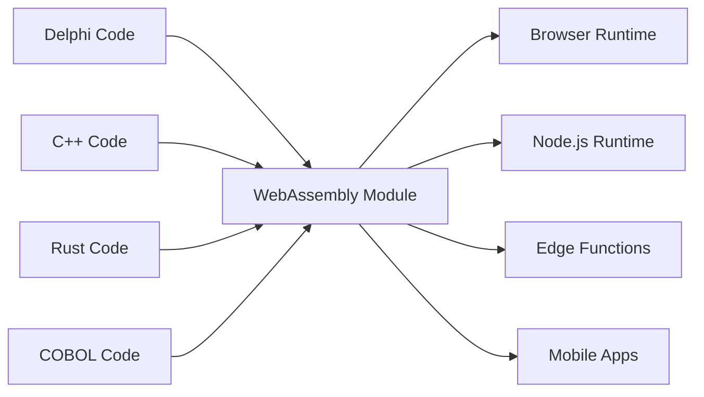

# The Universal Fabricator

"Making binaries for linux desktop applications is a major pain in the ass. You want to just compile one binary and have it work, preferably forever, and preferably across all the linux distributions." - Linus Torvalds, 2014

## Duas Mentiras Que Nos Recusamos a Aceitar

### A Mentira do Legado: "Reescreva Tudo"

O famoso desabafo de Linus sobre o pesadelo da distribuição de software é um sintoma de uma mentira maior e mais custosa que a indústria de software conta a si mesma: que código legado é dívida técnica, e a única maneira de modernizar é jogar fora décadas de lógica de negócios testada em batalha e começar do zero.

Isso é insanidade. Aquele código Delphi, COBOL ou C++ funciona. Ele codifica anos de conhecimento de negócios, lidou com casos extremos e corrigiu bugs. Reescrevê-lo não apenas introduz risco—destrói conhecimento institucional insubstituível.

O Universal Fabricator é fundado em uma recusa simples e poderosa: **nos recusamos a aceitar que esta é a única maneira**. E se você pudesse executar sua lógica legada em qualquer lugar, sem uma reescrita? Não através de tradução. Através de **execução universal e determinística**.

### O Dilema Moderno: "Velocidade ou Desempenho"

Mas isso não é apenas sobre o passado. Na era moderna, enfrentamos uma nova escolha falsa: o dilema entre velocidade de prototipagem (TypeScript, Python) e desempenho de produção (Rust, Go). Equipes são forçadas a uma decisão dolorosa: ficar com o protótipo lento, ou embarcar em uma reescrita arriscada e completa para produção.

O Universal Fabricator rejeita esta escolha também. Ele fornece uma ponte—não apenas do passado para o presente, mas do presente para um futuro de maior desempenho, sem sacrificar sua velocidade de desenvolvimento.

> **Sua lógica de negócios não precisa de uma reescrita. Ela precisa de um renascimento.**

## Como Funciona

O Universal Fabricator se manifesta como Polyglot Hatcher Functions—seu código legado compilado para WebAssembly—que são empacotadas e executadas com segurança dentro de um Hatcher EGG. Esta arquitetura é alimentada por três componentes-chave:

### A Mágica do WebAssembly

WebAssembly (WASM) é o avanço que torna isso possível. Qualquer linguagem que possa compilar para WASM pode rodar em qualquer lugar—navegador, servidor, edge, mobile. Seu código legado se torna portátil sem mudar uma única linha.



### Hatcher Functions: Funções Sem Fronteiras

Lambdas tradicionais rodam na nuvem. Nossas Hatcher Functions rodam em todo lugar:

```typescript
// Seu cálculo de impostos Delphi de 20 anos
const taxCalculator = await loadWASM('./legacy/tax-engine.wasm')

// Use como uma função JavaScript moderna
const tax = await taxCalculator.calculateTax({
  income: 75000,
  deductions: 12000,
  state: 'NY',
})

// Roda em velocidade nativa, localmente, com perfeita precisão
```

### A Arquitetura EGGs

EGGs (Enforced Governance Guardrails) são os containers para sua lógica universal:

```yaml
egg: payroll-processor
version: 2.1.0
engine: wasm

modules:
  - name: tax-calculator
    source: delphi
    binary: tax-engine.wasm
    interface: ./interfaces/tax.ts

  - name: compliance-checker
    source: cobol
    binary: compliance.wasm
    interface: ./interfaces/compliance.ts

  - name: optimization-engine
    source: cpp
    binary: optimizer.wasm
    interface: ./interfaces/optimizer.ts

orchestration:
  entry: orchestrate.js
  runtime: node
```

## Preserve Seus Ativos

### A Segunda Vida do Seu Código

Aquela aplicação Delphi de 2001? Ela se torna:

- Um microserviço em seu cluster Kubernetes
- Uma função em seu app React
- Um edge worker para distribuição global
- Uma biblioteca em seu pipeline de dados Python

Sem mudar o código original. Sem perder a lógica de negócios. Sem o risco de reescrever.

### Exemplo: A Revolução Bancária

```javascript
// Original: Processador de transações COBOL de 30 anos
// Agora: API web moderna

import { loadCOBOLModule } from '@hatcher/eggs'

const transactionProcessor = await loadCOBOLModule('./legacy/transactions.wasm')

// API Express.js moderna
app.post('/api/transfer', async (req, res) => {
  // Validação moderna
  const validated = await validateRequest(req.body)

  // Lógica de negócios legada (precisão perfeita)
  const result = await transactionProcessor.processTransfer({
    fromAccount: validated.from,
    toAccount: validated.to,
    amount: validated.amount,
  })

  // Resposta moderna
  res.json({
    success: result.success,
    transactionId: result.id,
    timestamp: new Date().toISOString(),
  })
})
```

## Evolua Sem Risco

### Modernização Gradual

Você não precisa modernizar tudo de uma vez:

```typescript
class HybridPayrollSystem {
  // Mantenha o cálculo complexo em Delphi
  private legacyCalculator = loadWASM('./legacy/payroll.wasm')

  // Adicione funcionalidades modernas em TypeScript
  async calculatePayroll(employee: Employee) {
    // Use legado para cálculo central
    const base = await this.legacyCalculator.calculate(employee)

    // Aprimore com funcionalidades modernas
    const withBenefits = this.addModernBenefits(base)
    const withAnalytics = this.trackAnalytics(withBenefits)

    return withAnalytics
  }

  // Novas funcionalidades em código moderno
  private addModernBenefits(payroll: Payroll) {
    // Cálculo de benefícios modernos
  }
}
```

### Interoperabilidade de Linguagens

Diferentes linguagens para diferentes forças:

```javascript
// Use cada linguagem para o que ela faz melhor
const system = {
  // Rust para crítico em desempenho
  imageProcessor: await loadWASM('./rust/image-processor.wasm'),

  // Delphi para lógica de negócios
  businessRules: await loadWASM('./delphi/rules-engine.wasm'),

  // C++ para algoritmos
  optimizer: await loadWASM('./cpp/optimizer.wasm'),

  // JavaScript para orquestração
  async process(input) {
    const image = await this.imageProcessor.prepare(input.image)
    const rules = await this.businessRules.evaluate(input.data)
    const optimized = await this.optimizer.optimize(rules)

    return { image, result: optimized }
  },
}
```

## Otimize Seu Futuro: De Protótipo para Desempenho

Hatcher também é uma plataforma de otimização gradual para aplicações modernas. Você pode prototipar toda sua aplicação em TypeScript para encontrar product-market fit, então substituir cirurgicamente gargalos de desempenho com módulos de alto desempenho em Rust ou Go sem uma reescrita completa.

### Otimize Seu Futuro: O Fluxo de Transmutação

Hatcher fornece um fluxo de trabalho revolucionário para evoluir um protótipo moderno em uma aplicação de alto desempenho. Você não reescreve; você transmuta. Você pode prototipar toda sua aplicação em TypeScript, então usar IA como parceira para atualizar de forma segura e sistemática lógica crítica para linguagens de alto desempenho como Rust ou Go.

Este é o Alchemist's Playbook.

#### Passo 1: O Protótipo (TypeScript)

Você começa com código TypeScript funcional, mas talvez "sujo" ou lento.

```ts
// Seu protótipo inicial para calcular descontos de usuário.
// Funciona, mas tem lógica complexa e não é rápido o suficiente.
function calculateDiscount(user, cart) {
  let discount = 0
  if (user.isVip) discount += 0.1
  if (cart.total > 100) discount += 0.05
  // ... muitas outras regras complexas e lentas
  return Math.min(discount, 0.25) // limita desconto
}
```

#### Passo 2: Especificação Alimentada por IA (Código → ACs)

Você seleciona a função e comanda Hatcher: "Descreva esta lógica como Critérios de Aceitação." A IA analisa o código e faz engenharia reversa das regras de negócio.

```Gherkin
# AI-Generated Acceptance Criteria

Feature: User Discount Calculation

Scenario: VIP user with large cart
Given a user is a "VIP"
And the cart total is over 100
Then the final discount should be 15%

Scenario: Non-VIP user
Given a user is not a "VIP"
Then the discount is based only on cart total

Scenario: Discount Capping
When any combination of rules results in a discount over 25%
Then the final discount must be capped at 25%
```

#### **Passo 3: Refinamento Humano (O Ponto de Controle)**

Agora, você, o desenvolvedor, revisa e melhora estes ACs em inglês simples. Você captura um caso extremo que a IA perdeu e adiciona um novo cenário. Este é seu ponto de controle.

#### Passo 4: Geração Dirigida por Testes (ACs → Testes → Código)

Com os ACs aprovados por humanos como um contrato, você comanda Hatcher: "Gere código Rust e testes unitários para satisfazer estes critérios."

1. Hatcher primeiro gera os testes em Rust, refletindo diretamente os ACs.

2. Então, ele gera o código Rust que faz esses testes passarem.

```rust
// O código Rust final de alto desempenho, garantido por testes
// para corresponder à lógica de negócios aprovada por humanos.
pub fn calculate_discount(user: &User, cart: &Cart) -> f64 {
    // Lógica Rust incrivelmente rápida e segura...
}
```

#### Passo 5: O Artefato Vivo

A saída final não é apenas o módulo .wasm compilado. É o módulo **pareado com sua especificação legível por humanos**. Os ACs são preservados ao lado da lambda, criando documentação viva para manutenção e evolução futuras.

Este é o sonho do Alquimista: um processo seguro e estruturado para transmutar um protótipo em uma aplicação de alto desempenho, sem risco e com perfeita clareza.

## Execute com Confiança

### A Sala Limpa WASM

Todo módulo WASM roda em uma sandbox:

```typescript
interface WASMSandbox {
  memory: {
    limit: '100MB'
    shared: false
  }

  cpu: {
    timeout: '5s'
    priority: 'normal'
  }

  io: {
    filesystem: 'none'
    network: 'none'
    system: 'none'
  }
}
```

Seu código legado não pode:

- Acessar o sistema de arquivos (a menos que explicitamente concedido)
- Fazer chamadas de rede (a menos que explicitamente concedido)
- Crashar o processo hospedeiro
- Vazar memória
- Interferir com outros módulos

### Interfaces Type-Safe

Gere interfaces TypeScript do seu código legado:

```typescript
// Auto-gerado de assinaturas de função Delphi
export interface TaxEngine {
  calculateFederalTax(income: number, deductions: number): Promise<number>
  calculateStateTax(income: number, state: string): Promise<number>
  getDeductionLimit(filingStatus: FilingStatus): Promise<number>
}

// Uso type-safe
const engine: TaxEngine = await loadWASM('./tax-engine.wasm')
const tax = await engine.calculateFederalTax(100000, 12000) // Type-checked!
```

## Comprovado nas Trincheiras

### Cenário 1: A Gigante de Seguros

Uma companhia de seguros de 40 anos com milhões de linhas de COBOL:

```yaml
before:
  problem: 'COBOL mainframe costs $2M/year'
  solution: '5-year, $50M rewrite project (failed twice)'

after:
  solution: 'Compile COBOL to WASM'
  timeline: '3 months'
  result:
    - Run on commodity hardware
    - Scale horizontally
    - Keep all business logic
    - Modern API layer
  savings: '$1.8M/year'
```

### Cenário 2: A Empresa de Trading

Algoritmos de negociação de alta frequência em C++:

```javascript
// Original: C++ rodando em hardware especializado
// Agora: Mesmo C++ rodando em todo lugar

const tradingEngine = await loadWASM('./trading/algorithm.wasm')

// Implante em locais edge globalmente
const edgeLocations = ['nyc', 'london', 'tokyo', 'singapore']

for (const location of edgeLocations) {
  deployToEdge(location, tradingEngine)
  // Mesmo algoritmo, latência de microssegundos, distribuição global
}
```

### Cenário 3: O Sistema de Manufatura

Código C embarcado de controladores industriais:

```typescript
// Código C de 30 anos de equipamentos de manufatura
const controller = await loadWASM('./embedded/controller.wasm')

// Agora alimenta um dashboard web moderno
const Dashboard = () => {
  const [status, setStatus] = useState()

  useEffect(() => {
    const interval = setInterval(async () => {
      const data = await controller.getSystemStatus()
      setStatus(data)
    }, 1000)

    return () => clearInterval(interval)
  }, [])

  return <ModernUIComponent data={status} />
}
```

### Cenário 4: A Startup de IA

Uma startup ágil faz o protótipo de seu pipeline de processamento de dados em Python.

```yaml
before:
  problem: 'Python prototype is too slow for production customers.'
  solution: "Plan a 6-month 'rewrite it in Go' project, pausing all feature development."
after:
  solution: 'Identify and rewrite 3 critical functions in Rust with Hatcher.'
  timeline: '2 weeks.'
  result:
    - 90% of the codebase remains in easy-to-iterate Python.
    - Critical path is now 120x faster.
    - Shipped to production customers next month.
    - Rewrite project cancelled.
```

## Começando

### Passo 1: Identifique Sua Lógica

Qual lógica de negócios está presa em código legado?

- Motores de cálculo
- Regras de negócios
- Lógica de validação
- Algoritmos de processamento

### Passo 2: Compile para WASM

A maioria das linguagens agora suporta compilação WASM:

```bash
# Delphi
delphi2wasm your-code.pas -o output.wasm

# C/C++
emcc your-code.cpp -o output.wasm

# COBOL
cobol2wasm your-code.cob -o output.wasm

# Rust
cargo build --target wasm32-unknown-unknown
```

### Passo 3: Crie Interfaces

Defina como código moderno vai interagir:

```typescript
// Defina a interface
interface LegacyModule {
  initialize(): Promise<void>
  process(input: Input): Promise<Output>
  cleanup(): Promise<void>
}
```

### Passo 4: Integre

Use sua lógica legada em aplicações modernas:

```javascript
const legacy = await loadWASM('./legacy.wasm')
// Seu código de 30 anos é agora um módulo moderno
```

## A Filosofia

O Universal Fabricator incorpora uma crença fundamental: **código é um ativo, não um passivo**. Cada linha de código funcional representa problemas resolvidos, casos extremos tratados e conhecimento incorporado. A idade do código não diminui seu valor—prova-o.

Nós não jogamos fora livros porque são velhos. Não demolimos prédios porque foram construídos com ferramentas diferentes. Por que insistimos em reescrever código que funciona?

O Universal Fabricator é preservação através do progresso. É modernização sem destruição. É a ponte entre o que foi construído e o que precisa ser construído.

---

_O Universal Fabricator não apenas roda seu código legado—ele o liberta. Sua lógica de negócios, libertada da prisão de runtimes desatualizados, se torna verdadeiramente universal. Escreva uma vez, rode para sempre, em todo lugar._

<PageCTA
  title="Liberte Seu Código Legado"
  subtitle="Transforme décadas de lógica de negócios em módulos modernos e universais"
  buttonText="Explore o Fabricator"
  buttonLink="/pt/features-universal-fabricator"
  buttonStyle="secondary"
  footer="Seu código é um ativo, não um passivo. Preserve-o. Modernize-o."
/>
