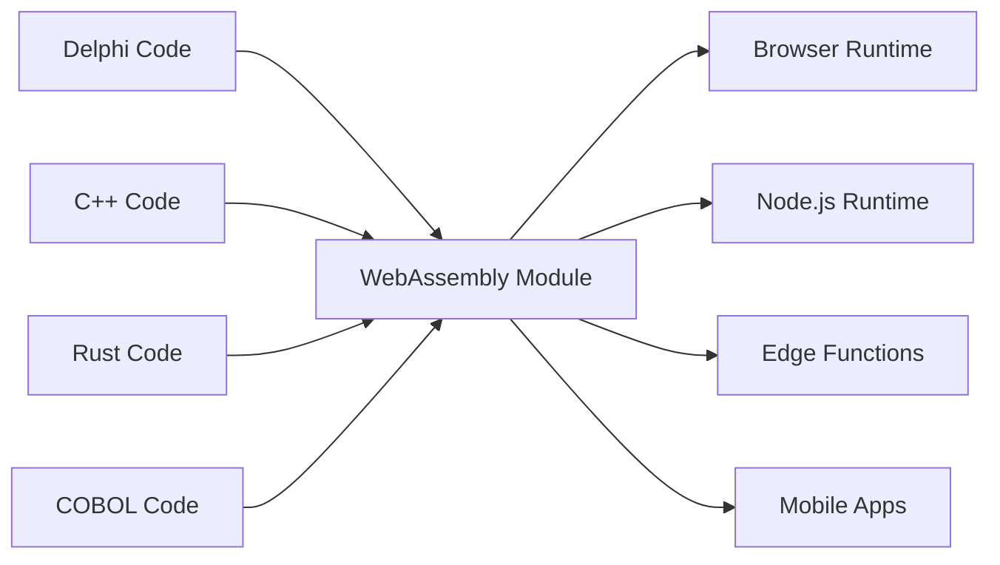

# The Universal Fabricator

"Making binaries for linux desktop applications is a major pain in the ass. You want to just compile one binary and have it work, preferably forever, and preferably across all the linux distributions." - Linus Torvalds, 2014

## Две лжи, которые мы отказываемся принимать

### Legacy ложь: "Переписать все"

Знаменитая тирада Линуса о кошмаре распространения ПО - это симптом более крупной, более дорогостоящей лжи, которую индустрия программного обеспечения говорит себе: что legacy код - это технический долг, и единственный способ модернизироваться - это выбросить десятилетия проверенной в боях бизнес-логики и начать с нуля.

Это безумие. Тот код Delphi, COBOL или C++ работает. Он кодирует годы бизнес-знаний, обработанные граничные случаи и исправленные баги. Переписывание не просто вносит риск - оно разрушает незаменимые институциональные знания.

Universal Fabricator основан на простом, мощном отказе: **мы отказываемся принимать, что это единственный путь**. Что если бы вы могли запускать свою legacy логику где угодно, без переписывания? Не через перевод. Через **универсальное, детерминистское выполнение**.

### Современная дилемма: "Скорость или производительность"

Но это не только о прошлом. В современную эпоху мы сталкиваемся с новым ложным выбором: дилеммой между скоростью прототипирования (TypeScript, Python) и производительностью продакшена (Rust, Go). Команды вынуждены принимать болезненное решение: оставаться с медленным прототипом или начинать рискованное, полное переписывание для продакшена.

Universal Fabricator отвергает и этот выбор. Он предоставляет мост - не только из прошлого в настоящее, но из настоящего в более производительное будущее, не жертвуя скоростью разработки.

> **Вашей бизнес-логике не нужно переписывание. Ей нужен ренессанс.**

## Как это работает

Universal Fabricator проявляется как полиглот Hatcher Functions - ваш legacy код, скомпилированный в WebAssembly - которые безопасно упакованы и выполняются внутри Hatcher EGG. Эта архитектура питается тремя ключевыми компонентами:

### Магия WebAssembly

WebAssembly (WASM) - это прорыв, который делает это возможным. Любой язык, который может компилироваться в WASM, может работать где угодно - браузер, сервер, edge, мобильные устройства. Ваш legacy код становится портируемым без изменения ни одной строки.



### Hatcher Functions: Функции без границ

Традиционные лямбды работают в облаке. Наши Hatcher Functions работают везде:

```typescript
// Ваш 20-летний расчет налогов Delphi
const taxCalculator = await loadWASM('./legacy/tax-engine.wasm')

// Используйте его как современную JavaScript функцию
const tax = await taxCalculator.calculateTax({
  income: 75000,
  deductions: 12000,
  state: 'NY',
})

// Он работает с нативной скоростью, локально, с идеальной точностью
```

### Архитектура EGGs

EGGs (Enforced Governance Guardrails) - это контейнеры для вашей универсальной логики:

```yaml
egg: payroll-processor
version: 2.1.0
engine: wasm

modules:
  - name: tax-calculator
    source: delphi
    binary: tax-engine.wasm
    interface: ./interfaces/tax.ts

  - name: compliance-checker
    source: cobol
    binary: compliance.wasm
    interface: ./interfaces/compliance.ts

  - name: optimization-engine
    source: cpp
    binary: optimizer.wasm
    interface: ./interfaces/optimizer.ts

orchestration:
  entry: orchestrate.js
  runtime: node
```

## Сохраните свои активы

### Вторая жизнь вашего кода

То Delphi приложение 2001 года? Оно становится:

- Микросервисом в вашем Kubernetes кластере
- Функцией в вашем React приложении
- Edge worker для глобального распределения
- Библиотекой в вашем Python data pipeline

Без изменения оригинального кода. Без потери бизнес-логики. Без риска переписывания.

### Пример: Банковская революция

```javascript
// Оригинал: 30-летний процессор транзакций COBOL
// Сейчас: Современный web API

import { loadCOBOLModule } from '@hatcher/eggs'

const transactionProcessor = await loadCOBOLModule('./legacy/transactions.wasm')

// Современный Express.js API
app.post('/api/transfer', async (req, res) => {
  // Современная валидация
  const validated = await validateRequest(req.body)

  // Legacy бизнес-логика (идеальная точность)
  const result = await transactionProcessor.processTransfer({
    fromAccount: validated.from,
    toAccount: validated.to,
    amount: validated.amount,
  })

  // Современный ответ
  res.json({
    success: result.success,
    transactionId: result.id,
    timestamp: new Date().toISOString(),
  })
})
```

## Эволюционируйте без риска

### Постепенная модернизация

Вам не нужно модернизировать все сразу:

```typescript
class HybridPayrollSystem {
  // Сохраните сложный расчет в Delphi
  private legacyCalculator = loadWASM('./legacy/payroll.wasm')

  // Добавьте современные функции в TypeScript
  async calculatePayroll(employee: Employee) {
    // Используйте legacy для основного расчета
    const base = await this.legacyCalculator.calculate(employee)

    // Улучшите современными функциями
    const withBenefits = this.addModernBenefits(base)
    const withAnalytics = this.trackAnalytics(withBenefits)

    return withAnalytics
  }

  // Новые функции в современном коде
  private addModernBenefits(payroll: Payroll) {
    // Современный расчет льгот
  }
}
```

### Языковая интероперабельность

Разные языки для разных сильных сторон:

```javascript
// Используйте каждый язык для того, в чем он лучший
const system = {
  // Rust для критичной производительности
  imageProcessor: await loadWASM('./rust/image-processor.wasm'),

  // Delphi для бизнес-логики
  businessRules: await loadWASM('./delphi/rules-engine.wasm'),

  // C++ для алгоритмов
  optimizer: await loadWASM('./cpp/optimizer.wasm'),

  // JavaScript для оркестровки
  async process(input) {
    const image = await this.imageProcessor.prepare(input.image)
    const rules = await this.businessRules.evaluate(input.data)
    const optimized = await this.optimizer.optimize(rules)

    return { image, result: optimized }
  },
}
```

## Оптимизируйте свое будущее: От прототипа к производительности

Hatcher - это также платформа постепенной оптимизации для современных приложений. Вы можете прототипировать все свое приложение в TypeScript для поиска product-market fit, затем хирургически заменять узкие места производительности высокопроизводительными Rust или Go модулями без полного переписывания.

### Оптимизируйте свое будущее: Рабочий процесс трансмутации

Hatcher предоставляет революционный рабочий процесс для эволюции современного прототипа в высокопроизводительное приложение. Вы не переписываете; вы трансмутируете. Вы можете прототипировать все свое приложение в TypeScript, затем использовать ИИ как партнера для безопасной и систематической модернизации критичной логики в высокопроизводительные языки, такие как Rust или Go.

Это Playbook алхимика.

#### Шаг 1: Прототип (TypeScript)

Вы начинаете с работающего, но возможно "грязного" или медленного TypeScript кода.

```ts
// Ваш начальный прототип для расчета скидок пользователя.
// Он работает, но имеет сложную логику и недостаточно быстр.
function calculateDiscount(user, cart) {
  let discount = 0
  if (user.isVip) discount += 0.1
  if (cart.total > 100) discount += 0.05
  // ... много более сложных и медленных правил
  return Math.min(discount, 0.25) // cap discount
}
```

#### Шаг 2: Спецификация на основе ИИ (Код → AC)

Вы выбираете функцию и командуете Hatcher: "Опишите эту логику как критерии приемки." ИИ анализирует код и обратно инженерит бизнес-правила.

```Gherkin
# Сгенерированные ИИ критерии приемки

Feature: User Discount Calculation

Scenario: VIP user with large cart
Given a user is a "VIP"
And the cart total is over 100
Then the final discount should be 15%

Scenario: Non-VIP user
Given a user is not a "VIP"
Then the discount is based only on cart total

Scenario: Discount Capping
When any combination of rules results in a discount over 25%
Then the final discount must be capped at 25%
```

#### **Шаг 3: Уточнение человеком (Точка контроля)**

Теперь вы, разработчик, проверяете и улучшаете эти AC на простом английском. Вы ловите граничный случай, который пропустил ИИ, и добавляете новый сценарий. Это ваша точка контроля.

#### Шаг 4: Генерация на основе тестов (AC → Тесты → Код)

С одобренными человеком AC как контрактом, вы командуете Hatcher: "Сгенерируйте Rust код и юнит-тесты для удовлетворения этих критериев."

1. Hatcher сначала генерирует тесты в Rust, напрямую отражая AC.

2. Затем он генерирует Rust код, который заставляет эти тесты проходить.

```rust
// Финальный, высокопроизводительный Rust код, гарантированный тестами
// соответствовать одобренной человеком бизнес-логике.
pub fn calculate_discount(user: &User, cart: &Cart) -> f64 {
    // Молниеносно быстрая, безопасная Rust логика...
}
```

#### Шаг 5: Живой артефакт

Финальный вывод - это не только скомпилированный .wasm модуль. Это модуль **в паре с его человекочитаемой спецификацией**. AC сохраняются рядом с лямбдой, создавая живую документацию для будущей поддержки и эволюции.

Это мечта алхимика: безопасный, структурированный процесс для трансмутации прототипа в высокопроизводительное приложение, без риска и с идеальной ясностью.

## Выполняйте с уверенностью

### WASM Cleanroom

Каждый WASM модуль работает в песочнице:

```typescript
interface WASMSandbox {
  memory: {
    limit: '100MB'
    shared: false
  }

  cpu: {
    timeout: '5s'
    priority: 'normal'
  }

  io: {
    filesystem: 'none'
    network: 'none'
    system: 'none'
  }
}
```

Ваш legacy код не может:

- Получать доступ к файловой системе (если явно не разрешено)
- Делать сетевые вызовы (если явно не разрешено)
- Крашить хост-процесс
- Утекать память
- Мешать другим модулям

### Типобезопасные интерфейсы

Генерируйте TypeScript интерфейсы из вашего legacy кода:

```typescript
// Автогенерировано из сигнатур функций Delphi
export interface TaxEngine {
  calculateFederalTax(income: number, deductions: number): Promise<number>
  calculateStateTax(income: number, state: string): Promise<number>
  getDeductionLimit(filingStatus: FilingStatus): Promise<number>
}

// Типобезопасное использование
const engine: TaxEngine = await loadWASM('./tax-engine.wasm')
const tax = await engine.calculateFederalTax(100000, 12000) // Проверено типами!
```

## Доказано в окопах

### Сценарий 1: Страховой гигант

40-летняя страховая компания с миллионами строк COBOL:

```yaml
before:
  problem: 'COBOL mainframe costs $2M/year'
  solution: '5-year, $50M rewrite project (failed twice)'

after:
  solution: 'Compile COBOL to WASM'
  timeline: '3 months'
  result:
    - Run on commodity hardware
    - Scale horizontally
    - Keep all business logic
    - Modern API layer
  savings: '$1.8M/year'
```

### Сценарий 2: Торговая фирма

Высокочастотные торговые алгоритмы на C++:

```javascript
// Оригинал: C++ на специализированном оборудовании
// Сейчас: Тот же C++ везде

const tradingEngine = await loadWASM('./trading/algorithm.wasm')

// Разверните на edge локации глобально
const edgeLocations = ['nyc', 'london', 'tokyo', 'singapore']

for (const location of edgeLocations) {
  deployToEdge(location, tradingEngine)
  // Тот же алгоритм, микросекундная задержка, глобальное распределение
}
```

### Сценарий 3: Производственная система

Встроенный C код из промышленных контроллеров:

```typescript
// 30-летний C код из производственного оборудования
const controller = await loadWASM('./embedded/controller.wasm')

// Теперь он питает современную web панель
const Dashboard = () => {
  const [status, setStatus] = useState()

  useEffect(() => {
    const interval = setInterval(async () => {
      const data = await controller.getSystemStatus()
      setStatus(data)
    }, 1000)

    return () => clearInterval(interval)
  }, [])

  return <ModernUIComponent data={status} />
}
```

### Сценарий 4: ИИ стартап

Быстро движущийся стартап прототипирует свой data processing pipeline на Python.

```yaml
before:
  problem: 'Python prototype is too slow for production customers.'
  solution: "Plan a 6-month 'rewrite it in Go' project, pausing all feature development."
after:
  solution: 'Identify and rewrite 3 critical functions in Rust with Hatcher.'
  timeline: '2 weeks.'
  result:
    - 90% of the codebase remains in easy-to-iterate Python.
    - Critical path is now 120x faster.
    - Shipped to production customers next month.
    - Rewrite project cancelled.
```

## Начало работы

### Шаг 1: Определите свою логику

Какая бизнес-логика застряла в legacy коде?

- Движки расчетов
- Бизнес-правила
- Логика валидации
- Алгоритмы обработки

### Шаг 2: Скомпилируйте в WASM

Большинство языков теперь поддерживают компиляцию WASM:

```bash
# Delphi
delphi2wasm your-code.pas -o output.wasm

# C/C++
emcc your-code.cpp -o output.wasm

# COBOL
cobol2wasm your-code.cob -o output.wasm

# Rust
cargo build --target wasm32-unknown-unknown
```

### Шаг 3: Создайте интерфейсы

Определите, как современный код будет взаимодействовать:

```typescript
// Определите интерфейс
interface LegacyModule {
  initialize(): Promise<void>
  process(input: Input): Promise<Output>
  cleanup(): Promise<void>
}
```

### Шаг 4: Интегрируйте

Используйте свою legacy логику в современных приложениях:

```javascript
const legacy = await loadWASM('./legacy.wasm')
// Ваш 30-летний код теперь современный модуль
```

## Философия

Universal Fabricator воплощает фундаментальную веру: **код - это актив, а не обязательство**. Каждая строка работающего кода представляет решенные проблемы, обработанные граничные случаи и встроенные знания. Возраст кода не уменьшает его ценность - он доказывает её.

Мы не выбрасываем книги, потому что они старые. Мы не сносим здания, потому что они были построены другими инструментами. Почему мы настаиваем на переписывании кода, который работает?

Universal Fabricator - это сохранение через прогресс. Это модернизация без разрушения. Это мост между тем, что было построено, и тем, что нужно построить.

---

_Universal Fabricator не просто запускает ваш legacy код - он освобождает его. Ваша бизнес-логика, освобожденная от тюрьмы устаревших runtime, становится действительно универсальной. Напишите один раз, запускайте навсегда, везде._

<PageCTA
  title="Освободите свой legacy код"
  subtitle="Трансформируйте десятилетия бизнес-логики в современные, универсальные модули"
  buttonText="Исследовать Fabricator"
  buttonLink="/ru/features-universal-fabricator"
  buttonStyle="secondary"
  footer="Ваш код - это актив, а не обязательство. Сохраните его. Модернизируйте его."
/>
