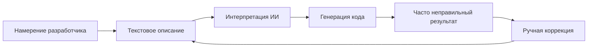

# Visual-to-Code Bridge

Visual-to-Code Bridge - это фирменная функция Hatcher, которая революционизирует то, как разработчики взаимодействуют с ИИ-помощниками по кодированию. Вместо описания изменений текстом вы напрямую манипулируете визуальным интерфейсом вашего приложения, и Hatcher переводит ваши действия в точные модификации кода.

## Как это работает

### Традиционная проблема



**Пример разочаровывающего цикла:**

- Разработчик: "Make the header blue and center it"
- ИИ: Генерирует CSS, который делает синим не тот элемент
- Разработчик: "No, the main header, not the sidebar header"
- ИИ: Делает не тот оттенок синего
- Разработчик: "Make it #3B82F6 and also increase the font size"
- ... и так далее

### Подход Visual-to-Code Hatcher: Двойные режимы моста

Visual-to-Code Bridge работает по-разному в зависимости от миссии вашего проекта, обеспечивая правильный баланс свободы и контроля.

**В Generative режиме: Создание с помощью ИИ**

В `Generative` проекте мост действует как высокоточная система наведения для ИИ. Рабочий процесс:

1. **Вы закрепляете контекст:** Кликните для выбора элемента.

2. **Вы предоставляете команду:** Используйте естественный язык для описания желаемого изменения.

3. **ИИ выполняет:** Он генерирует необходимый код, ограниченный определенной вами областью.

**В EGG: Детерминистская манипуляция**

В EGG (Enforced Governance Guardrails) мост становится инструментом прямой манипуляции, где генерация кода ИИ не используется для визуальных изменений. Рабочий процесс 100% детерминистский:

1. **Вы манипулируете напрямую:** Перетаскиваете, изменяете размер или редактируете свойства в визуальной панели.

2. **Движок фиксирует событие:** Hatcher записывает изменение как структурированное обновление.

3. **Конфигурация обновляется:** Изменение записывается в конфигурационный файл проекта, не генерируется как новый исходный код.

## Основные функции

### 1. Выбор элементов

**Умная система выбора**

- Кликните любой элемент для выбора
- Наведите для предпросмотра границ выбора
- Выберите несколько элементов для пакетных операций
- Иерархический выбор (потомок, родитель, соседи)

```typescript
// Пример: Выбор кнопки
const selection = {
  element: 'button.submit-btn',
  properties: {
    position: { x: 120, y: 45 },
    dimensions: { width: 100, height: 36 },
    styles: {
      backgroundColor: '#3B82F6',
      borderRadius: '6px',
      fontSize: '14px',
    },
  },
  context: {
    parent: 'form.checkout-form',
    siblings: ['input.email', 'input.password'],
    framework: 'Vue 3',
    component: 'SubmitButton.vue',
  },
}
```

### 2. Визуальная манипуляция

**Прямое редактирование свойств**

- Перетаскивайте элементы в новые позиции
- Изменяйте размер перетаскиванием углов
- Выбор цвета для фонов и текста
- Контроль типографики (шрифт, размер, вес)
- Контроль отступов (margin, padding)

**Живой предпросмотр**

- Видьте изменения мгновенно в вашем приложении
- Не нужно обновлять или пересобирать
- Интеграция с горячей заменой модулей
- Обновления CSS в реальном времени

### 3. Распознавание намерения

Hatcher анализирует ваши визуальные изменения и понимает:

**Изменения макета**

- Модификации позиции (absolute, relative, flex)
- Корректировки размера (ширина, высота, отзывчивость)
- Изменения выравнивания (center, flex, grid)

**Изменения стиля**

- Модификации цвета (hex, RGB, HSL, переменные CSS)
- Обновления типографики (семейство шрифта, размер, вес, высота строки)
- Визуальные эффекты (тени, границы, градиенты)

**Изменения компонентов**

- Модификации props
- Обновления состояния
- Добавления обработчиков событий

### 4. Генерация кода

На основе вашего визуального намерения Hatcher генерирует:

**Код для конкретного фреймворка**

```vue
<!-- Пример Vue 3 -->
<template>
  <button
    class="submit-btn"
    :style="{
      transform: `translate(${position.x}px, ${position.y}px)`,
      backgroundColor: '#3B82F6',
    }"
    @click="handleSubmit"
  >
    Submit
  </button>
</template>
```

**Обновления CSS**

```css
.submit-btn {
  position: absolute;
  left: 120px;
  top: 45px;
  background-color: #3b82f6;
  width: 100px;
  height: 36px;
  border-radius: 6px;
  font-size: 14px;
}
```

**Интеграция TypeScript**

```typescript
interface ButtonProps {
  position: { x: number; y: number }
  variant: 'primary' | 'secondary'
  size: 'sm' | 'md' | 'lg'
}
```

## Продвинутые возможности

### 1. Отзывчивый дизайн

**Редактирование нескольких точек останова**

- Редактируйте разные размеры экрана одновременно
- Автоматически генерируйте отзывчивый CSS
- Поддерживайте согласованность дизайна на устройствах

```css
/* Сгенерированный отзывчивый код */
.submit-btn {
  /* Мобильный */
  width: 100%;
  margin: 0 16px;
}

@media (min-width: 768px) {
  /* Планшет */
  .submit-btn {
    width: 200px;
    margin: 0 auto;
  }
}

@media (min-width: 1024px) {
  /* Десктоп */
  .submit-btn {
    width: 150px;
    position: absolute;
    left: 120px;
  }
}
```

### 2. Компонентно-осведомленные изменения

**Умное определение компонентов**

- Распознает компоненты Vue, React, Svelte
- Понимает props и состояние компонентов
- Поддерживает границы компонентов

**Пример: Модификация компонента Vue**

```vue
<!-- До -->
<UserCard :user="currentUser" size="medium" />

<!-- После визуальной модификации -->
<UserCard
  :user="currentUser"
  size="large"
  :style="{ marginTop: '24px' }"
  show-avatar
/>
```

### 3. Интеграция дизайн-системы

**Автоматическое использование токенов**

- Распознает токены дизайн-системы
- Предлагает соответствующие значения
- Поддерживает согласованность

```css
/* Вместо произвольных значений */
color: #3b82f6;
padding: 12px;

/* Использует токены дизайна */
color: var(--color-primary-500);
padding: var(--spacing-3);
```

## Примеры рабочих процессов

### Пример 1: Корректировка макета

**Цель**: Переместить боковую панель с левой на правую сторону

1. **Выберите**: Кликните на компонент боковой панели
2. **Перетащите**: Перетащите его на правую сторону экрана
3. **Проверьте**: Увидьте сгенерированные изменения flex/grid
4. **Примените**: Примите модификации CSS

**Сгенерированный код**:

```css
.layout-container {
  display: flex;
  flex-direction: row; /* Изменено с row-reverse */
}

.sidebar {
  order: 2; /* Изменено с 1 */
  margin-left: auto; /* Добавлено */
}
```

### Пример 2: Стилизация компонента

**Цель**: Изменить внешний вид кнопки для соответствия дизайну

1. **Выберите**: Кликните кнопку
2. **Стилизуйте**: Используйте выбор цвета, отрегулируйте размер, модифицируйте границу
3. **Предпросмотр**: Увидьте изменения живьем в приложении
4. **Сгенерируйте**: Получите обновления props компонента

**Сгенерированный код**:

```vue
<script setup>
const buttonStyle = {
  variant: 'primary',
  size: 'lg',
  rounded: true,
}
</script>

<template>
  <AppButton v-bind="buttonStyle"> Submit Order </AppButton>
</template>
```

### Пример 3: Отзывчивая корректировка

**Цель**: Сделать сетку отзывчивой

1. **Выберите**: Выберите контейнер сетки
2. **Измените размер**: Отрегулируйте колонки для разных точек останова
3. **Протестируйте**: Предпросмотр на мобильном/планшете/десктопе
4. **Примените**: Сгенерируйте отзывчивый CSS Grid

**Сгенерированный код**:

```css
.product-grid {
  display: grid;
  gap: 1rem;
  grid-template-columns: 1fr; /* Мобильный */
}

@media (min-width: 640px) {
  .product-grid {
    grid-template-columns: repeat(2, 1fr); /* Планшет */
  }
}

@media (min-width: 1024px) {
  .product-grid {
    grid-template-columns: repeat(3, 1fr); /* Десктоп */
  }
}
```

## Интеграция с ИИ-движками

Visual-to-Code Bridge работает бесшовно с поддерживаемыми ИИ-движками:

### Интеграция Claude Code

```typescript
const visualIntent = captureVisualChange(selection, modification)
const codeChange = await claudeCode.generateChange({
  intent: visualIntent,
  context: projectContext,
  playbook: teamPlaybook,
})
```

### Интеграция Gemini CLI

```typescript
const prompt = buildVisualPrompt(visualIntent, codeContext)
const suggestion = await geminiCLI.complete(prompt)
const refinedCode = refineWithPlaybook(suggestion)
```

## Лучшие практики

### 1. Начинайте с малого

- Делайте инкрементальные визуальные изменения
- Тестируйте каждую модификацию перед переходом к следующей
- Стройте сложные изменения через меньшие шаги

### 2. Используйте Playbooks

- Определяйте паттерны компонентов в ваших playbooks
- Устанавливайте согласованные правила стилизации
- Документируйте общие паттерны дизайна

### 3. Проверяйте сгенерированный код

- Всегда проверяйте diff кода перед применением
- Убедитесь, что сгенерированный код следует вашим стандартам
- Уточняйте промпты при необходимости для лучших результатов

### 4. Тщательно тестируйте

- Используйте автоматизированные тесты для валидации изменений
- Проверяйте отзывчивое поведение
- Проверяйте соответствие доступности

---

Visual-to-Code Bridge представляет фундаментальный сдвиг в том, как мы взаимодействуем с ИИ для разработки. Устраняя слой перевода между намерением и реализацией, он создает более интуитивный, точный и эффективный опыт разработки.
