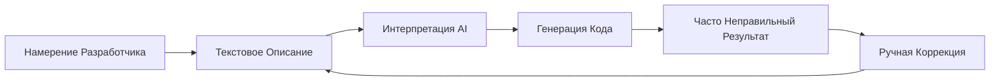
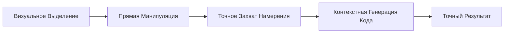

# Visual-to-Code Мост

Visual-to-Code мост — это фирменная функция Hatcher, которая революционизирует то, как разработчики взаимодействуют с AI ассистентами кодирования. Вместо описания изменений текстом, вы напрямую манипулируете визуальным интерфейсом вашего приложения, и Hatcher переводит ваши действия в точные модификации кода.

## Как Это Работает

### Традиционная Проблема



**Пример фрустрирующего цикла:**

- Разработчик: "Сделай заголовок синим и отцентрируй его"
- AI: Генерирует CSS, который делает неправильный элемент синим
- Разработчик: "Нет, главный заголовок, не заголовок боковой панели"
- AI: Делает его неправильным оттенком синего
- Разработчик: "Сделай его #3B82F6 и также увеличь размер шрифта"
- ... и так далее

### Подход Visual-to-Code от Hatcher



**Как это работает на самом деле:**

1. **Кликни и Выбери**: Укажи на элемент, который хочешь изменить
2. **Визуальная Манипуляция**: Перетаскивай, изменяй размер или модифицируй свойства визуально
3. **Распознавание Намерения**: Hatcher понимает точно, что изменилось
4. **Генерация Кода**: AI генерирует точный необходимый код
5. **Идеальный Результат**: Изменение точно соответствует твоему визуальному намерению

## Основные Функции

### 1. Выбор Элементов

**Умная Система Выбора**

- Кликни любой элемент для его выбора
- Наведи для предварительного просмотра границ выбора
- Выбери несколько элементов для массовых операций
- Иерархический выбор (дочерний, родительский, соседние)

```typescript
// Пример: Выбор кнопки
const selection = {
  element: 'button.submit-btn',
  properties: {
    position: { x: 120, y: 45 },
    dimensions: { width: 100, height: 36 },
    styles: {
      backgroundColor: '#3B82F6',
      borderRadius: '6px',
      fontSize: '14px',
    },
  },
  context: {
    parent: 'form.checkout-form',
    siblings: ['input.email', 'input.password'],
    framework: 'Vue 3',
    component: 'SubmitButton.vue',
  },
}
```

### 2. Визуальная Манипуляция

**Прямое Редактирование Свойств**

- Перетаскивай элементы в новые позиции
- Изменяй размер перетаскиванием углов
- Палитра цветов для фонов и текста
- Контроль типографики (шрифт, размер, вес)
- Контроль отступов (margin, padding)

**Живой Предпросмотр**

- Видь изменения мгновенно в твоем приложении
- Не нужно обновлять или пересобирать
- Интеграция с горячей заменой модулей
- Обновления CSS в реальном времени

### 3. Распознавание Намерения

Hatcher анализирует твои визуальные изменения и понимает:

**Изменения Макета**

- Модификации позиции (absolute, relative, flex)
- Корректировки размера (width, height, responsive)
- Изменения выравнивания (center, flex, grid)

**Изменения Стиля**

- Модификации цвета (hex, RGB, HSL, CSS переменные)
- Обновления типографики (font family, size, weight, line height)
- Визуальные эффекты (тени, границы, градиенты)

**Изменения Компонентов**

- Модификации Props
- Обновления состояния
- Добавление обработчиков событий

### 4. Генерация Кода

На основе твоего визуального намерения Hatcher генерирует:

**Код Специфичный для Фреймворка**

```vue
<!-- Пример Vue 3 -->
<template>
  <button
    class="submit-btn"
    :style="{
      transform: `translate(${position.x}px, ${position.y}px)`,
      backgroundColor: '#3B82F6',
    }"
    @click="handleSubmit"
  >
    Отправить
  </button>
</template>
```

**Обновления CSS**

```css
.submit-btn {
  position: absolute;
  left: 120px;
  top: 45px;
  background-color: #3b82f6;
  width: 100px;
  height: 36px;
  border-radius: 6px;
  font-size: 14px;
}
```

**Интеграция TypeScript**

```typescript
interface ButtonProps {
  position: { x: number; y: number }
  variant: 'primary' | 'secondary'
  size: 'sm' | 'md' | 'lg'
}
```

## Продвинутые Возможности

### 1. Адаптивный Дизайн

**Редактирование Множественных Точек Останова**

- Редактируй разные размеры экрана одновременно
- Генерируй адаптивный CSS автоматически
- Поддерживай согласованность дизайна на устройствах

```css
/* Сгенерированный адаптивный код */
.submit-btn {
  /* Мобильный */
  width: 100%;
  margin: 0 16px;
}

@media (min-width: 768px) {
  /* Планшет */
  .submit-btn {
    width: 200px;
    margin: 0 auto;
  }
}

@media (min-width: 1024px) {
  /* Десктоп */
  .submit-btn {
    width: 150px;
    position: absolute;
    left: 120px;
  }
}
```

### 2. Изменения с Учетом Компонентов

**Умное Распознавание Компонентов**

- Распознает компоненты Vue, React, Svelte
- Понимает props и состояние компонентов
- Сохраняет границы компонентов

**Пример: Модификация Vue Компонента**

```vue
<!-- До -->
<UserCard :user="currentUser" size="medium" />

<!-- После визуальной модификации -->
<UserCard
  :user="currentUser"
  size="large"
  :style="{ marginTop: '24px' }"
  show-avatar
/>
```

### 3. Интеграция с Дизайн-Системой

**Автоматическое Использование Токенов**

- Распознает токены дизайн-системы
- Предлагает подходящие значения
- Поддерживает согласованность

```css
/* Вместо произвольных значений */
color: #3b82f6;
padding: 12px;

/* Использует токены дизайна */
color: var(--color-primary-500);
padding: var(--spacing-3);
```

## Примеры Рабочего Процесса

### Пример 1: Корректировка Макета

**Цель**: Переместить боковую панель с левой стороны на правую

1. **Выбери**: Кликни на компонент боковой панели
2. **Перетащи**: Перетащи его на правую сторону экрана
3. **Просмотри**: Посмотри сгенерированные изменения flex/grid
4. **Примени**: Прими модификации CSS

**Сгенерированный Код**:

```css
.layout-container {
  display: flex;
  flex-direction: row; /* Изменено с row-reverse */
}

.sidebar {
  order: 2; /* Изменено с 1 */
  margin-left: auto; /* Добавлено */
}
```

### Пример 2: Стилизация Компонента

**Цель**: Изменить внешний вид кнопки под дизайн

1. **Выбери**: Кликни кнопку
2. **Стилизуй**: Используй палитру цветов, настрой размер, модифицируй границу
3. **Предпросмотр**: Видь изменения в реальном времени в приложении
4. **Генерируй**: Получи обновления props компонента

**Сгенерированный Код**:

```vue
<script setup>
const buttonStyle = {
  variant: 'primary',
  size: 'lg',
  rounded: true,
}
</script>

<template>
  <AppButton v-bind="buttonStyle"> Отправить Заказ </AppButton>
</template>
```

### Пример 3: Адаптивная Корректировка

**Цель**: Сделать сетку адаптивной

1. **Выбери**: Выбери контейнер сетки
2. **Изменяй Размер**: Настрой колонки для разных точек останова
3. **Тестируй**: Предпросматривай на мобильном/планшете/десктопе
4. **Примени**: Генерируй адаптивный CSS Grid

**Сгенерированный Код**:

```css
.product-grid {
  display: grid;
  gap: 1rem;
  grid-template-columns: 1fr; /* Мобильный */
}

@media (min-width: 640px) {
  .product-grid {
    grid-template-columns: repeat(2, 1fr); /* Планшет */
  }
}

@media (min-width: 1024px) {
  .product-grid {
    grid-template-columns: repeat(3, 1fr); /* Десктоп */
  }
}
```

## Интеграция с AI Движками

Visual-to-Code мост работает безупречно с поддерживаемыми AI движками:

### Интеграция Claude Code

```typescript
const visualIntent = captureVisualChange(selection, modification)
const codeChange = await claudeCode.generateChange({
  intent: visualIntent,
  context: projectContext,
  playbook: teamPlaybook,
})
```

### Интеграция Gemini CLI

```typescript
const prompt = buildVisualPrompt(visualIntent, codeContext)
const suggestion = await geminiCLI.complete(prompt)
const refinedCode = refineWithPlaybook(suggestion)
```

## Лучшие Практики

### 1. Начинай с Малого

- Делай постепенные визуальные изменения
- Тестируй каждую модификацию перед переходом к следующей
- Стройй сложные изменения через меньшие шаги

### 2. Используй Playbooks

- Определяй паттерны компонентов в своих playbooks
- Устанавливай консистентные правила стилизации
- Документируй общие паттерны дизайна

### 3. Проверяй Сгенерированный Код

- Всегда проверяй diff кода перед применением
- Убеждайся, что сгенерированный код следует твоим стандартам
- Улучшай промпты при необходимости для лучших результатов

### 4. Тестируй Тщательно

- Используй автоматизированные тесты для валидации изменений
- Проверяй адаптивное поведение
- Верифицируй соответствие доступности

---

Visual-to-Code мост представляет фундаментальное изменение в том, как мы взаимодействуем с AI для разработки. Устраняя слой перевода между намерением и реализацией, он создает более интуитивный, точный и эффективный опыт разработки.
