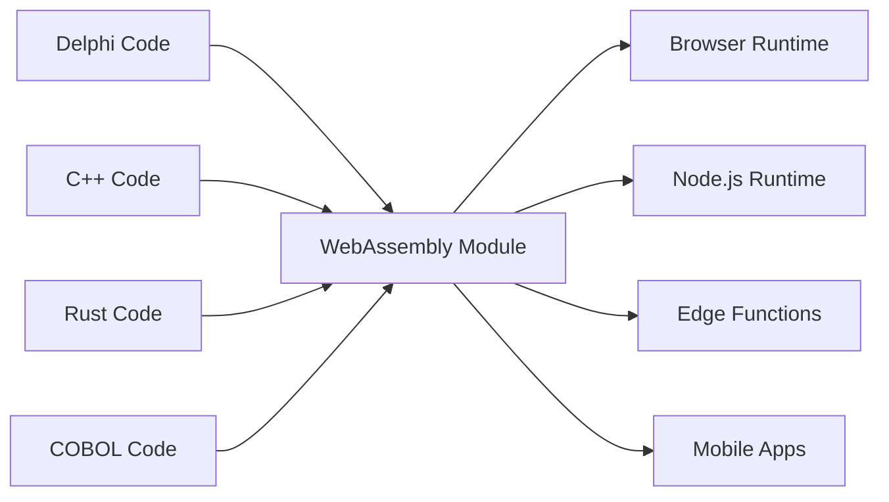

# The Universal Fabricator

"Making binaries for linux desktop applications is a major pain in the ass. You want to just compile one binary and have it work, preferably forever, and preferably across all the linux distributions." - Linus Torvalds, 2014

## Kabul Etmeyi Reddettiğimiz İki Yalan

### Eski Sistem Yalanı: "Her Şeyi Yeniden Yazın"

Linus'un yazılım dağıtımının kabusla ilgili ünlü sözü, yazılım endüstrisinin kendine söylediği daha büyük, daha maliyetli bir yalanın belirtisidir: eski kodun teknik borç olduğu ve modernleşmenin tek yolunun on yıllarca test edilmiş iş mantığını atıp sıfırdan başlamak olduğu.

Bu delilik. O Delphi, COBOL veya C++ kodu çalışıyor. Yıllarca iş bilgisini kodluyor, uç durumları ele aldı ve hataları düzeltti. Onu yeniden yazmak sadece risk getirmekle kalmaz—vazgeçilmez kurumsal bilgiyi yok eder.

Universal Fabricator basit, güçlü bir redde dayanır: **bunun tek yol olduğunu kabul etmeyi reddediyoruz**. Ya eski mantığınızı yeniden yazma olmadan her yerde çalıştırabilseydiniz? Çeviri yoluyla değil. **Evrensel, deterministik yürütme** yoluyla.

### Modern İkilem: "Hız mı Performans mı"

Ama bu sadece geçmişle ilgili değil. Modern çağda, yeni bir yanlış seçimle karşı karşıyayız: prototipleme hızı (TypeScript, Python) ve üretim performansı (Rust, Go) arasındaki ikilem. Ekipler acı verici bir karara zorlanıyor: yavaş prototiple kal veya üretim için riskli, tam bir yeniden yazma girişiminde bulun.

Universal Fabricator bu seçimi de reddediyor. Bir köprü sağlıyor—sadece geçmişten günümüze değil, gelişme hızınızı feda etmeden daha yüksek performanslı bir geleceğe de.

> **İş mantığınızın yeniden yazılmaya ihtiyacı yok. Rönesansa ihtiyacı var.**

## Nasıl Çalışır

Universal Fabricator, Çok Dilli Hatcher Fonksiyonları olarak kendini gösterir—eski kodunuz WebAssembly'ye derlenmiş—bunlar güvenli bir şekilde paketlenir ve bir Hatcher EGG içinde yürütülür. Bu mimari üç temel bileşen tarafından güçlendirilir:

### WebAssembly'nin Sihri

WebAssembly (WASM) bunu mümkün kılan atılımdır. WASM'ye derlenebilen herhangi bir dil her yerde çalışabilir—tarayıcı, sunucu, edge, mobil. Eski kodunuz tek bir satır değişmeden taşınabilir hale gelir.



### Hatcher Fonksiyonları: Sınırsız Fonksiyonlar

Geleneksel lambda'lar bulutta çalışır. Hatcher Fonksiyonlarımız her yerde çalışır:

```typescript
// 20 yıllık Delphi vergi hesaplaması
const taxCalculator = await loadWASM('./legacy/tax-engine.wasm')

// Modern bir JavaScript fonksiyonu gibi kullanın
const tax = await taxCalculator.calculateTax({
  income: 75000,
  deductions: 12000,
  state: 'NY',
})

// Native hızda, yerel olarak, mükemmel doğrulukla çalışır
```

### EGGs Mimarisi

EGG'ler (Enforced Governance Guardrails) evrensel mantığınız için konteynerlardır:

```yaml
egg: payroll-processor
version: 2.1.0
engine: wasm

modules:
  - name: tax-calculator
    source: delphi
    binary: tax-engine.wasm
    interface: ./interfaces/tax.ts

  - name: compliance-checker
    source: cobol
    binary: compliance.wasm
    interface: ./interfaces/compliance.ts

  - name: optimization-engine
    source: cpp
    binary: optimizer.wasm
    interface: ./interfaces/optimizer.ts

orchestration:
  entry: orchestrate.js
  runtime: node
```

## Varlıklarınızı Koruyun

### Kodunuzun İkinci Hayatı

2001'den kalma o Delphi uygulaması? Şunlara dönüşür:

- Kubernetes kümenizde bir mikroservis
- React uygulamanızda bir fonksiyon
- Global dağıtım için bir edge worker
- Python veri hattınızda bir kütüphane

Orijinal kodu değiştirmeden. İş mantığını kaybetmeden. Yeniden yazma riski olmadan.

### Örnek: Bankacılık Devrimi

```javascript
// Orijinal: 30 yıllık COBOL işlem işlemcisi
// Şimdi: Modern web API

import { loadCOBOLModule } from '@hatcher/eggs'

const transactionProcessor = await loadCOBOLModule('./legacy/transactions.wasm')

// Modern Express.js API
app.post('/api/transfer', async (req, res) => {
  // Modern doğrulama
  const validated = await validateRequest(req.body)

  // Eski iş mantığı (mükemmel doğruluk)
  const result = await transactionProcessor.processTransfer({
    fromAccount: validated.from,
    toAccount: validated.to,
    amount: validated.amount,
  })

  // Modern yanıt
  res.json({
    success: result.success,
    transactionId: result.id,
    timestamp: new Date().toISOString(),
  })
})
```

## Risk Olmadan Evrim

### Kademeli Modernleşme

Her şeyi bir anda modernleştirmeniz gerekmez:

```typescript
class HybridPayrollSystem {
  // Karmaşık hesaplamayı Delphi'de tutun
  private legacyCalculator = loadWASM('./legacy/payroll.wasm')

  // TypeScript'te modern özellikler ekleyin
  async calculatePayroll(employee: Employee) {
    // Çekirdek hesaplama için eski sistemi kullanın
    const base = await this.legacyCalculator.calculate(employee)

    // Modern özelliklerle geliştirin
    const withBenefits = this.addModernBenefits(base)
    const withAnalytics = this.trackAnalytics(withBenefits)

    return withAnalytics
  }

  // Modern kodda yeni özellikler
  private addModernBenefits(payroll: Payroll) {
    // Modern yan haklar hesaplaması
  }
}
```

### Dil Birlikte Çalışabilirliği

Farklı güçler için farklı diller:

```javascript
// Her dili en iyi yaptığı şey için kullanın
const system = {
  // Performans kritik için Rust
  imageProcessor: await loadWASM('./rust/image-processor.wasm'),

  // İş mantığı için Delphi
  businessRules: await loadWASM('./delphi/rules-engine.wasm'),

  // Algoritmalar için C++
  optimizer: await loadWASM('./cpp/optimizer.wasm'),

  // Orkestrasyon için JavaScript
  async process(input) {
    const image = await this.imageProcessor.prepare(input.image)
    const rules = await this.businessRules.evaluate(input.data)
    const optimized = await this.optimizer.optimize(rules)

    return { image, result: optimized }
  },
}
```

## Geleceğinizi Optimize Edin: Prototipten Performansa

Hatcher aynı zamanda modern uygulamalar için kademeli bir optimizasyon platformudur. Ürün-pazar uyumunu bulmak için tüm uygulamanızı TypeScript'te prototipleyebilir, ardından tam bir yeniden yazma olmadan performans darboğazlarını cerrahi olarak yüksek performanslı Rust veya Go modülleriyle değiştirebilirsiniz.

### Geleceğinizi Optimize Edin: Dönüşüm İş Akışı

Hatcher, modern bir prototipi yüksek performanslı bir uygulamaya dönüştürmek için devrimci bir iş akışı sağlar. Yeniden yazmazsınız; dönüştürürsünüz. Tüm uygulamanızı TypeScript'te prototipleyebilir, ardından kritik mantığı güvenli ve sistematik bir şekilde Rust veya Go gibi yüksek performanslı dillere yükseltmek için AI'yı ortak olarak kullanabilirsiniz.

Bu Simyacının Playbook'udur.

#### Adım 1: Prototip (TypeScript)

Çalışan, ancak belki "kirli" veya yavaş TypeScript koduyla başlarsınız.

```ts
// Kullanıcı indirimlerini hesaplamak için ilk prototipiniz.
// Çalışıyor, ancak karmaşık mantığa sahip ve yeterince hızlı değil.
function calculateDiscount(user, cart) {
  let discount = 0
  if (user.isVip) discount += 0.1
  if (cart.total > 100) discount += 0.05
  // ... çok daha fazla karmaşık ve yavaş kural
  return Math.min(discount, 0.25) // indirim üst sınırı
}
```

#### Adım 2: AI Destekli Spesifikasyon (Kod → AC'ler)

Fonksiyonu seçer ve Hatcher'a komut edersiniz: "Bu mantığı Kabul Kriterleri olarak açıkla." AI kodu analiz eder ve iş kurallarını tersine mühendislik yapar.

```Gherkin
# AI Tarafından Oluşturulan Kabul Kriterleri

Feature: User Discount Calculation

Scenario: VIP user with large cart
Given a user is a "VIP"
And the cart total is over 100
Then the final discount should be 15%

Scenario: Non-VIP user
Given a user is not a "VIP"
Then the discount is based only on cart total

Scenario: Discount Capping
When any combination of rules results in a discount over 25%
Then the final discount must be capped at 25%
```

#### **Adım 3: İnsan Rafine Etmesi (Kontrol Noktası)**

Şimdi, geliştirici olarak siz, bu AC'leri sade İngilizce olarak inceler ve geliştirirsiniz. AI'nın kaçırdığı bir uç durumu yakalarsınız ve yeni bir senaryo eklersiniz. Bu sizin kontrol noktanızdır.

#### Adım 4: Test Odaklı Üretim (AC'ler → Testler → Kod)

İnsan onaylı AC'ler sözleşme olarak, Hatcher'a komut edersiniz: "Bu kriterleri karşılayan Rust kodu ve birim testleri oluştur."

1. Hatcher önce AC'leri doğrudan yansıtan Rust'ta testleri oluşturur.

2. Ardından, bu testleri geçiren Rust kodunu oluşturur.

```rust
// Son, yüksek performanslı Rust kodu, testler tarafından garanti edilir
// insan onaylı iş mantığıyla eşleşmesi için.
pub fn calculate_discount(user: &User, cart: &Cart) -> f64 {
    // Şimşek hızında, güvenli Rust mantığı...
}
```

#### Adım 5: Yaşayan Eser

Son çıktı sadece derlenmiş .wasm modülü değildir. Modül **insan tarafından okunabilir spesifikasyonuyla birleştirilmiştir**. AC'ler lambda'nın yanında korunur, gelecekteki bakım ve evrim için yaşayan dokümantasyon oluşturur.

Bu Simyacının rüyasıdır: bir prototipi yüksek performanslı bir uygulamaya dönüştürmek için güvenli, yapılandırılmış bir süreç, risk olmadan ve mükemmel netlikle.

## Güvenle Yürütün

### WASM Temiz Odası

Her WASM modülü bir sandbox'ta çalışır:

```typescript
interface WASMSandbox {
  memory: {
    limit: '100MB'
    shared: false
  }

  cpu: {
    timeout: '5s'
    priority: 'normal'
  }

  io: {
    filesystem: 'none'
    network: 'none'
    system: 'none'
  }
}
```

Eski kodunuz şunları yapamaz:

- Dosya sistemine erişim (açıkça verilmedikçe)
- Ağ çağrıları yapma (açıkça verilmedikçe)
- Host sürecini çökertme
- Bellek sızıntısı
- Diğer modüllerle müdahale

### Tip Güvenli Arayüzler

Eski kodunuzdan TypeScript arayüzleri oluşturun:

```typescript
// Delphi fonksiyon imzalarından otomatik oluşturuldu
export interface TaxEngine {
  calculateFederalTax(income: number, deductions: number): Promise<number>
  calculateStateTax(income: number, state: string): Promise<number>
  getDeductionLimit(filingStatus: FilingStatus): Promise<number>
}

// Tip güvenli kullanım
const engine: TaxEngine = await loadWASM('./tax-engine.wasm')
const tax = await engine.calculateFederalTax(100000, 12000) // Tip kontrolü yapıldı!
```

## Savaş Alanında Kanıtlanmış

### Senaryo 1: Sigorta Devi

Milyonlarca satır COBOL'a sahip 40 yıllık bir sigorta şirketi:

```yaml
before:
  problem: 'COBOL mainframe costs $2M/year'
  solution: '5-year, $50M rewrite project (failed twice)'

after:
  solution: 'Compile COBOL to WASM'
  timeline: '3 months'
  result:
    - Run on commodity hardware
    - Scale horizontally
    - Keep all business logic
    - Modern API layer
  savings: '$1.8M/year'
```

### Senaryo 2: Ticaret Firması

C++'ta yüksek frekanslı ticaret algoritmaları:

```javascript
// Orijinal: Özel donanımda çalışan C++
// Şimdi: Aynı C++ her yerde çalışıyor

const tradingEngine = await loadWASM('./trading/algorithm.wasm')

// Global olarak edge lokasyonlara dağıtın
const edgeLocations = ['nyc', 'london', 'tokyo', 'singapore']

for (const location of edgeLocations) {
  deployToEdge(location, tradingEngine)
  // Aynı algoritma, mikrosaniye gecikmesi, global dağıtım
}
```

### Senaryo 3: Üretim Sistemi

Endüstriyel kontrolörlerden gömülü C kodu:

```typescript
// Üretim ekipmanından 30 yıllık C kodu
const controller = await loadWASM('./embedded/controller.wasm')

// Şimdi modern bir web panosu güçlendiriyor
const Dashboard = () => {
  const [status, setStatus] = useState()

  useEffect(() => {
    const interval = setInterval(async () => {
      const data = await controller.getSystemStatus()
      setStatus(data)
    }, 1000)

    return () => clearInterval(interval)
  }, [])

  return <ModernUIComponent data={status} />
}
```

### Senaryo 4: AI Startup'ı

Hızlı hareket eden bir startup, veri işleme hattını Python'da prototipliyor.

```yaml
before:
  problem: 'Python prototype is too slow for production customers.'
  solution: "Plan a 6-month 'rewrite it in Go' project, pausing all feature development."
after:
  solution: 'Identify and rewrite 3 critical functions in Rust with Hatcher.'
  timeline: '2 weeks.'
  result:
    - 90% of the codebase remains in easy-to-iterate Python.
    - Critical path is now 120x faster.
    - Shipped to production customers next month.
    - Rewrite project cancelled.
```

## Başlarken

### Adım 1: Mantığınızı Belirleyin

Eski kodda hangi iş mantığı hapsolmuş?

- Hesaplama motorları
- İş kuralları
- Doğrulama mantığı
- İşleme algoritmaları

### Adım 2: WASM'ye Derleyin

Çoğu dil artık WASM derlemesini destekliyor:

```bash
# Delphi
delphi2wasm your-code.pas -o output.wasm

# C/C++
emcc your-code.cpp -o output.wasm

# COBOL
cobol2wasm your-code.cob -o output.wasm

# Rust
cargo build --target wasm32-unknown-unknown
```

### Adım 3: Arayüzler Oluşturun

Modern kodun nasıl etkileşim kuracağını tanımlayın:

```typescript
// Arayüzü tanımlayın
interface LegacyModule {
  initialize(): Promise<void>
  process(input: Input): Promise<Output>
  cleanup(): Promise<void>
}
```

### Adım 4: Entegre Edin

Eski mantığınızı modern uygulamalarda kullanın:

```javascript
const legacy = await loadWASM('./legacy.wasm')
// 30 yıllık kodunuz artık modern bir modül
```

## Felsefe

Universal Fabricator temel bir inancı somutlaştırır: **kod bir varlıktır, yükümlülük değil**. Çalışan her kod satırı, çözülmüş problemleri, ele alınmış uç durumları ve gömülü bilgiyi temsil eder. Kodun yaşı değerini azaltmaz—kanıtlar.

Eski oldukları için kitapları atmıyoruz. Farklı araçlarla inşa edildikleri için binaları yıkmıyoruz. Neden çalışan kodu yeniden yazmakta ısrar ediyoruz?

Universal Fabricator, ilerleme yoluyla korumadır. Yıkım olmadan modernleşmedir. Yapılanla yapılması gerekenler arasında köprüdür.

---

_Universal Fabricator sadece eski kodunuzu çalıştırmaz—onu özgürleştirir. İş mantığınız, eskimiş çalışma zamanlarının hapishanesinden kurtularak gerçekten evrensel hale gelir. Bir kez yazın, sonsuza kadar, her yerde çalıştırın._

<PageCTA
  title="Eski Kodunuzu Özgürleştirin"
  subtitle="On yıllarca iş mantığını modern, evrensel modüllere dönüştürün"
  buttonText="Fabricator'ı Keşfedin"
  buttonLink="/tr/features-universal-fabricator"
  buttonStyle="secondary"
  footer="Kodunuz bir varlıktır, yükümlülük değil. Koruyun. Modernize edin."
/>
