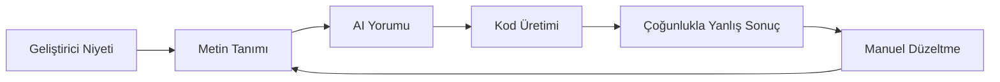
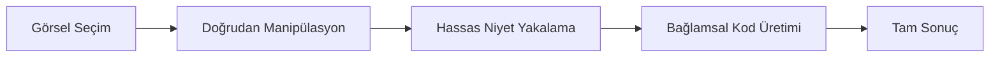

# Visual-to-Code Köprüsü

Visual-to-Code köprüsü, geliştiricilerin AI kodlama asistanları ile etkileşim şeklini devrimleştiren Hatcher'ın imza özelliğidir. Değişiklikleri metinle tanımlamak yerine, uygulamanızın görsel arayüzünü doğrudan manipüle edersiniz ve Hatcher eylemlerinizi hassas kod değişikliklerine çevirir.

## Nasıl Çalışır

### Geleneksel Problem



**Sinir bozucu döngü örneği:**

- Geliştirici: "Başlığı mavi yap ve ortala"
- AI: Yanlış öğeyi mavi yapan CSS üretir
- Geliştirici: "Hayır, kenar çubuğu başlığı değil, ana başlık"
- AI: Yanlış mavi tonunu yapar
- Geliştirici: "#3B82F6 yap ve yazı boyutunu da artır"
- ... böyle devam eder

### Hatcher'ın Visual-to-Code Yaklaşımı



**Gerçekte nasıl çalışır:**

1. **Tıkla ve Seç**: Değiştirmek istediğin öğeyi işaret et
2. **Görsel Manipülasyon**: Görsel olarak sürükle, yeniden boyutlandır veya özellikleri değiştir
3. **Niyet Tanıma**: Hatcher neyin değiştiğini tam olarak anlar
4. **Kod Üretimi**: AI gereken hassas kodu üretir
5. **Mükemmel Sonuç**: Değişiklik görsel niyetinle tam olarak eşleşir

## Temel Özellikler

### 1. Öğe Seçimi

**Akıllı Seçim Sistemi**

- Herhangi bir öğeyi seçmek için tıklayın
- Seçim sınırlarını önizlemek için üzerine gelin
- Toplu işlemler için birden fazla öğe seçin
- Hiyerarşik seçim (çocuk, ebeveyn, kardeş)

```typescript
// Örnek: Bir buton seçmek
const selection = {
  element: 'button.submit-btn',
  properties: {
    position: { x: 120, y: 45 },
    dimensions: { width: 100, height: 36 },
    styles: {
      backgroundColor: '#3B82F6',
      borderRadius: '6px',
      fontSize: '14px',
    },
  },
  context: {
    parent: 'form.checkout-form',
    siblings: ['input.email', 'input.password'],
    framework: 'Vue 3',
    component: 'SubmitButton.vue',
  },
}
```

### 2. Görsel Manipülasyon

**Doğrudan Özellik Düzenleme**

- Öğeleri yeni konumlara sürükleyin
- Köşeleri sürükleyerek yeniden boyutlandırın
- Arka planlar ve metin için renk seçici
- Tipografi kontrolleri (yazı tipi, boyut, ağırlık)
- Boşluk kontrolleri (margin, padding)

**Canlı Önizleme**

- Uygulamanızda değişiklikleri anında görün
- Yenileme veya yeniden derleme gerekmez
- Sıcak modül değiştirme entegrasyonu
- Gerçek zamanlı CSS güncellemeleri

### 3. Niyet Tanıma

Hatcher görsel değişikliklerinizi analiz eder ve şunları anlar:

**Düzen Değişiklikleri**

- Konum değişiklikleri (absolute, relative, flex)
- Boyut ayarlamaları (width, height, responsive)
- Hizalama değişiklikleri (center, flex, grid)

**Stil Değişiklikleri**

- Renk değişiklikleri (hex, RGB, HSL, CSS değişkenleri)
- Tipografi güncellemeleri (font family, size, weight, line height)
- Görsel efektler (gölgeler, kenarlıklar, gradyanlar)

**Bileşen Değişiklikleri**

- Props değişiklikleri
- State güncellemeleri
- Event handler eklemeleri

### 4. Kod Üretimi

Görsel niyetinize dayanarak Hatcher şunları üretir:

**Framework-Özel Kod**

```vue
<!-- Vue 3 Örneği -->
<template>
  <button
    class="submit-btn"
    :style="{
      transform: `translate(${position.x}px, ${position.y}px)`,
      backgroundColor: '#3B82F6',
    }"
    @click="handleSubmit"
  >
    Gönder
  </button>
</template>
```

**CSS Güncellemeleri**

```css
.submit-btn {
  position: absolute;
  left: 120px;
  top: 45px;
  background-color: #3b82f6;
  width: 100px;
  height: 36px;
  border-radius: 6px;
  font-size: 14px;
}
```

**TypeScript Entegrasyonu**

```typescript
interface ButtonProps {
  position: { x: number; y: number }
  variant: 'primary' | 'secondary'
  size: 'sm' | 'md' | 'lg'
}
```

## Gelişmiş Yetenekler

### 1. Duyarlı Tasarım

**Çoklu Kırılma Noktası Düzenleme**

- Farklı ekran boyutlarını aynı anda düzenleyin
- Duyarlı CSS'yi otomatik olarak üretin
- Cihazlar arası tasarım tutarlılığını koruyun

```css
/* Üretilen duyarlı kod */
.submit-btn {
  /* Mobil */
  width: 100%;
  margin: 0 16px;
}

@media (min-width: 768px) {
  /* Tablet */
  .submit-btn {
    width: 200px;
    margin: 0 auto;
  }
}

@media (min-width: 1024px) {
  /* Masaüstü */
  .submit-btn {
    width: 150px;
    position: absolute;
    left: 120px;
  }
}
```

### 2. Bileşen-Farkında Değişiklikler

**Akıllı Bileşen Algılama**

- Vue, React, Svelte bileşenlerini tanır
- Bileşen props ve state'ini anlar
- Bileşen sınırlarını korur

**Örnek: Vue Bileşenini Değiştirme**

```vue
<!-- Öncesi -->
<UserCard :user="currentUser" size="medium" />

<!-- Görsel değişiklik sonrası -->
<UserCard
  :user="currentUser"
  size="large"
  :style="{ marginTop: '24px' }"
  show-avatar
/>
```

### 3. Tasarım Sistemi Entegrasyonu

**Otomatik Token Kullanımı**

- Tasarım sistemi tokenlarını tanır
- Uygun değerler önerir
- Tutarlılığı korur

```css
/* Rastgele değerler yerine */
color: #3b82f6;
padding: 12px;

/* Tasarım tokenları kullanır */
color: var(--color-primary-500);
padding: var(--spacing-3);
```

## İş Akışı Örnekleri

### Örnek 1: Düzen Ayarlaması

**Hedef**: Kenar çubuğunu soldan sağa taşımak

1. **Seç**: Kenar çubuğu bileşenini tıklayın
2. **Sürükle**: Ekranın sağ tarafına sürükleyin
3. **İncele**: Üretilen flex/grid değişikliklerini görün
4. **Uygula**: CSS değişikliklerini kabul edin

**Üretilen Kod**:

```css
.layout-container {
  display: flex;
  flex-direction: row; /* row-reverse'den değişti */
}

.sidebar {
  order: 2; /* 1'den değişti */
  margin-left: auto; /* Eklendi */
}
```

### Örnek 2: Bileşen Stillendirme

**Hedef**: Buton görünümünü tasarıma uygun şekilde değiştirmek

1. **Seç**: Butonu tıklayın
2. **Stil**: Renk seçiciyi kullanın, boyutu ayarlayın, kenarlığı değiştirin
3. **Önizle**: Uygulamada değişiklikleri canlı görün
4. **Üret**: Bileşen prop güncellemelerini alın

**Üretilen Kod**:

```vue
<script setup>
const buttonStyle = {
  variant: 'primary',
  size: 'lg',
  rounded: true,
}
</script>

<template>
  <AppButton v-bind="buttonStyle"> Siparişi Gönder </AppButton>
</template>
```

### Örnek 3: Duyarlı Ayarlama

**Hedef**: Bir ızgarayı duyarlı yapmak

1. **Seç**: Izgara konteynerini seçin
2. **Yeniden Boyutlandır**: Farklı kırılma noktaları için sütunları ayarlayın
3. **Test**: Mobil/tablet/masaüstünde önizleyin
4. **Uygula**: Duyarlı CSS Grid üretin

**Üretilen Kod**:

```css
.product-grid {
  display: grid;
  gap: 1rem;
  grid-template-columns: 1fr; /* Mobil */
}

@media (min-width: 640px) {
  .product-grid {
    grid-template-columns: repeat(2, 1fr); /* Tablet */
  }
}

@media (min-width: 1024px) {
  .product-grid {
    grid-template-columns: repeat(3, 1fr); /* Masaüstü */
  }
}
```

## AI Motorları ile Entegrasyon

Visual-to-Code köprüsü desteklenen AI motorları ile sorunsuz çalışır:

### Claude Code Entegrasyonu

```typescript
const visualIntent = captureVisualChange(selection, modification)
const codeChange = await claudeCode.generateChange({
  intent: visualIntent,
  context: projectContext,
  playbook: teamPlaybook,
})
```

### Gemini CLI Entegrasyonu

```typescript
const prompt = buildVisualPrompt(visualIntent, codeContext)
const suggestion = await geminiCLI.complete(prompt)
const refinedCode = refineWithPlaybook(suggestion)
```

## En İyi Uygulamalar

### 1. Küçük Başlayın

- Artırımlı görsel değişiklikler yapın
- Bir sonrakine geçmeden önce her değişikliği test edin
- Karmaşık değişiklikleri küçük adımlarla oluşturun

### 2. Playbooks Kullanın

- Playbook'larınızda bileşen kalıplarını tanımlayın
- Tutarlı stillendirme kuralları oluşturun
- Yaygın tasarım kalıplarını belgeleyin

### 3. Üretilen Kodu İnceleyin

- Uygulamadan önce her zaman kod farkını inceleyin
- Üretilen kodun standartlarınızı takip ettiğinden emin olun
- Daha iyi sonuçlar için gerekirse komutları iyileştirin

### 4. Kapsamlı Test Edin

- Değişiklikleri doğrulamak için otomatik testler kullanın
- Duyarlı davranışı kontrol edin
- Erişilebilirlik uyumluluğunu doğrulayın

---

Visual-to-Code köprüsü, geliştirme için AI ile etkileşimimizde temel bir değişimi temsil eder. Niyet ve uygulama arasındaki çeviri katmanını ortadan kaldırarak, daha sezgisel, hassas ve verimli bir geliştirme deneyimi yaratır.
