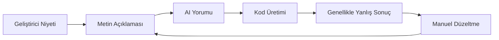

# Visual-to-Code Köprüsü

Visual-to-Code Köprüsü, geliştiricilerin AI kodlama asistanlarıyla nasıl etkileşime girdiğini devrimleştiren Hatcher'ın imza özelliğidir. Değişiklikleri metinde tanımlamak yerine, uygulamanızın görsel arayüzünü doğrudan manipüle ediyorsunuz ve Hatcher eylemlerinizi hassas kod değişikliklerine çeviriyor.

## Nasıl Çalışır

### Geleneksel Problem



**Sinir bozucu döngü örneği:**

- Geliştirici: "Başlığı mavi yap ve ortala"
- AI: Yanlış öğeyi mavi yapan CSS üretir
- Geliştirici: "Hayır, yan çubuk başlığı değil ana başlık"
- AI: Yanlış mavi tonunu yapar
- Geliştirici: "#3B82F6 yap ve ayrıca yazı boyutunu artır"
- ... ve devam eder

### Hatcher'ın Visual-to-Code Yaklaşımı: Köprünün İkili Modları

Visual-to-Code Köprüsü, projenizin görevine bağlı olarak farklı çalışır, özgürlük ve kontrolün doğru dengesini sağlar.

**Generative Modda: AI Destekli Oluşturma**

`Generative` projesinde köprü, AI için yüksek hassasiyetli bir hedefleme sistemi görevi görür. İş akışı:

1. **Bağlamı sabitlediğiniz**: Bir öğe seçmek için tıklayın.

2. **Komutu sağladığınız**: İstenen değişikliği tanımlamak için doğal dil kullanın.

3. **AI'nın yürüttüğü**: Tanımladığınız kapsama kısıtlanmış gerekli kodu üretir.

**Bir EGG'de: Deterministik Manipülasyon**

Bir EGG'de (Enforced Governance Guardrails), köprü görsel değişiklikler için AI kod üretiminin kullanılmadığı doğrudan bir manipülasyon aracı haline gelir. İş akışı %100 deterministiktir:

1. **Doğrudan manipüle edersiniz**: Sürükleyin, yeniden boyutlandırın veya görsel bir panelde özellikleri düzenleyin.

2. **Motor olayı yakalar**: Hatcher değişikliği yapılandırılmış bir güncelleme olarak kaydeder.

3- **Konfigürasyon güncellenir**: Değişiklik, yeni kaynak kod olarak değil, proje konfigürasyon dosyasına yazılır.

## Temel Özellikler

### 1. Öğe Seçimi

**Akıllı Seçim Sistemi**

- Seçmek için herhangi bir öğeye tıklayın
- Seçim sınırlarını önizlemek için üzerine gelin
- Toplu işlemler için birden fazla öğe seçin
- Hiyerarşik seçim (alt, üst, kardeşler)

```typescript
// Örnek: Bir buton seçmek
const selection = {
  element: 'button.submit-btn',
  properties: {
    position: { x: 120, y: 45 },
    dimensions: { width: 100, height: 36 },
    styles: {
      backgroundColor: '#3B82F6',
      borderRadius: '6px',
      fontSize: '14px',
    },
  },
  context: {
    parent: 'form.checkout-form',
    siblings: ['input.email', 'input.password'],
    framework: 'Vue 3',
    component: 'SubmitButton.vue',
  },
}
```

### 2. Görsel Manipülasyon

**Doğrudan Özellik Düzenleme**

- Öğeleri yeni konumlara sürükleyin
- Köşeleri sürükleyerek yeniden boyutlandırın
- Arka plan ve metin için renk seçici
- Tipografi kontrolleri (font, boyut, ağırlık)
- Boşluk kontrolleri (margin, padding)

**Canlı Önizleme**

- Değişiklikleri uygulamanızda anında görün
- Yenilemek veya yeniden oluşturmak gerekmez
- Hot module replacement entegrasyonu
- Gerçek zamanlı CSS güncellemeleri

### 3. Niyet Tanıma

Hatcher görsel değişikliklerinizi analiz eder ve şunları anlar:

**Düzen Değişiklikleri**

- Konum değişiklikleri (absolute, relative, flex)
- Boyut ayarlamaları (width, height, responsive)
- Hizalama değişiklikleri (center, flex, grid)

**Stil Değişiklikleri**

- Renk değişiklikleri (hex, RGB, HSL, CSS değişkenleri)
- Tipografi güncellemeleri (font ailesi, boyutu, ağırlık, satır yüksekliği)
- Görsel efektler (gölgeler, kenarlıklar, gradyanlar)

**Bileşen Değişiklikleri**

- Props değişiklikleri
- State güncellemeleri
- Olay işleyici eklemeleri

### 4. Kod Üretimi

Görsel niyetinize dayalı olarak, Hatcher şunları üretir:

**Framework'e Özgü Kod**

```vue
<!-- Vue 3 Örneği -->
<template>
  <button
    class="submit-btn"
    :style="{
      transform: `translate(${position.x}px, ${position.y}px)`,
      backgroundColor: '#3B82F6',
    }"
    @click="handleSubmit"
  >
    Submit
  </button>
</template>
```

**CSS Güncellemeleri**

```css
.submit-btn {
  position: absolute;
  left: 120px;
  top: 45px;
  background-color: #3b82f6;
  width: 100px;
  height: 36px;
  border-radius: 6px;
  font-size: 14px;
}
```

**TypeScript Entegrasyonu**

```typescript
interface ButtonProps {
  position: { x: number; y: number }
  variant: 'primary' | 'secondary'
  size: 'sm' | 'md' | 'lg'
}
```

## Gelişmiş Yetenekler

### 1. Responsive Tasarım

**Çoklu Breakpoint Düzenleme**

- Aynı anda farklı ekran boyutlarını düzenleyin
- Responsive CSS'yi otomatik olarak oluşturun
- Cihazlar arasında tasarım tutarlılığını koruyun

```css
/* Oluşturulan responsive kod */
.submit-btn {
  /* Mobil */
  width: 100%;
  margin: 0 16px;
}

@media (min-width: 768px) {
  /* Tablet */
  .submit-btn {
    width: 200px;
    margin: 0 auto;
  }
}

@media (min-width: 1024px) {
  /* Masaüstü */
  .submit-btn {
    width: 150px;
    position: absolute;
    left: 120px;
  }
}
```

### 2. Bileşen Farkında Değişiklikler

**Akıllı Bileşen Algılama**

- Vue, React, Svelte bileşenlerini tanır
- Bileşen props ve state'ini anlar
- Bileşen sınırlarını korur

**Örnek: Bir Vue Bileşenini Değiştirme**

```vue
<!-- Önce -->
<UserCard :user="currentUser" size="medium" />

<!-- Görsel değişiklikten sonra -->
<UserCard
  :user="currentUser"
  size="large"
  :style="{ marginTop: '24px' }"
  show-avatar
/>
```

### 3. Tasarım Sistemi Entegrasyonu

**Otomatik Token Kullanımı**

- Tasarım sistemi token'larını tanır
- Uygun değerler önerir
- Tutarlılığı korur

```css
/* Keyfi değerler yerine */
color: #3b82f6;
padding: 12px;

/* Tasarım token'ları kullanır */
color: var(--color-primary-500);
padding: var(--spacing-3);
```

## İş Akışı Örnekleri

### Örnek 1: Düzen Ayarlaması

**Hedef**: Bir kenar çubuğunu sol taraftan sağ tarafa taşıyın

1. **Seçin**: Kenar çubuğu bileşenine tıklayın
2. **Sürükleyin**: Ekranın sağ tarafına sürükleyin
3. **İnceleyin**: Oluşturulan flex/grid değişikliklerini görün
4. **Uygulayın**: CSS değişikliklerini kabul edin

**Oluşturulan Kod**:

```css
.layout-container {
  display: flex;
  flex-direction: row; /* row-reverse'den değiştirildi */
}

.sidebar {
  order: 2; /* 1'den değiştirildi */
  margin-left: auto; /* Eklendi */
}
```

### Örnek 2: Bileşen Stillendirme

**Hedef**: Buton görünümünü tasarımla eşleşecek şekilde değiştirin

1. **Seçin**: Butona tıklayın
2. **Stil**: Renk seçici kullanın, boyutu ayarlayın, kenarlığı değiştirin
3. **Önizleme**: Değişiklikleri uygulamada canlı görün
4. **Oluştur**: Bileşen prop güncellemelerini alın

**Oluşturulan Kod**:

```vue
<script setup>
const buttonStyle = {
  variant: 'primary',
  size: 'lg',
  rounded: true,
}
</script>

<template>
  <AppButton v-bind="buttonStyle"> Submit Order </AppButton>
</template>
```

### Örnek 3: Responsive Ayarlama

**Hedef**: Bir grid'i responsive yapın

1. **Seçin**: Grid konteynerini seçin
2. **Yeniden Boyutlandır**: Farklı breakpoint'ler için sütunları ayarlayın
3. **Test**: Mobil/tablet/masaüstünde önizleme yapın
4. **Uygula**: Responsive CSS Grid oluşturun

**Oluşturulan Kod**:

```css
.product-grid {
  display: grid;
  gap: 1rem;
  grid-template-columns: 1fr; /* Mobil */
}

@media (min-width: 640px) {
  .product-grid {
    grid-template-columns: repeat(2, 1fr); /* Tablet */
  }
}

@media (min-width: 1024px) {
  .product-grid {
    grid-template-columns: repeat(3, 1fr); /* Masaüstü */
  }
}
```

## AI Motorları ile Entegrasyon

Visual-to-Code Köprüsü, desteklenen AI motorlarıyla sorunsuz çalışır:

### Claude Code Entegrasyonu

```typescript
const visualIntent = captureVisualChange(selection, modification)
const codeChange = await claudeCode.generateChange({
  intent: visualIntent,
  context: projectContext,
  playbook: teamPlaybook,
})
```

### Gemini CLI Entegrasyonu

```typescript
const prompt = buildVisualPrompt(visualIntent, codeContext)
const suggestion = await geminiCLI.complete(prompt)
const refinedCode = refineWithPlaybook(suggestion)
```

## En İyi Uygulamalar

### 1. Küçük Başlayın

- Kademeli görsel değişiklikler yapın
- Bir sonrakine geçmeden önce her değişikliği test edin
- Karmaşık değişiklikleri daha küçük adımlarla oluşturun

### 2. Playbook'ları Kullanın

- Playbook'larınızda bileşen kalıplarını tanımlayın
- Tutarlı stillendirme kuralları oluşturun
- Yaygın tasarım kalıplarını belgeleyin

### 3. Oluşturulan Kodu İnceleyin

- Uygulamadan önce her zaman kod farkını inceleyin
- Oluşturulan kodun standartlarınızı takip ettiğinden emin olun
- Daha iyi sonuçlar için gerekirse promptları rafine edin

### 4. İyice Test Edin

- Değişiklikleri doğrulamak için otomatik testler kullanın
- Responsive davranışı kontrol edin
- Erişilebilirlik uyumluluğunu doğrulayın

---

Visual-to-Code Köprüsü, geliştirme için AI ile nasıl etkileşime girdiğimizde temel bir değişimi temsil eder. Niyet ve uygulama arasındaki çeviri katmanını ortadan kaldırarak, daha sezgisel, hassas ve verimli bir geliştirme deneyimi yaratır.
