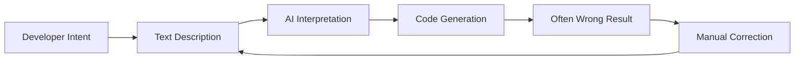

# Visual-to-Code Bridge

The Visual-to-Code Bridge is Hatcher's signature feature that revolutionizes how developers interact with AI coding assistants. Instead of describing changes in text, you directly manipulate your application's visual interface, and Hatcher translates your actions into precise code modifications.

## How It Works

### The Traditional Problem



**Example of the frustrating cycle:**

- Developer: "Make the header blue and center it"
- AI: Generates CSS that makes the wrong element blue
- Developer: "No, the main header, not the sidebar header"
- AI: Makes it the wrong shade of blue
- Developer: "Make it #3B82F6 and also increase the font size"
- ... and so on

### Hatcher's Visual-to-Code Approach: The Bridge's Dual Modes

The Visual-to-Code Bridge operates differently depending on your project's mission, providing the right balance of freedom and control.

**In Generative Mode: AI-Assisted Creation**

In a `Generative` project, the bridge acts as a high-precision targeting system for the AI. The workflow is:

1. **You anchor the context:** Click to select an element.

2. **You provide the command:** Use natural language to describe the desired change.

3. **The AI executes:** It generates the necessary code, constrained to the scope you defined.

**In an EGG: Deterministic Manipulation**

In an `EGG`, the bridge becomes a direct manipulation tool where AI code generation is not used for visual changes. The workflow is 100% deterministic:

1. **You manipulate directly:** Drag, resize, or edit properties in a visual panel.

2. **The engine captures the event:** Hatcher records the change as a structured update.

3- **The configuration is updated:** The change is written to a project configuration file, not generated as new source code.

## Core Features

### 1. Element Selection

**Smart Selection System**

- Click any element to select it
- Hover to preview selection boundaries
- Select multiple elements for batch operations
- Hierarchical selection (child, parent, siblings)

```typescript
// Example: Selecting a button
const selection = {
  element: 'button.submit-btn',
  properties: {
    position: { x: 120, y: 45 },
    dimensions: { width: 100, height: 36 },
    styles: {
      backgroundColor: '#3B82F6',
      borderRadius: '6px',
      fontSize: '14px',
    },
  },
  context: {
    parent: 'form.checkout-form',
    siblings: ['input.email', 'input.password'],
    framework: 'Vue 3',
    component: 'SubmitButton.vue',
  },
}
```

### 2. Visual Manipulation

**Direct Property Editing**

- Drag elements to new positions
- Resize by dragging corners
- Color picker for backgrounds and text
- Typography controls (font, size, weight)
- Spacing controls (margin, padding)

**Live Preview**

- See changes instantly in your application
- No need to refresh or rebuild
- Hot module replacement integration
- Real-time CSS updates

### 3. Intent Recognition

Hatcher analyzes your visual changes and understands:

**Layout Changes**

- Position modifications (absolute, relative, flex)
- Size adjustments (width, height, responsive)
- Alignment changes (center, flex, grid)

**Style Changes**

- Color modifications (hex, RGB, HSL, CSS variables)
- Typography updates (font family, size, weight, line height)
- Visual effects (shadows, borders, gradients)

**Component Changes**

- Props modifications
- State updates
- Event handler additions

### 4. Code Generation

Based on your visual intent, Hatcher generates:

**Framework-Specific Code**

```vue
<!-- Vue 3 Example -->
<template>
  <button
    class="submit-btn"
    :style="{
      transform: `translate(${position.x}px, ${position.y}px)`,
      backgroundColor: '#3B82F6',
    }"
    @click="handleSubmit"
  >
    Submit
  </button>
</template>
```

**CSS Updates**

```css
.submit-btn {
  position: absolute;
  left: 120px;
  top: 45px;
  background-color: #3b82f6;
  width: 100px;
  height: 36px;
  border-radius: 6px;
  font-size: 14px;
}
```

**TypeScript Integration**

```typescript
interface ButtonProps {
  position: { x: number; y: number }
  variant: 'primary' | 'secondary'
  size: 'sm' | 'md' | 'lg'
}
```

## Advanced Capabilities

### 1. Responsive Design

**Multi-Breakpoint Editing**

- Edit different screen sizes simultaneously
- Generate responsive CSS automatically
- Maintain design consistency across devices

```css
/* Generated responsive code */
.submit-btn {
  /* Mobile */
  width: 100%;
  margin: 0 16px;
}

@media (min-width: 768px) {
  /* Tablet */
  .submit-btn {
    width: 200px;
    margin: 0 auto;
  }
}

@media (min-width: 1024px) {
  /* Desktop */
  .submit-btn {
    width: 150px;
    position: absolute;
    left: 120px;
  }
}
```

### 2. Component-Aware Changes

**Smart Component Detection**

- Recognizes Vue, React, Svelte components
- Understands component props and state
- Maintains component boundaries

**Example: Modifying a Vue Component**

```vue
<!-- Before -->
<UserCard :user="currentUser" size="medium" />

<!-- After visual modification -->
<UserCard
  :user="currentUser"
  size="large"
  :style="{ marginTop: '24px' }"
  show-avatar
/>
```

### 3. Design System Integration

**Automatic Token Usage**

- Recognizes design system tokens
- Suggests appropriate values
- Maintains consistency

```css
/* Instead of arbitrary values */
color: #3b82f6;
padding: 12px;

/* Uses design tokens */
color: var(--color-primary-500);
padding: var(--spacing-3);
```

## Workflow Examples

### Example 1: Layout Adjustment

**Goal**: Move a sidebar from left to right side

1. **Select**: Click on the sidebar component
2. **Drag**: Drag it to the right side of the screen
3. **Review**: See the generated flex/grid changes
4. **Apply**: Accept the CSS modifications

**Generated Code**:

```css
.layout-container {
  display: flex;
  flex-direction: row; /* Changed from row-reverse */
}

.sidebar {
  order: 2; /* Changed from 1 */
  margin-left: auto; /* Added */
}
```

### Example 2: Component Styling

**Goal**: Change button appearance to match design

1. **Select**: Click the button
2. **Style**: Use color picker, adjust size, modify border
3. **Preview**: See changes live in application
4. **Generate**: Get component prop updates

**Generated Code**:

```vue
<script setup>
const buttonStyle = {
  variant: 'primary',
  size: 'lg',
  rounded: true,
}
</script>

<template>
  <AppButton v-bind="buttonStyle"> Submit Order </AppButton>
</template>
```

### Example 3: Responsive Adjustment

**Goal**: Make a grid responsive

1. **Select**: Choose the grid container
2. **Resize**: Adjust columns for different breakpoints
3. **Test**: Preview on mobile/tablet/desktop
4. **Apply**: Generate responsive CSS Grid

**Generated Code**:

```css
.product-grid {
  display: grid;
  gap: 1rem;
  grid-template-columns: 1fr; /* Mobile */
}

@media (min-width: 640px) {
  .product-grid {
    grid-template-columns: repeat(2, 1fr); /* Tablet */
  }
}

@media (min-width: 1024px) {
  .product-grid {
    grid-template-columns: repeat(3, 1fr); /* Desktop */
  }
}
```

## Integration with AI Engines

The Visual-to-Code Bridge works seamlessly with supported AI engines:

### Claude Code Integration

```typescript
const visualIntent = captureVisualChange(selection, modification)
const codeChange = await claudeCode.generateChange({
  intent: visualIntent,
  context: projectContext,
  playbook: teamPlaybook,
})
```

### Gemini CLI Integration

```typescript
const prompt = buildVisualPrompt(visualIntent, codeContext)
const suggestion = await geminiCLI.complete(prompt)
const refinedCode = refineWithPlaybook(suggestion)
```

## Best Practices

### 1. Start Small

- Make incremental visual changes
- Test each modification before moving to the next
- Build complex changes through smaller steps

### 2. Use Playbooks

- Define component patterns in your playbooks
- Establish consistent styling rules
- Document common design patterns

### 3. Review Generated Code

- Always review the code diff before applying
- Ensure the generated code follows your standards
- Refine prompts if needed for better results

### 4. Test Thoroughly

- Use automated tests to validate changes
- Check responsive behavior
- Verify accessibility compliance

---

The Visual-to-Code Bridge represents a fundamental shift in how we interact with AI for development. By eliminating the translation layer between intent and implementation, it creates a more intuitive, precise, and efficient development experience.
