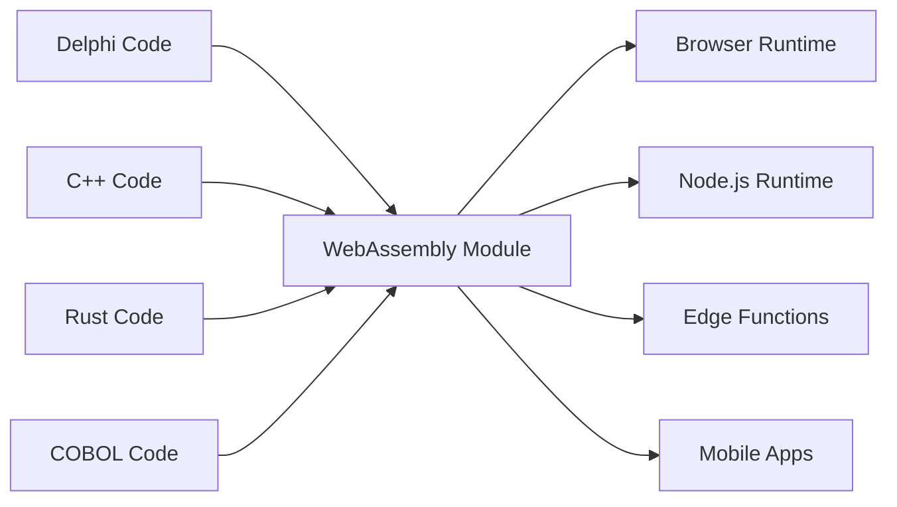

# Universal Fabricator

"为linux桌面应用程序制作二进制文件是一件非常痛苦的事情。你想要编译一个二进制文件就能工作，最好是永远，最好是跨所有linux发行版。" - Linus Torvalds，2014年

## 我们拒绝接受的两个谎言

### 遗留谎言："重写一切"

Linus关于软件分发噩梦的著名抱怨是软件行业告诉自己的一个更大、更昂贵谎言的症状：遗留代码是技术债务，现代化的唯一方法是扔掉几十年经过实战检验的业务逻辑，从头开始。

这是疯狂的。那些Delphi、COBOL或C++代码是有效的。它编码了多年的业务知识，处理了边缘案例，修复了bug。重写它不仅引入风险——它摧毁了不可替代的机构知识。

Universal Fabricator建立在一个简单而强大的拒绝之上：**我们拒绝接受这是唯一的方法**。如果你可以在任何地方运行你的遗留逻辑，而不需要重写呢？不是通过翻译。而是通过**通用的、确定性的执行**。

### 现代困境："速度或性能"

但这不仅仅是关于过去。在现代时代，我们面临一个新的错误选择：原型速度（TypeScript、Python）和生产性能（Rust、Go）之间的困境。团队被迫做出痛苦的决定：保持慢速原型，还是为生产进行有风险的完全重写。

Universal Fabricator也拒绝这种选择。它提供了一座桥梁——不仅从过去到现在，而且从现在到更高性能的未来，而不牺牲你的开发速度。

> **你的业务逻辑不需要重写。它需要复兴。**

## 工作原理

Universal Fabricator表现为Polyglot Hatcher Functions——你的遗留代码编译为WebAssembly——它们被安全打包并在Hatcher EGG中执行。这个架构由三个关键组件驱动：

### WebAssembly的魔力

WebAssembly（WASM）是使这成为可能的突破。任何可以编译为WASM的语言都可以在任何地方运行——浏览器、服务器、边缘、移动设备。你的遗留代码变得可移植，无需更改一行代码。



### Hatcher Functions：无国界的函数

传统的lambda在云中运行。我们的Hatcher Functions在任何地方运行：

```typescript
// 你的20年历史的Delphi税务计算
const taxCalculator = await loadWASM('./legacy/tax-engine.wasm')

// 像现代JavaScript函数一样使用它
const tax = await taxCalculator.calculateTax({
  income: 75000,
  deductions: 12000,
  state: 'NY',
})

// 它以原生速度运行，本地运行，完美准确
```

### EGGs架构

EGGs（Enforced Governance Guardrails）是你的通用逻辑的容器：

```yaml
egg: payroll-processor
version: 2.1.0
engine: wasm

modules:
  - name: tax-calculator
    source: delphi
    binary: tax-engine.wasm
    interface: ./interfaces/tax.ts

  - name: compliance-checker
    source: cobol
    binary: compliance.wasm
    interface: ./interfaces/compliance.ts

  - name: optimization-engine
    source: cpp
    binary: optimizer.wasm
    interface: ./interfaces/optimizer.ts

orchestration:
  entry: orchestrate.js
  runtime: node
```

## 保护你的资产

### 你的代码的第二次生命

那个2001年的Delphi应用程序？它变成：

- 你的Kubernetes集群中的微服务
- 你的React应用中的函数
- 全球分发的边缘worker
- 你的Python数据管道中的库

无需更改原始代码。无需丢失业务逻辑。无需重写的风险。

### 示例：银行革命

```javascript
// 原始：30年历史的COBOL事务处理器
// 现在：现代Web API

import { loadCOBOLModule } from '@hatcher/eggs'

const transactionProcessor = await loadCOBOLModule('./legacy/transactions.wasm')

// 现代Express.js API
app.post('/api/transfer', async (req, res) => {
  // 现代验证
  const validated = await validateRequest(req.body)

  // 遗留业务逻辑（完美准确）
  const result = await transactionProcessor.processTransfer({
    fromAccount: validated.from,
    toAccount: validated.to,
    amount: validated.amount,
  })

  // 现代响应
  res.json({
    success: result.success,
    transactionId: result.id,
    timestamp: new Date().toISOString(),
  })
})
```

## 无风险演进

### 渐进式现代化

你不必一次性现代化所有内容：

```typescript
class HybridPayrollSystem {
  // 在Delphi中保留复杂计算
  private legacyCalculator = loadWASM('./legacy/payroll.wasm')

  // 在TypeScript中添加现代功能
  async calculatePayroll(employee: Employee) {
    // 使用遗留进行核心计算
    const base = await this.legacyCalculator.calculate(employee)

    // 用现代功能增强
    const withBenefits = this.addModernBenefits(base)
    const withAnalytics = this.trackAnalytics(withBenefits)

    return withAnalytics
  }

  // 现代代码中的新功能
  private addModernBenefits(payroll: Payroll) {
    // 现代福利计算
  }
}
```

### 语言互操作性

不同语言的不同优势：

```javascript
// 使用每种语言擅长的领域
const system = {
  // Rust用于性能关键
  imageProcessor: await loadWASM('./rust/image-processor.wasm'),

  // Delphi用于业务逻辑
  businessRules: await loadWASM('./delphi/rules-engine.wasm'),

  // C++用于算法
  optimizer: await loadWASM('./cpp/optimizer.wasm'),

  // JavaScript用于编排
  async process(input) {
    const image = await this.imageProcessor.prepare(input.image)
    const rules = await this.businessRules.evaluate(input.data)
    const optimized = await this.optimizer.optimize(rules)

    return { image, result: optimized }
  },
}
```

## 优化你的未来：从原型到性能

Hatcher也是现代应用程序的渐进优化平台。你可以在TypeScript中原型化整个应用程序以找到产品市场契合度，然后用高性能的Rust或Go模块手术式地替换性能瓶颈，而无需完全重写。

### 优化你的未来：转化工作流

Hatcher提供了将现代原型演变为高性能应用程序的革命性工作流。你不是重写；你是转化。你可以在TypeScript中原型化整个应用程序，然后使用AI作为合作伙伴，安全而系统地将关键逻辑升级到Rust或Go等高性能语言。

这是Alchemist's Playbook。

#### 步骤1：原型（TypeScript）

你从工作但可能"脏"或慢的TypeScript代码开始。

```ts
// 你的计算用户折扣的初始原型。
// 它有效，但有复杂的逻辑且不够快。
function calculateDiscount(user, cart) {
  let discount = 0
  if (user.isVip) discount += 0.1
  if (cart.total > 100) discount += 0.05
  // ... 更多复杂和缓慢的规则
  return Math.min(discount, 0.25) // 折扣上限
}
```

#### 步骤2：AI驱动的规范（代码→验收标准）

你选择函数并命令Hatcher："将此逻辑描述为验收标准。"AI分析代码并反向工程业务规则。

```Gherkin
# AI生成的验收标准

Feature: User Discount Calculation

Scenario: VIP user with large cart
Given a user is a "VIP"
And the cart total is over 100
Then the final discount should be 15%

Scenario: Non-VIP user
Given a user is not a "VIP"
Then the discount is based only on cart total

Scenario: Discount Capping
When any combination of rules results in a discount over 25%
Then the final discount must be capped at 25%
```

#### **步骤3：人类完善（控制点）**

现在，你，开发者，用纯英语审查和改进这些验收标准。你捕获AI错过的边缘案例并添加新场景。这是你的控制点。

#### 步骤4：测试驱动生成（验收标准→测试→代码）

有了人类批准的验收标准作为合同，你命令Hatcher："生成Rust代码和单元测试以满足这些标准。"

1. Hatcher首先在Rust中生成测试，直接反映验收标准。

2. 然后，它生成使这些测试通过的Rust代码。

```rust
// 最终的高性能Rust代码，由测试保证
// 匹配人类批准的业务逻辑。
pub fn calculate_discount(user: &User, cart: &Cart) -> f64 {
    // 快速、安全的Rust逻辑...
}
```

#### 步骤5：活文档

最终输出不仅仅是编译的.wasm模块。它是模块**与其人类可读规范配对**。验收标准与lambda一起保存，为未来的维护和演进创建活文档。

这是炼金术士的梦想：一个安全、结构化的过程，将原型转化为高性能应用程序，无风险，完全清晰。

## 自信地执行

### WASM洁净室

每个WASM模块都在沙箱中运行：

```typescript
interface WASMSandbox {
  memory: {
    limit: '100MB'
    shared: false
  }

  cpu: {
    timeout: '5s'
    priority: 'normal'
  }

  io: {
    filesystem: 'none'
    network: 'none'
    system: 'none'
  }
}
```

你的遗留代码不能：

- 访问文件系统（除非明确授予）
- 进行网络调用（除非明确授予）
- 使主机进程崩溃
- 泄漏内存
- 干扰其他模块

### 类型安全接口

从你的遗留代码生成TypeScript接口：

```typescript
// 从Delphi函数签名自动生成
export interface TaxEngine {
  calculateFederalTax(income: number, deductions: number): Promise<number>
  calculateStateTax(income: number, state: string): Promise<number>
  getDeductionLimit(filingStatus: FilingStatus): Promise<number>
}

// 类型安全使用
const engine: TaxEngine = await loadWASM('./tax-engine.wasm')
const tax = await engine.calculateFederalTax(100000, 12000) // 类型检查！
```

## 在战场中验证

### 场景1：保险巨头

一家拥有数百万行COBOL的40年历史的保险公司：

```yaml
before:
  problem: 'COBOL mainframe costs $2M/year'
  solution: '5-year, $50M rewrite project (failed twice)'

after:
  solution: 'Compile COBOL to WASM'
  timeline: '3 months'
  result:
    - Run on commodity hardware
    - Scale horizontally
    - Keep all business logic
    - Modern API layer
  savings: '$1.8M/year'
```

### 场景2：交易公司

C++中的高频交易算法：

```javascript
// 原始：在专用硬件上运行的C++
// 现在：在任何地方运行的相同C++

const tradingEngine = await loadWASM('./trading/algorithm.wasm')

// 部署到全球边缘位置
const edgeLocations = ['nyc', 'london', 'tokyo', 'singapore']

for (const location of edgeLocations) {
  deployToEdge(location, tradingEngine)
  // 相同算法，微秒延迟，全球分发
}
```

### 场景3：制造系统

来自工业控制器的嵌入式C代码：

```typescript
// 来自制造设备的30年历史C代码
const controller = await loadWASM('./embedded/controller.wasm')

// 现在它驱动现代Web仪表板
const Dashboard = () => {
  const [status, setStatus] = useState()

  useEffect(() => {
    const interval = setInterval(async () => {
      const data = await controller.getSystemStatus()
      setStatus(data)
    }, 1000)

    return () => clearInterval(interval)
  }, [])

  return <ModernUIComponent data={status} />
}
```

### 场景4：AI创业公司

一家快速移动的创业公司用Python原型化他们的数据处理管道。

```yaml
before:
  problem: 'Python prototype is too slow for production customers.'
  solution: "Plan a 6-month 'rewrite it in Go' project, pausing all feature development."
after:
  solution: 'Identify and rewrite 3 critical functions in Rust with Hatcher.'
  timeline: '2 weeks.'
  result:
    - 90% of the codebase remains in easy-to-iterate Python.
    - Critical path is now 120x faster.
    - Shipped to production customers next month.
    - Rewrite project cancelled.
```

## 开始使用

### 步骤1：识别你的逻辑

什么业务逻辑被困在遗留代码中？

- 计算引擎
- 业务规则
- 验证逻辑
- 处理算法

### 步骤2：编译为WASM

大多数语言现在支持WASM编译：

```bash
# Delphi
delphi2wasm your-code.pas -o output.wasm

# C/C++
emcc your-code.cpp -o output.wasm

# COBOL
cobol2wasm your-code.cob -o output.wasm

# Rust
cargo build --target wasm32-unknown-unknown
```

### 步骤3：创建接口

定义现代代码将如何交互：

```typescript
// 定义接口
interface LegacyModule {
  initialize(): Promise<void>
  process(input: Input): Promise<Output>
  cleanup(): Promise<void>
}
```

### 步骤4：集成

在现代应用程序中使用你的遗留逻辑：

```javascript
const legacy = await loadWASM('./legacy.wasm')
// 你的30年历史代码现在是一个现代模块
```

## 哲学

Universal Fabricator体现了一个基本信念：**代码是资产，不是负债**。每一行工作代码都代表已解决的问题、已处理的边缘案例和嵌入的知识。代码的年龄不会降低其价值——它证明了它。

我们不会因为书籍老旧而扔掉它们。我们不会因为建筑物是用不同工具建造的而拆除它们。为什么我们坚持重写有效的代码？

Universal Fabricator是通过进步来保存。它是无破坏的现代化。它是已建成和需要建成之间的桥梁。

---

_Universal Fabricator不仅运行你的遗留代码——它解放它。你的业务逻辑从过时运行时的监狱中释放，变得真正通用。一次编写，永远运行，在任何地方。_

<PageCTA
  title="解放你的遗留代码"
  subtitle="将几十年的业务逻辑转化为现代的通用模块"
  buttonText="探索Fabricator"
  buttonLink="/zh-cn/features-universal-fabricator"
  buttonStyle="secondary"
  footer="你的代码是资产，不是负债。保存它。现代化它。"
/>
