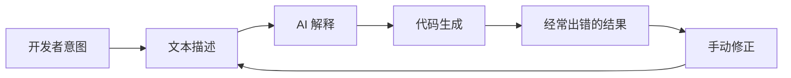

# Visual-to-Code Bridge

Visual-to-Code Bridge 是 Hatcher 的标志性功能，它彻底改变了开发者与 AI 编码助手的交互方式。您无需用文本描述更改，而是直接操作应用程序的可视界面，Hatcher 会将您的操作转换为精确的代码修改。

## 工作原理

### 传统问题



**令人沮丧的循环示例：**

- 开发者："将标题设为蓝色并居中"
- AI：生成 CSS，使错误的元素变为蓝色
- 开发者："不，是主标题，不是侧边栏标题"
- AI：变成了错误的蓝色阴影
- 开发者："将其设为 #3B82F6 并增加字体大小"
- ... 依此类推

### Hatcher 的 Visual-to-Code 方法：Bridge 的双重模式

Visual-to-Code Bridge 根据您项目的任务以不同的方式运行，提供自由度和控制之间的适当平衡。

**在生成模式下：AI 辅助创建**

在 `Generative` 项目中，桥接充当 AI 的高精度定位系统。工作流程是：

1. **您锚定上下文：** 点击选择一个元素。

2. **您提供命令：** 使用自然语言描述所需的更改。

3. **AI 执行：** 它生成必要的代码，受限于您定义的范围。

**在 EGG 中：确定性操作**

在 EGG（Enforced Governance Guardrails）中，桥接成为一个直接操作工具，其中 AI 代码生成不用于视觉更改。工作流程是 100% 确定性的：

1. **您直接操作：** 在可视面板中拖动、调整大小或编辑属性。

2. **引擎捕获事件：** Hatcher 将更改记录为结构化更新。

3. **配置已更新：** 更改被写入项目配置文件，而不是生成为新的源代码。

## 核心功能

### 1. 元素选择

**智能选择系统**

- 点击任何元素以选择它
- 悬停以预览选择边界
- 为批量操作选择多个元素
- 分层选择（子级、父级、同级）

```typescript
// 示例：选择一个按钮
const selection = {
  element: 'button.submit-btn',
  properties: {
    position: { x: 120, y: 45 },
    dimensions: { width: 100, height: 36 },
    styles: {
      backgroundColor: '#3B82F6',
      borderRadius: '6px',
      fontSize: '14px',
    },
  },
  context: {
    parent: 'form.checkout-form',
    siblings: ['input.email', 'input.password'],
    framework: 'Vue 3',
    component: 'SubmitButton.vue',
  },
}
```

### 2. 视觉操作

**直接属性编辑**

- 将元素拖动到新位置
- 通过拖动角落调整大小
- 用于背景和文本的颜色选择器
- 排版控件（字体、大小、粗细）
- 间距控件（边距、填充）

**实时预览**

- 立即在您的应用程序中查看更改
- 无需刷新或重建
- 热模块替换集成
- 实时 CSS 更新

### 3. 意图识别

Hatcher 分析您的视觉更改并理解：

**布局更改**

- 位置修改（绝对、相对、flex）
- 大小调整（宽度、高度、响应式）
- 对齐更改（居中、flex、grid）

**样式更改**

- 颜色修改（hex、RGB、HSL、CSS 变量）
- 排版更新（字体系列、大小、粗细、行高）
- 视觉效果（阴影、边框、渐变）

**组件更改**

- Props 修改
- State 更新
- 事件处理程序添加

### 4. 代码生成

根据您的视觉意图，Hatcher 生成：

**框架特定代码**

```vue
<!-- Vue 3 示例 -->
<template>
  <button
    class="submit-btn"
    :style="{
      transform: `translate(${position.x}px, ${position.y}px)`,
      backgroundColor: '#3B82F6',
    }"
    @click="handleSubmit"
  >
    提交
  </button>
</template>
```

**CSS 更新**

```css
.submit-btn {
  position: absolute;
  left: 120px;
  top: 45px;
  background-color: #3b82f6;
  width: 100px;
  height: 36px;
  border-radius: 6px;
  font-size: 14px;
}
```

**TypeScript 集成**

```typescript
interface ButtonProps {
  position: { x: number; y: number }
  variant: 'primary' | 'secondary'
  size: 'sm' | 'md' | 'lg'
}
```

## 高级功能

### 1. 响应式设计

**多断点编辑**

- 同时编辑不同的屏幕尺寸
- 自动生成响应式 CSS
- 在设备之间保持设计一致性

```css
/* 生成的响应式代码 */
.submit-btn {
  /* 移动设备 */
  width: 100%;
  margin: 0 16px;
}

@media (min-width: 768px) {
  /* 平板电脑 */
  .submit-btn {
    width: 200px;
    margin: 0 auto;
  }
}

@media (min-width: 1024px) {
  /* 桌面 */
  .submit-btn {
    width: 150px;
    position: absolute;
    left: 120px;
  }
}
```

### 2. 组件感知更改

**智能组件检测**

- 识别 Vue、React、Svelte 组件
- 理解组件 props 和 state
- 保持组件边界

**示例：修改 Vue 组件**

```vue
<!-- 之前 -->
<UserCard :user="currentUser" size="medium" />

<!-- 视觉修改后 -->
<UserCard
  :user="currentUser"
  size="large"
  :style="{ marginTop: '24px' }"
  show-avatar
/>
```

### 3. 设计系统集成

**自动令牌使用**

- 识别设计系统令牌
- 建议适当的值
- 保持一致性

```css
/* 而不是任意值 */
color: #3b82f6;
padding: 12px;

/* 使用设计令牌 */
color: var(--color-primary-500);
padding: var(--spacing-3);
```

## 工作流程示例

### 示例 1：布局调整

**目标**：将侧边栏从左侧移动到右侧

1. **选择**：点击侧边栏组件
2. **拖动**：将其拖动到屏幕右侧
3. **审查**：查看生成的 flex/grid 更改
4. **应用**：接受 CSS 修改

**生成的代码**：

```css
.layout-container {
  display: flex;
  flex-direction: row; /* 从 row-reverse 更改 */
}

.sidebar {
  order: 2; /* 从 1 更改 */
  margin-left: auto; /* 添加 */
}
```

### 示例 2：组件样式

**目标**：更改按钮外观以匹配设计

1. **选择**：点击按钮
2. **样式**：使用颜色选择器，调整大小，修改边框
3. **预览**：在应用程序中实时查看更改
4. **生成**：获取组件 prop 更新

**生成的代码**：

```vue
<script setup>
const buttonStyle = {
  variant: 'primary',
  size: 'lg',
  rounded: true,
}
</script>

<template>
  <AppButton v-bind="buttonStyle"> 提交订单 </AppButton>
</template>
```

### 示例 3：响应式调整

**目标**：使网格响应式

1. **选择**：选择网格容器
2. **调整大小**：为不同的断点调整列
3. **测试**：在移动设备/平板电脑/桌面上预览
4. **应用**：生成响应式 CSS Grid

**生成的代码**：

```css
.product-grid {
  display: grid;
  gap: 1rem;
  grid-template-columns: 1fr; /* 移动设备 */
}

@media (min-width: 640px) {
  .product-grid {
    grid-template-columns: repeat(2, 1fr); /* 平板电脑 */
  }
}

@media (min-width: 1024px) {
  .product-grid {
    grid-template-columns: repeat(3, 1fr); /* 桌面 */
  }
}
```

## 与 AI 引擎的集成

Visual-to-Code Bridge 与支持的 AI 引擎无缝协作：

### Claude Code 集成

```typescript
const visualIntent = captureVisualChange(selection, modification)
const codeChange = await claudeCode.generateChange({
  intent: visualIntent,
  context: projectContext,
  playbook: teamPlaybook,
})
```

### Gemini CLI 集成

```typescript
const prompt = buildVisualPrompt(visualIntent, codeContext)
const suggestion = await geminiCLI.complete(prompt)
const refinedCode = refineWithPlaybook(suggestion)
```

## 最佳实践

### 1. 从小处开始

- 进行增量视觉更改
- 在进行下一个更改之前测试每个修改
- 通过较小的步骤构建复杂的更改

### 2. 使用 Playbooks

- 在 playbooks 中定义组件模式
- 建立一致的样式规则
- 记录常见的设计模式

### 3. 审查生成的代码

- 在应用之前始终审查代码差异
- 确保生成的代码遵循您的标准
- 如有需要，优化提示以获得更好的结果

### 4. 彻底测试

- 使用自动化测试来验证更改
- 检查响应式行为
- 验证可访问性合规性

---

Visual-to-Code Bridge 代表了我们与 AI 进行开发交互方式的根本性转变。通过消除意图和实现之间的翻译层，它创造了更直观、精确和高效的开发体验。
